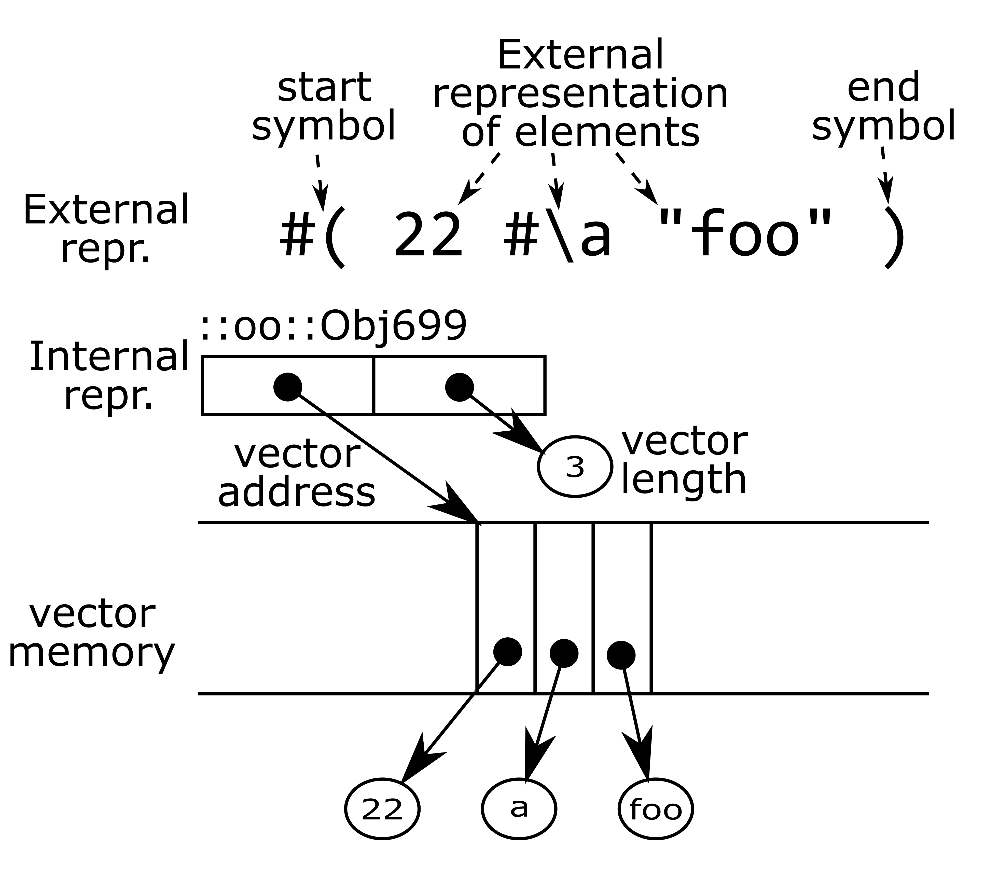
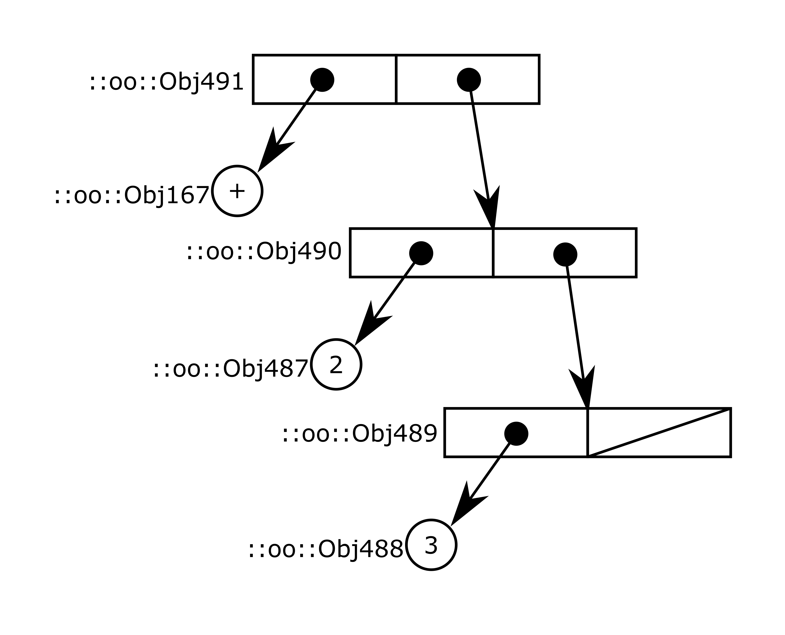
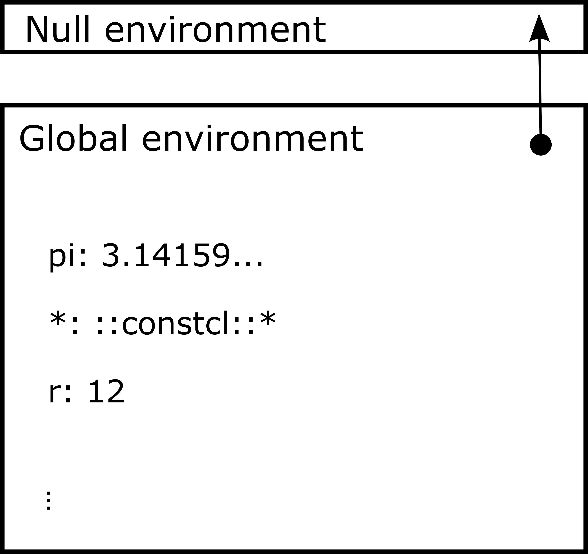
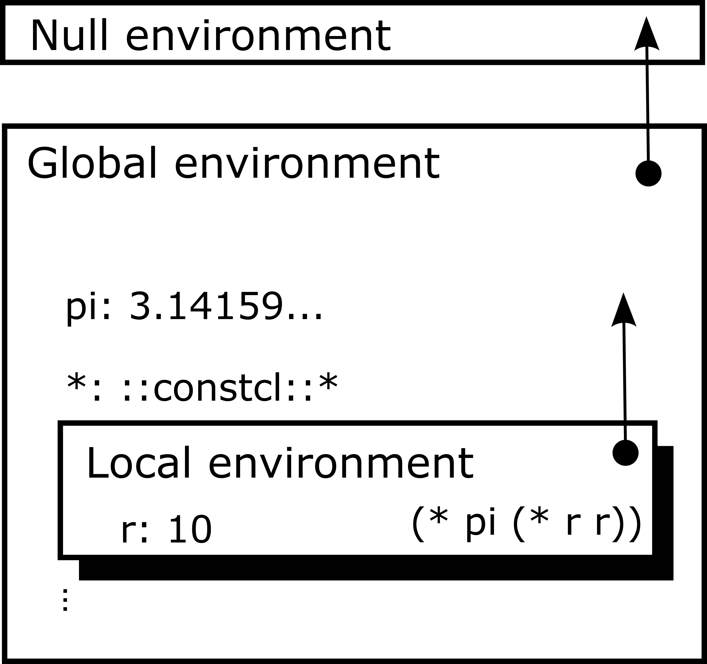
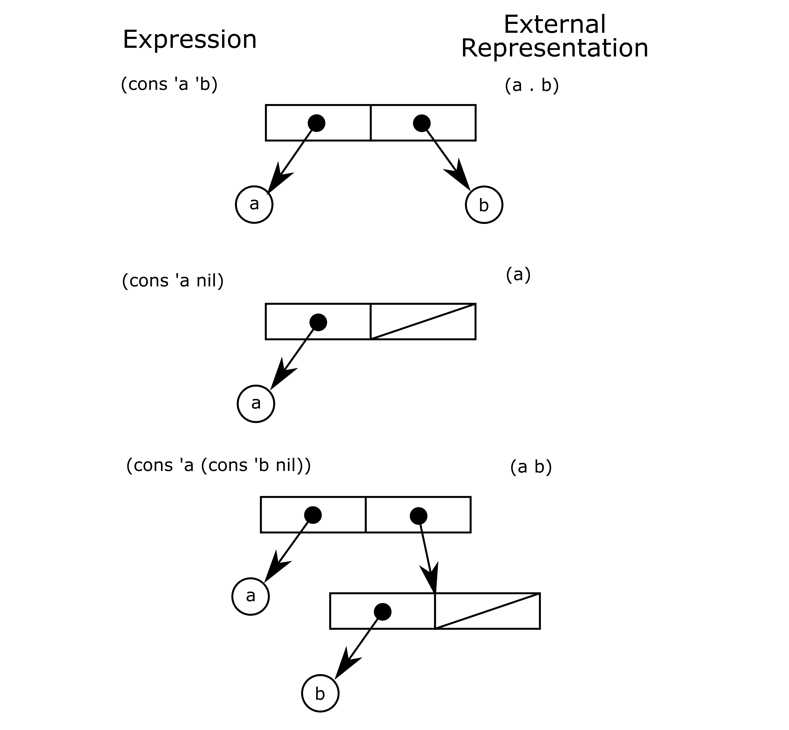

# ConsTcl

## Introduction

### To run the software

First things first. To run, source the file __constcl.tcl__ (with
__schemebase.lsp__ in the directory) in a Tcl console (I use __tkcon__) and use
the command __repl__ for a primitive command dialog.  Source
__all.tcl__ to run the test suite (you need __constcl.test__ for that). The
files can be found on [GitHub/ConsTcl](https://github.com/hoodiecrow/ConsTcl).

### Background

It all started with Peter Norvig's Lisp emulator
[Lispy](https://norvig.com/lispy.html). In January 2025 I was inspired to port
it to Tcl. The result was [Thtcl](https://github.com/hoodiecrow/thtcl). It had
the same features and limitations as Lispy, plus a couple that were due to
shortcomings of Tcl, and I came out of the experience feeling a bit
dissatisfied. In the latter part of January I embarked on a new project,
ConsTcl, a true Lisp interpreter. In Tcl.

#### About ConsTcl

Compared to Lispy/Thtcl, ConsTcl has, (quote from Lispy), "comments, quote and
quasiquote notation, # literals, the derived expression types (such as cond,
derived from if, or let, derived from lambda), and dotted list notation."
Again compared to Lispy/Thtcl, ConsTcl has the data types, quote, "strings,
characters, booleans, ports, vectors." And pairs and procedures too. The
number of missing primitive procedures is in the tens, not the 100s. 

The completeness comes with a price: due to the sheer number of calls for each
action, ConsTcl is is fairly slow. On my cheap computer, the following code
(which calculates the factorial of 100) takes 0.03 seconds to run. That is ten
times slower than Lispy assuming that Norvig's computer is as slow as mine,
which is unlikely. So it's probably a factor of less than ten.

```
time {pe "(fact 100)"} 10
```

ConsTcl is of course still limited. It doesn't come close to having call/cc or
tail recursion. It doesn't have exact/inexact numbers, or most of the numerical
tower. There is no memory management. Error reporting is spotty, and there is no
error recovery.


## Initial declarations

In this chapter, mostly things I need to start working on the interpreter. Feel free to skim this chapter, maybe coming back later to check up on things here.

First, I need to create the namespace that will be used for most identifiers:

```
namespace eval ::constcl {}
```

### Utility commands

Next, some procedures that make my life as developer somewhat easier.

#### reg procedure

`` reg `` registers built-in procedures, special forms, and macros in the definitions register. That way I don't need to manually keep track of and list procedures. The definitions register's contents will eventually get dumped into the [standard library](https://github.com/hoodiecrow/ConsTcl#environment-startup).

You can call `` reg `` with one parameter: _name_. _name_ is the string that will eventually become the lookup symbol in the standard library. If you give two parameters, the first one is the _binding type_, either `` special `` or `` macro ``. The former registers special forms like `` if `` and `` define ``, and the latter registers macros like `` and `` or `` when ``.

There is also `` regvar ``, which registers variables. You pass the _name_ and _value_ to it. There are only a couple of variables registered this way.

`` reg `` and `` regvar `` start out by checking if the definitions register (`` defreg ``) exists, and if not, they create it. Then they construct a _val_(ue) by concatenating a keyword (`` VARIABLE ``, `` SPECIAL ``, or `` SYNTAX ``) with a variation on _name_ (or, in `` regvar ``'s case, _value_). Then they set an _index number_ based on the current size of the `` defreg ``. Finally they insert the concatenation of _name_ and _val_ under _index_.

<table border=1><thead><tr><th colspan=2 align="left">reg (internal)</th></tr></thead><tr><td>?btype?</td><td>either 'special' or 'macro'</td></tr><tr><td>name</td><td>a Tcl string</td></tr><tr><td><i>Returns:</i></td><td>nothing</td></tr></table>

<table border=1><thead><tr><th colspan=2 align="left">regvar (internal)</th></tr></thead><tr><td>name</td><td>a Tcl string</td></tr><tr><td>val</td><td>a value</td></tr><tr><td><i>Returns:</i></td><td>nothing</td></tr></table>

```
unset -nocomplain ::constcl::defreg

proc reg {args} {
  if {[llength $args] == 2} {
    lassign $args btype name
  } elseif {[llength $args] == 1} {
    lassign $args name
    set btype {}
  } else {
    error "wrong number of parameters\n([pn])"
  }
  if {![info exists ::constcl::defreg]} {
    set ::constcl::defreg [dict create]
  }
  switch $btype {
    special {
      set val [::list SPECIAL ::constcl::special-$name]
    }
    macro {
      set val [::list SYNTAX ::constcl::expand-$name]
    }
    default {
      set val [::list VARIABLE ::constcl::$name]
    }
  }
  set idx [dict size $::constcl::defreg]
  dict set ::constcl::defreg $idx [::list $name $val]
}

proc regvar {name value} {
  if {![info exists ::constcl::defreg]} {
    set ::constcl::defreg [dict create]
  }
  set val [::list VARIABLE $value]
  set idx [dict size $::constcl::defreg]
  dict set ::constcl::defreg $idx [::list $name $val]
}
```


---


##### Procedures, functions, and commands

I use all of these terms for the subroutines in ConsTcl. I try to stick to procedure, because that's the standard term in R5RS (Revised:5 Report on the Algorithmic Language Scheme, Scheme's standardization document). Still, they usually pass useful values back to the caller, so technically they're functions. Lastly, I'm programming in Tcl here, and the usual term for these things is `commands' in Tcl.

And the `internal/public' distinction is probably a misnomer (an aside within an aside, here). What it means is that `public' procedures can be called from Lisp code being interpreted, and the others cannot. They are for use in the infrastructure around the interpreter, including in implementing the `public' procedures. Another way to put it is that procedures registered by `` reg ``* are `public' and those who aren't are `internal'.


---


#### atom? procedure

This one isn't just for my convenience: it's a standard procedure in Scheme. There are two kinds of data in Lisp: lists and atoms. Lists are collections of lists and atoms. Atoms are instances of types such as booleans, characters, numbers, ports, strings, symbols, and vectors. `` Atom? `` recognizes an atom by checking for membership in any one of the atomic types. It returns `` #t `` (true) if it is an atom, and `` #f `` (false) if not.


---


##### Predicates

By Scheme convention, predicates (procedures that return either `` #t `` or `` #f ``) have '?' at the end of their name. Some care is necessary when calling Scheme predicates from Tcl code (the Tcl `` if `` command expects 1 or 0 as truth values). Example:

``if {[atom? $x]} ...``

will not do, but

``if {[atom? $x] ne "#f"} ...``

(``[atom? $x] not equal to false'') works. Or see the `` T `` procedure.


---


<table border=1><thead><tr><th colspan=2 align="left">atom? (public)</th></tr></thead><tr><td>val</td><td>a value</td></tr><tr><td><i>Returns:</i></td><td>a boolean</td></tr></table>

```
reg atom?

proc ::constcl::atom? {val} {
  foreach type {symbol number string
      char boolean vector port eof} {
    if {[$type? $val] eq "#t"} {
      return #t
    }
  }
  return #f
}
```

#### T procedure

The `` T `` procedure is intended to reduce the hassle of trying to make Lisp booleans work with Tcl conditions. The idea is to line the Tcl condition with `` [T ...] `` and have the Lisp expression inside `` T ``. `` T `` returns 0 if and only if the value passed to it is `` #f ``, and 1 otherwise. The procedure's name stands for `truth of'.

Example:

```
if {[T [atom? $x]]} ...
```

<table border=1><thead><tr><th colspan=2 align="left">T (internal)</th></tr></thead><tr><td>val</td><td>a value</td></tr><tr><td><i>Returns:</i></td><td>a Tcl truth value (1 or 0)</td></tr></table>

```
proc ::T {val} {
  if {$val eq "#f"} {
    return 0
  } elseif {[::constcl::boolean? $val] eq "#t" &&
    [$val boolval] eq "#f"} {
    return 0
  } else {
    return 1
  }
}
```

#### assert procedure

`` assert `` signals an error if an assertion fails.

<table border=1><thead><tr><th colspan=2 align="left">assert (internal)</th></tr></thead><tr><td>expr</td><td>a Tcl expression</td></tr><tr><td><i>Returns:</i></td><td>nothing</td></tr></table>

```
proc assert {expr} {
  if {![uplevel [list expr $expr]]} {
    error "Failed assertion [
      uplevel [list subst $expr]]"
  }
}
```

#### pairlis-tcl procedure

A Tcl version of the procedure in the Scheme base.

<table border=1><thead><tr><th colspan=2 align="left">pairlis-tcl (internal)</th></tr></thead><tr><td>lvals</td><td>a Lisp list of values</td></tr><tr><td><i>Returns:</i></td><td>a Lisp list of association pairs</td></tr></table>

```
proc ::constcl::pairlis-tcl {a b} {
  if {[T [null? $a]]} {
    parse {()}
  } else {
    cons \
      [cons [car $a] [car $b]] \
      [pairlis-tcl [cdr $a] [cdr $b]]
  }
}
```

#### usage procedure

`` usage `` is a simple procedure to compare a Lisp list (to wit: a Lisp expression) with the expected format of the expression. Mostly it just compares lengths.

<table border=1><thead><tr><th colspan=2 align="left">usage (internal)</th></tr></thead><tr><td>usage</td><td>an expression</td></tr><tr><td>expr</td><td>an expression</td></tr><tr><td><i>Returns:</i></td><td>nothing</td></tr></table>

```
proc ::constcl::usage {usage expr} {
  set u $usage
  set e $expr
  if {[[length $usage] numval] !=
      [[length $expr] numval]} {
    while {$u ne "#NIL" && $e ne "#NIL"} {
      set u [cdr $u]
      set e [cdr $e]
    }
    if {$e eq "#NIL" && $u ne "#NIL" &&
      [regexp {\?.*\?} [[car $u] name]]} {
      return
    }
    ::error "usage error\n[
      $usage show] not [$expr show]"
  }
}
```

#### pn procedure

`` pn `` stands for 'procedure name'. When called, tells the caller the name of its command. I use it for error messages so the error message can automagically tell the user which command failed.

<table border=1><thead><tr><th colspan=2 align="left">pn (internal)</th></tr></thead><tr><td><i>Returns:</i></td><td>a Tcl string</td></tr></table>

```
proc ::pn {} {
  namespace tail [lindex [info level -1] 0]
}
```

#### unbind procedure

`` unbind `` removes bindings from the environment it is bound in.

<table border=1><thead><tr><th colspan=2 align="left">unbind (internal)</th></tr></thead><tr><td>syms</td><td>some symbols</td></tr><tr><td><i>Returns:</i></td><td>nothing</td></tr></table>

```
proc ::unbind {args} {
  # TODO go from current environment
  set syms $args
  foreach sym $syms {
    set env [::constcl::global_env find $sym]
    if {$env ne "::constcl::null_env"} {
      $env unbind $sym
    }
  }
}
```

#### typeof? procedure

`` typeof? `` looks at a value's type and reports if it is the same as the given type. To be certain, it looks at the value in two ways: once assuming that the value is a ConsTcl object, and once assuming that the value is an interpreter (the Tcl interpreter, not ConsTcl) alias for a ConsTcl object. If one of those affirms the type, the procedure returns `` #t ``.

<table border=1><thead><tr><th colspan=2 align="left">typeof? (internal)</th></tr></thead><tr><td>val</td><td>a value</td></tr><tr><td>type</td><td>a Tcl string</td></tr><tr><td><i>Returns:</i></td><td>a boolean</td></tr></table>

```
proc ::constcl::typeof? {val type} {
  if {[info object isa typeof $val $type]} {
    return #t
  } elseif {[info object isa typeof \
      [interp alias {} $val] $type]} {
    return #t
  } else {
    return #f
  }
}
```

#### in-range procedure

This one is a little bit of both, a utility function that is also among the builtins in the library (it's not standard, though). It started out as a one-liner by Donal K. Fellows, but has grown a bit since then to suit my needs.

The plan is to arrange a sequence of numbers, given one, two or three ConsTcl Number objects. If one is passed to the procedure, it is used as the end of the sequence: the sequence will end just before it. If two numbers are passed, the first one becomes the start of the sequence: the first number in it. The second number will become the end of the sequence. If three numbers are passed, they become start, end, and step, i.e. how much is added to the current number to find next number in the sequence.

<table border=1><thead><tr><th colspan=2 align="left">in-range (public)</th></tr></thead><tr><td>x</td><td>a number</td></tr><tr><td>?e?</td><td>a number</td></tr><tr><td>?t?</td><td>a number</td></tr><tr><td><i>Returns:</i></td><td>a Lisp list of numbers</td></tr></table>

```
reg in-range

proc ::constcl::in-range {x args} {
  set start 0
  set step 1
  switch [llength $args] {
    0 {
      set e $x
      set end [$e numval]
    }
    1 {
      set s $x
      lassign $args e
      set start [$s numval]
      set end [$e numval]
    }
    2 {
      set s $x
      lassign $args e t
      set start [$s numval]
      set end [$e numval]
      set step [$t numval]
    }
  }
  set res $start
  while {$step > 0 && $end > [incr start $step] ||
      $step < 0 && $end < [incr start $step]} {
    lappend res $start
  }
  return [list {*}[lmap r $res {MkNumber $r}]]
}
```

#### error procedure

`` error `` is used to signal an error, with _msg_ being a message string and the optional arguments being values to show after the message.

<table border=1><thead><tr><th colspan=2 align="left">error (public)</th></tr></thead><tr><td>msg</td><td>a message string</td></tr><tr><td>?exprs?</td><td>some expressions</td></tr><tr><td><i>Returns:</i></td><td>-don't care-</td></tr></table>

```
reg error

proc ::constcl::error {msg args} {
  if {[llength $args]} {
    set res [lmap arg $args {
      $arg show
    }]
    ::append msg " (" [join $res] ")"
  }
  ::error $msg
}
```

#### check procedure

`` check `` does a check (typically a type check) on something and throws an error if it fails.

```
proc ::constcl::check {cond msg} {
  if {[uplevel $cond] eq "#f"} {
    ::error [
      uplevel [
        ::list subst [
          ::string trim $msg]]]
  }
}
```

### Testing commands

Testing gets easier if you have the software tools to manipulate and pick apart the testing data and actions. Short names reduce clutter in the test cases, at the cost of some readability.

#### pew procedure

`` pew `` was originally named `` pep `` after the sequence parse-eval-print. Now it's named for parse-eval-write. It reads and evals an expression, and writes the result. It's the most common command in the test cases, since it allows me to write code directly in Scheme, get it evaled and get to see proper Lisp output from it.

<table border=1><thead><tr><th colspan=2 align="left">pew (internal)</th></tr></thead><tr><td>str</td><td>a Tcl string, Lisp string, or a string input port</td></tr><tr><td>?env?</td><td>an environment</td></tr><tr><td><i>Returns:</i></td><td>nothing</td></tr></table>

```
proc ::pew {str {env ::constcl::global_env}} {
  ::constcl::write [
    ::constcl::eval [
      ::constcl::parse $str] $env]
}
```

#### rew procedure

`` rew `` is the reading variant of `` pew ``. Instead of taking string input it takes a regular input port. It mattered more while the input library was being written.

<table border=1><thead><tr><th colspan=2 align="left">rew (internal)</th></tr></thead><tr><td>port</td><td>an input port</td></tr><tr><td>?env?</td><td>an environment</td></tr><tr><td><i>Returns:</i></td><td>nothing</td></tr></table>

```
proc ::rew {port {env ::constcl::global_env}} {
  ::constcl::write [
    ::constcl::eval [
      ::constcl::read $port] $env]
}
```

#### pw procedure

`` pw `` is a similar command, except it doesn't eval the expression. It just writes what is parsed. It is useful for tests when the evaluator can't (yet) evaluate the form, but I can still check if it gets read and written correctly.

<table border=1><thead><tr><th colspan=2 align="left">pw (internal)</th></tr></thead><tr><td>str</td><td>a Tcl string, Lisp string, or a string input port</td></tr><tr><td><i>Returns:</i></td><td>nothing</td></tr></table>

```
proc ::pw {str} {
  ::constcl::write [
    ::constcl::parse $str]
}
```

#### rw procedure

`` rw `` is the reading variant of `` pw ``. Instead of taking string input it takes a regular input port. The procedure just writes what is read.

<table border=1><thead><tr><th colspan=2 align="left">rw (internal)</th></tr></thead><tr><td>?port?</td><td>an input port</td></tr><tr><td><i>Returns:</i></td><td>nothing</td></tr></table>

```
proc ::rw {args} {
  ::constcl::write [
    ::constcl::read {*}$args]
}
```

#### pe procedure

`` pe `` is also similar, but it doesn't write the expression. It just evaluates what is read. That way I get a value object which I can pass to another command, or pick apart in different ways.

<table border=1><thead><tr><th colspan=2 align="left">pe (internal)</th></tr></thead><tr><td>str</td><td>a Tcl string, Lisp string, or a string input port</td></tr><tr><td>?env?</td><td>an environment</td></tr><tr><td><i>Returns:</i></td><td>a value</td></tr></table>

```
proc ::pe {str {env ::constcl::global_env}} {
  ::constcl::eval [
    ::constcl::parse $str] $env
}
```

#### re procedure

`` re `` is like `` pe ``, but it reads from a regular port instead of an string input port. It evaluates what is read.

<table border=1><thead><tr><th colspan=2 align="left">re (internal)</th></tr></thead><tr><td>port</td><td>an input port</td></tr><tr><td>?env?</td><td>an environment</td></tr><tr><td><i>Returns:</i></td><td>a value</td></tr></table>

```
proc ::re {port {env ::constcl::global_env}} {
  ::constcl::eval [
    ::constcl::read $port] $env
}
```

#### p procedure

`` p `` only parses the input, returning an expression object.

<table border=1><thead><tr><th colspan=2 align="left">p (internal)</th></tr></thead><tr><td>str</td><td>a Tcl string, Lisp string, or a string input port</td></tr><tr><td><i>Returns:</i></td><td>an expression</td></tr></table>

```
proc ::p {str} {
  ::constcl::parse $str
}
```

#### e procedure

`` e `` is another single-action procedure, evaluating an expression and returning a value.

<table border=1><thead><tr><th colspan=2 align="left">e (internal)</th></tr></thead><tr><td>expr</td><td>an expression</td></tr><tr><td>?env?</td><td>an environment</td></tr><tr><td><i>Returns:</i></td><td>a value</td></tr></table>

```
proc ::e {expr {env ::constcl::global_env}} {
  ::constcl::eval $expr $env
}
```

#### w procedure

`` w `` is the third single-action procedure, printing a value and that's all.

<table border=1><thead><tr><th colspan=2 align="left">w (internal)</th></tr></thead><tr><td>val</td><td>a value</td></tr><tr><td><i>Returns:</i></td><td>nothing</td></tr></table>

```
proc ::w {val} {
  ::constcl::write $val
}
```

#### r procedure

`` r `` is an extra single-action procedure, reading from default input or from a port and returning an expression object.

<table border=1><thead><tr><th colspan=2 align="left">r (internal)</th></tr></thead><tr><td>?port?</td><td>an input port</td></tr><tr><td><i>Returns:</i></td><td>an expression</td></tr></table>

```
proc ::r {args} {
  ::constcl::read {*}$args
}
```

#### prw procedure

`` prw `` reads an expression, resolves defines, and writes the result. It was handy during the time I was porting the `resolve local defines' section.

<table border=1><thead><tr><th colspan=2 align="left">prw (internal)</th></tr></thead><tr><td>str</td><td>a Tcl string, Lisp string, or a string input port</td></tr><tr><td><i>Returns:</i></td><td>nothing</td></tr></table>

```
proc ::prw {str} {
  set expr [::constcl::parse $str]
  set expr [::constcl::resolve-local-defines \
    [::constcl::cdr $expr]]
  ::constcl::write $expr
}
```

#### pxw procedure

`` pxw `` attempts to macro-expand whatever it reads, and writes the result. (I do know that 'expand' doesn't start with an 'x'.) Again, this command's heyday was when I was developing the macro facility.

<table border=1><thead><tr><th colspan=2 align="left">pxw (internal)</th></tr></thead><tr><td>str</td><td>a Tcl string, Lisp string, or a string input port</td></tr><tr><td>?env?</td><td>an environment</td></tr><tr><td><i>Returns:</i></td><td>nothing</td></tr></table>

```
proc ::pxw {str {env ::constcl::global_env}} {
  set expr [::constcl::parse $str]
  set op [::constcl::car $expr]
  lassign [::constcl::binding-info $op $env] btype hinfo
  if {$btype eq "SYNTAX"} {
    set expr [$hinfo $expr $env]
    ::constcl::write $expr
  } else {
    puts "not a macro"
  }
}
```

### Some small classes

#### Dot class

The `` Dot `` class is a helper class for the parser.

```
catch { ::constcl::Dot destroy }

oo::class create ::constcl::Dot {
  method mkconstant {} {}
  method write {port} {
    $port put [my show]
  }
  method display {port} {
    my write $port
  }
  method show {} {
    format "."
  }
}
```

#### dot? procedure

`` dot? `` is a type predicate that checks for membership in the type `` Dot ``.

<table border=1><thead><tr><th colspan=2 align="left">dot? (internal)</th></tr></thead><tr><td>val</td><td>a value</td></tr><tr><td><i>Returns:</i></td><td>a boolean</td></tr></table>

```
proc ::constcl::dot? {val} {
  typeof? $val "Dot"
}
```

#### EndOfFile class

The `` EndOfFile `` class is for end-of-file conditions.

```
catch { ::constcl::EndOfFile destroy }

oo::singleton create ::constcl::EndOfFile {
  method mkconstant {} {}
  method write {port} {
    $port put [my show]
  }
  method display {port} {
    my write $port
  }
  method show {} {
    format "#<end-of-file>"
  }
}
```

#### eof? procedure

`` eof? `` is a type predicate that recognizes the end-of-file object.

<table border=1><thead><tr><th colspan=2 align="left">eof? (internal)</th></tr></thead><tr><td>val</td><td>a value</td></tr><tr><td><i>Returns:</i></td><td>a boolean</td></tr></table>

```
proc eof? {val} {
  if {$val eq "#EOF"} {
    return #t
  } else {
    return #f
  }
}
```

#### NIL class

The `` NIL `` class has one object: the empty list called `` #NIL ``. It is also base class for many other type classes.

```
catch { ::constcl::NIL destroy }

oo::singleton create ::constcl::NIL {
  method boolval {} {
    return #t
  }
  method car {} {
    ::error "PAIR expected"
  }
  method cdr {} {
    ::error "PAIR expected"
  }
  method set-car! {v} {
    ::error "PAIR expected"
  }
  method set-cdr! {v} {
    ::error "PAIR expected"
  }
  method numval {} {
    ::error "NUMBER expected"
  }
  method mkconstant {} {}
  method write {port} {
    $port put [my show]
  }
  method display {port} {
    my write $port
  }
  method show {} {
    format "()"
  }
}
```

#### null? procedure

The `` null? `` standard predicate recognizes the empty list.

<table border=1><thead><tr><th colspan=2 align="left">null? (public)</th></tr></thead><tr><td>val</td><td>a value</td></tr><tr><td><i>Returns:</i></td><td>a boolean</td></tr></table>

```
reg null?

proc ::constcl::null? {val} {
  if {$val eq "#NIL"} {
    return #t
  } else {
    return #f
  }
}
```

#### Undefined class

The `` Undefined `` class is for undefined things. It was created to facilitate porting of code from `Scheme 9 from Empty Space'.

```
catch { ::constcl::Undefined destroy }

oo::singleton create ::constcl::Undefined {
  method mkconstant {} {}
  method write {port} {
    $port put [my show]
  }
  method display {port} {
    my write $port
  }
  method show {} {
    format "#<undefined>"
  }
}
```

#### Unspecified class

The `` Unspecified `` class is for unspecified things. Also a S9fES support class.

```
catch { ::constcl::Unspecified destroy }

oo::singleton create ::constcl::Unspecified {
  method mkconstant {} {}
  method write {port} {
    $port put [my show]
  }
  method display {port} {
    my write $port
  }
  method show {} {
    format "#<unspecified>"
  }
}
```

## Input

The first thing an interpreter must be able to do is to take in the user's code and data input, whether from the keyboard or from a source file. `` read `` represents the interpreter's main input facility. The `` read- `` procedures read from standard input, or--if a port is provided--from the port's channel.

The main input procedures, `` read `` and the non-standard `` parse ``, do more than just read in the text of code and data: they also _parse_ the input into an _internal representation_ that the evaluator can use.

### The parsing process

[Parsing](https://en.wikipedia.org/wiki/Parsing), or syntactic analysis, is analyzing a sequence of letters, digits, and other characters, a piece of text conforming to the rules of _external representation_. The result of parsing is an _expression_ in _internal representation_.

#### External representation

The external representation is a 'recipe' for an expression that expresses it in a unique way.

For example, the external representation for a vector is a pound sign (`` # ``), a left parenthesis (`` ( ``), the external representation for some values, and a right parenthesis (`` ) ``). When the reader or parser is working through input, a `` #( `` symbol signals that a vector structure is being read. A number of subexpressions for the elements of the vector follow, and then a closing parenthesis `` ) `` signals that the vector is done. The elements are saved in vector memory and the vector gets the address to the first element and the number of elements.



The `` parse `` or `` read `` procedure takes in the input buffer character by character, matching each character against a fitting external representation. When done, it creates a ConsTcl object, which is the internal representation of an expression. The object can then be passed to the evaluator.

Given a string, `` parse `` creates a string input port for itself to read from. It then parses the input and produces the internal representation of an expression.

Example:

```
% ::constcl::parse "(+ 2 3)"
::oo::Obj491
```

Here, `` parse `` parsed the external representation of a list with three elements, +, 2, and 3. It produced the expression that has an internal representation labeled `` ::oo::Obj491 ``. I will now reach briefly into the following chapters and present procedures like `` eval ``, which transforms an expression into a value, and `` write ``, which writes a printed external representation of expressions and values. Putting them together we can see

```
% ::constcl::write ::oo::Obj491
(+ 2 3)
% ::constcl::eval ::oo::Obj491
::oo::Obj494
% ::constcl::write ::oo::Obj494
5
```

Fortunately, we don't _have_ to work at such a low level. We can use the `` repl `` instead:

```
ConsTcl> (+ 2 3)
5
```

Then, parsing and evaluation and writing goes on in the background and the internal representations of expressions and values are hidden.

Anyway, the figure shows what it really looks like. `` ::oo::Obj491 `` was just the head of the list.



### Input procedures


---


##### Ports

Ports are an abstraction of the input or output mechanism. An input port can be connected to standard input (the keyboard) or a file opened for input or a string input buffer where the complete available input is laid out before reading starts. Regardless of what kind of input port it is, one can read characters from it until it runs out and signals end-of-file. Likewise, an output port, regardless of whether it's the standard output--the screen--or a file opened for output, will receive characters sent to it.


---


#### parse procedure

`` parse `` can be called with either a string input port or a Tcl or ConsTcl string (which it uses to open a string input port). Once the input port is established, `` parse `` leaves control to [``read-expr``](https://github.com/hoodiecrow/ConsTcl#readexpr-procedure).

<table border=1><thead><tr><th colspan=2 align="left">parse (internal)</th></tr></thead><tr><td>inp</td><td>a Tcl string, Lisp string, or a string input port</td></tr><tr><td><i>Returns:</i></td><td>an expression</td></tr></table>

```
reg parse

proc ::constcl::parse {inp} {
  set c {}
  set unget {}
  if {[info object isa object $inp]} {
    if {[T [typeof? $inp StringInputPort]]} {
      set port $inp
    } elseif {[T [typeof? $inp String]]} {
      set port [StringInputPort new [$inp value]]
    } else {
      ::error "Unknown object [$inp show]"
    }
  } else {
    # It's a Tcl string, we hope
    set port [StringInputPort new $inp]
  }
  set oldport $::constcl::Input_port
  set ::constcl::Input_port $port
  set expr [read-expr]
  set ::constcl::Input_port $oldport
  return $expr
}
```

#### read procedure

The standard builtin `` read `` reads an input port the same way that `` parse `` does, but one can't pass a string to it. The `` read- `` procedures parse their input and produce ConsTcl objects.

One can pass a port to `` read `` (including a string input port) in which case `` read `` sets the standard input port temporarily to the provided port. If not, `` read `` uses the default standard input port (usually the keyboard (which doesn't work in a Windows windowing environment, e.g. wish or tkcon. repl does work in those, though. Input works in tclsh on Windows.)).

<table border=1><thead><tr><th colspan=2 align="left">read (public)</th></tr></thead><tr><td>?port?</td><td>an input port</td></tr><tr><td><i>Returns:</i></td><td>an expression</td></tr></table>

```
reg read

proc ::constcl::read {args} {
  set c {}
  set unget {}
  set oldport $::constcl::Input_port
  if {[llength $args]} {
    lassign $args port
    set ::constcl::Input_port $port
  }
  set expr [read-expr]
  set ::constcl::Input_port $oldport
  return $expr
}
```

### Input helper procedures

#### make-constant procedure

The `` make-constant `` helper procedure is called to set expressions to constants when read as a literal.

```
proc ::constcl::make-constant {val} {
  if {[T [pair? $val]]} {
    $val mkconstant
    make-constant [car $val]
    make-constant [cdr $val]
  } elseif {[T [null? $val]]} {
    return #NIL
  } else {
    $val mkconstant
  }
}
```

#### interspace? procedure

The `` interspace? `` helper procedure recognizes whitespace between value representations.

```
proc ::constcl::interspace? {c} {
  if {[::string is space $c]} {
    return #t
  } else {
    return #f
  }
}
```

#### delimiter? procedure

The `` delimiter? `` helper procedure recognizes delimiter characters between value representations.

```
proc ::constcl::delimiter? {c} {
  if {$c in {( ) ; \" ' ` | [ ] \{ \}}} {
    return #t
  } else {
    return #f
  }
}
```

#### valid-char? procedure

The `` valid-char? `` helper procedure compares a potential character constant to the valid kinds.

<table border=1><thead><tr><th colspan=2 align="left">valid-char? (internal)</th></tr></thead><tr><td>name</td><td>a Tcl string</td></tr><tr><td><i>Returns:</i></td><td>a boolean</td></tr></table>

```
proc ::constcl::valid-char? {name} {
  if {[regexp {(?i)^#\\([[:graph:]]|space|newline)$} \
      $name]} {
    return #t
  } else {
    return #f
  }
}
```

#### readchar procedure

`` readchar `` reads one character from the `` unget `` store if it isn't empty or else from the input port. If the input is at end-of-file, an `` #EOF `` object is returned. Shares the variable `` unget `` with its caller.

<table border=1><thead><tr><th colspan=2 align="left">readchar (internal)</th></tr></thead><tr><td><i>Returns:</i></td><td>a Tcl character or end of file</td></tr></table>

```
proc ::constcl::readchar {} {
  upvar unget unget
  if {$unget ne {}} {
    set c $unget
    set unget {}
  } else {
    set c [$::constcl::Input_port get]
    if {[$::constcl::Input_port eof]} {
      return #EOF
    }
  }
  return $c
}
```

#### find-char? procedure

`` find-char? `` reads ahead through whitespace to find a given character. It returns `` #t `` if it has found the character, and `` #f `` if it has stopped at some other character. Returns end of file if eof is encountered. Shares the variables `` c `` and `` unget `` with its caller.

<table border=1><thead><tr><th colspan=2 align="left">find-char? (internal)</th></tr></thead><tr><td>char</td><td>a Tcl character</td></tr><tr><td><i>Returns:</i></td><td>a boolean or end of file</td></tr></table>

```
proc ::constcl::find-char? {char} {
  upvar c c unget unget
  while {[::string is space -strict $c]} {
    set c [readchar]
    read-eof $c
    set unget $c
  }
  expr {($c eq $char) ? "#t" : "#f"}
}
```

#### read-end? procedure

`` read-end? `` reads one character and returns `` #t `` if it is an interspace character or a delimiter character, or end of file. Otherwise it returns `` #f ``. It ungets the character before returning. Shares the variables `` c `` and `` unget `` with its caller.

<table border=1><thead><tr><th colspan=2 align="left">read-end? (internal)</th></tr></thead><tr><td><i>Returns:</i></td><td>a boolean or end of file</td></tr></table>

```
proc ::constcl::read-end? {} {
  upvar c c unget unget
  set c [readchar]
  if {[T [interspace? $c]] ||
      [T [delimiter? $c]] ||
      $c eq "#EOF"} {
    set unget $c
    return #t
  } else {
    set unget $c
    return #f
  }
}
```

#### skip-ws procedure

`` skip-ws `` skips whitespace and comments (the `` ; `` to end of line kind). It leaves the first character not to be skipped in `` c `` and also ungets it. Shares the variables `` c `` and `` unget `` with its caller.

<table border=1><thead><tr><th colspan=2 align="left">skip-ws (internal)</th></tr></thead><tr><td><i>Returns:</i></td><td>nothing</td></tr></table>

```
proc ::constcl::skip-ws {} {
  upvar c c unget unget
  while true {
    switch -regexp $c {
      {[[:space:]]} {
        set c [readchar]
      }
      {;} {
        while {$c ne "\n" && $c ne "#EOF"}  {
          set c [readchar]
        }
      }
      default {
        set unget $c
        return
      }
    }
  }
}
```

#### read-eof procedure

`` read-eof `` checks a number of presumed characters for possible end-of-file objects. If it finds one, it returns _from its caller_ with the EOF value.

<table border=1><thead><tr><th colspan=2 align="left">read-eof (internal)</th></tr></thead><tr><td>chars</td><td>some characters</td></tr><tr><td><i>Returns:</i></td><td>nothing</td></tr></table>

```
proc ::constcl::read-eof {args} {
  set chars $args
  foreach char $chars {
    if {$char eq "#EOF"} {
      return -level 1 -code return #EOF
    }
  }
}
```

### Reader procedures

Reader procedures specialize in reading a certain kind of input, except for `` read-expr `` which reads them all (with a little help).

#### read-expr procedure

The `` read-expr `` procedure reads the first available character from the input port. Based on that it delegates to one of the more detailed readers, producing an expression of any kind. A Tcl character value can be passed to it: that character will be used first before reading from the input. If end of file is encountered before an expression can be read in full, the procedure returns end of file (`` #EOF ``). Shares the variables `` c `` and `` unget `` with its caller.

<table border=1><thead><tr><th colspan=2 align="left">read-expr (internal)</th></tr></thead><tr><td>?char?</td><td>a Tcl character</td></tr><tr><td><i>Returns:</i></td><td>an expression or end of file</td></tr></table>

```
proc ::constcl::read-expr {args} {
  upvar c c unget unget
  if {[llength $args]} {
    lassign $args c
  } else {
    set c [readchar]
  }
  set unget {}
  read-eof $c
  if {[::string is space $c] || $c eq ";"} {
    skip-ws
    read-eof $c
  }
  switch -regexp $c {
    {\"}          { read-string-expr }
    {\#}          { read-pound }
    {\'}          { read-quoted-expr }
    {\(}          { read-pair-expr ")" }
    {\+} - {\-}   { read-plus-minus $c }
    {\,}          { read-unquoted-expr }
    {\.} {
        set x [Dot new]; set c [readchar]; set x
    }
    {\:}          { read-object-expr }
    {\[}          { read-pair-expr "\]" }
    {\`}          { read-quasiquoted-expr }
    {\d}          { read-number-expr $c }
    {^$}          { return }
    {[[:graph:]]} { read-identifier-expr $c }
    default {
      read-eof $c
      ::error "unexpected character ($c)"
    }
  }
}
```

#### read-character-expr procedure

`` read-character-expr `` is activated by `` read-pound `` when that procedure finds a backslash in the input stream (pound-backslash is the external representation prefix for characters). It reads one or more characters to produce a character expression and return a [Char object](https://github.com/hoodiecrow/ConsTcl#characters). Shares the variables `` c `` and `` unget `` with its caller.

<table border=1><thead><tr><th colspan=2 align="left">read-character-expr (internal)</th></tr></thead><tr><td><i>Returns:</i></td><td>a character or end of file</td></tr></table>

```
proc ::constcl::read-character-expr {} {
  upvar c c unget unget
  set name "#\\"
  set c [readchar]
  read-eof $c
  while {![T [delimiter? $c]] &&
      [::string is graph $c] &&
      $c ne "#EOF"} {
    ::append name $c
    set c [readchar]
  }
  check {valid-char? $name} {
      Invalid character constant $name
  }
  set expr [MkChar $name]
  read-eof $expr
  return $expr
}
```

#### read-identifier-expr procedure

`` read-identifier-expr `` is activated for 'anything else', and takes in characters until it finds whitespace or a delimiter character. If it is passed one or more characters it will use them before consuming any from input. It checks the input against the rules for identifiers, accepting or rejecting it with an error message. It returns a [Symbol object](https://github.com/hoodiecrow/ConsTcl#symbols). Shares the variables `` c `` and `` unget `` with its caller.

<table border=1><thead><tr><th colspan=2 align="left">read-identifier-expr (internal)</th></tr></thead><tr><td>?chars?</td><td>some Tcl characters</td></tr><tr><td><i>Returns:</i></td><td>a symbol or end of file</td></tr></table>

```
proc ::constcl::read-identifier-expr {args} {
  upvar c c unget unget
  set unget {}
  if {[llength $args]} {
    set c [join $args {}]
  } else {
    set c [readchar]
  }
  read-eof $c
  set name {}
  while {[::string is graph -strict $c]} {
    if {$c eq "#EOF" || [T [interspace? $c]] ||
      [T [delimiter? $c]]} {
      break
    }
    ::append name $c
    set c [readchar]
    # do not check for EOF here
  }
  if {$c ne "#EOF"} {
    set unget $c
  }
  read-eof $name
  # idcheck throws error if invalid identifier
  idcheck $name
  return [S $name]
}
```

#### read-number-expr procedure

`` read-number-expr `` reads numerical input, both integers and floating point numbers. It is activated by `` read-expr `` or `` read-plus-minus `` if they encounter digits, and it actually takes in anything that starts out like a number and stops at whitespace or a delimiter character, and then it accepts or rejects the input by comparing it to a Tcl double. It returns a [Number object](https://github.com/hoodiecrow/ConsTcl#numbers). Shares the variables `` c `` and `` unget `` with its caller.

<table border=1><thead><tr><th colspan=2 align="left">read-number-expr (internal)</th></tr></thead><tr><td>?char?</td><td>a Tcl character</td></tr><tr><td><i>Returns:</i></td><td>a number or end of file</td></tr></table>

```
proc ::constcl::read-number-expr {args} {
  upvar c c unget unget
  set unget {}
  if {[llength $args]} {
    lassign $args c
  } else {
    set c [readchar]
  }
  read-eof $c
  while {[interspace? $c] ne "#t" && $c ne "#EOF" &&
      ![T [delimiter? $c]]} {
    ::append num $c
    set c [readchar]
  }
  set unget $c
  check {::string is double -strict $num} {
      Invalid numeric constant $num
  }
  set expr [N $num]
  return $expr
}
```

#### read-object-expr procedure

A non-standard extension, `` read-object-expr `` reads a ConsTcl object of any kind and passes its name along. It is activated when `` read-expr `` finds a colon in the input. Shares the variables `` c `` and `` unget `` with its caller.

<table border=1><thead><tr><th colspan=2 align="left">read-object-expr (internal)</th></tr></thead><tr><td><i>Returns:</i></td><td>a ConsTcl object or end of file</td></tr></table>

```
proc ::constcl::read-object-expr {} {
  upvar c c unget unget
  # first colon has already been read
  foreach ch [split ":oo::Obj" {}] {
    set c [readchar]
    read-eof $c
    if {$c ne $ch} {
      error "bad object name"
    }
  }
  set res "::oo::Obj"
  set c [readchar]
  read-eof $c
  while {[::string is digit $c]} {
    ::append res $c
    set c [readchar]
    read-eof $c
  }
  set unget $c
  return $res
}
```

#### read-pair-expr procedure

The `` read-pair-expr `` procedure reads everything between two matching parentheses, or, as the case might be, brackets. It produces either an empty list, or a possibly recursive structure of [Pair objects](https://github.com/hoodiecrow/ConsTcl#pairs-and-lists), either a proper list (one that ends in `` #NIL ``), or an improper one (one that has an atom as its last member). Shares the variables `` c `` and `` unget `` with its caller.


<table border=1><thead><tr><th colspan=2 align="left">read-pair-expr (internal)</th></tr></thead><tr><td>char</td><td>the terminating paren or bracket</td></tr><tr><td><i>Returns:</i></td><td>a structure of pair expressions or end of file</td></tr></table>

```
proc ::constcl::read-pair-expr {char} {
  upvar c c unget unget
  set unget {}
  set expr [read-pair $char]
  read-eof $expr
  if {$c ne $char} {
    if {$char eq ")"} {
      ::error \
        "Missing right paren. ($c)."
    } else {
      ::error \
        "Missing right bracket ($c)."
    }
  } else {
    set unget {}
    set c [readchar]
  }
  return $expr
}
```

__read-pair__ procedure

`` read-pair `` is a helper procedure that does the heavy lifting in reading a pair structure. First it checks if the list is empty, returning `` #NIL `` in that case. Otherwise it reads the first element in the list and then repeatedly the rest of them. If it reads a Dot object, the following element to be read is the tail end of an improper list. When `` read-pair `` has reached the ending parenthesis or bracket, it conses up the elements starting from the last, and returns the head of the list. Shares the variables `` c `` and `` unget `` with its caller.

<table border=1><thead><tr><th colspan=2 align="left">read-pair (internal)</th></tr></thead><tr><td>char</td><td>the terminating paren or bracket</td></tr><tr><td><i>Returns:</i></td><td>a structure of pair expressions or end of file</td></tr></table>

```
proc ::constcl::read-pair {char} {
  upvar c c unget unget
  set c [readchar]
  read-eof $c
  if {[T [find-char? $char]]} {
    # read right paren/brack
    #set c [readchar]
    return #NIL
  }
  set a [read-expr $c]
  set res $a
  skip-ws
  set prev #NIL
  while {[find-char? $char] eq "#f"} {
    set x [read-expr $c]
    skip-ws
    read-eof $c
    if {[T [dot? $x]]} {
      set prev [read-expr $c]
      skip-ws
      read-eof $c
    } else {
      lappend res $x
    }
    if {[llength $res] > 99} break
  }
  # read right paren/brack
  foreach r [lreverse $res] {
    set prev [cons $r $prev]
  }
  return $prev
}
```

#### read-plus-minus procedure

`` read-plus-minus `` is called when a plus or minus is found in the input stream. The plus or minus character is passed to it. If the next character is a digit, it delegates to the number reader. If it is a space character or a delimiter, it returns a `` + `` or `` - `` symbol. Otherwise, it delegates to the identifier reader. Shares the variables `` c `` and `` unget `` with its caller.

<table border=1><thead><tr><th colspan=2 align="left">read-plus-minus (internal)</th></tr></thead><tr><td>char</td><td>a Tcl character</td></tr><tr><td><i>Returns:</i></td><td>either the symbols + or - or a number or end of file</td></tr></table>

```
proc ::constcl::read-plus-minus {char} {
  upvar c c unget unget
  set unget {}
  set c [readchar]
  read-eof $c
  if {[::string is digit -strict $c]} {
    set n [read-number-expr $c]
    read-eof $n
    if {$char eq "-"} {
      set n [- $n]
    }
    return $n
  } elseif {[::string is space -strict $c] ||
      [T [delimiter? $c]]} {
    if {$char eq "+"} {
      return [S "+"]
    } else {
      return [S "-"]
    }
  } else {
    set n [read-identifier-expr $char $c]
    read-eof $n
    return $n
  }
}
```

#### read-pound procedure

`` read-pound `` is activated by `` read-expr `` when it reads a pound sign (`` # ``). It in turn either delegates to the vector reader or the character reader, or returns boolean literals. Shares the variables `` c `` and `` unget `` with its caller.

<table border=1><thead><tr><th colspan=2 align="left">read-pound (internal)</th></tr></thead><tr><td><i>Returns:</i></td><td>a vector, boolean, or character value or end of file</td></tr></table>

```
proc ::constcl::read-pound {} {
  upvar c c unget unget
  set unget {}
  set c [readchar]
  read-eof $c
  switch $c {
    (    { set n [read-vector-expr] }
    t    { if {[T [read-end?]]} {set n #t} }
    f    { if {[T [read-end?]]} {set n #f} }
    "\\" { set n [read-character-expr] }
    default {
      ::error "Illegal #-literal: #$c"
    }
  }
  return $n
}
```

#### read-quasiquoted-expr procedure

`` read-quasiquoted-expr `` is activated when there is a backquote (`` ` ``) in the input stream. It reads an entire expression and returns it wrapped in `` quasiquote ``. Shares the variables `` c `` and `` unget `` with its caller.

<table border=1><thead><tr><th colspan=2 align="left">read-quasiquoted-expr (internal)</th></tr></thead><tr><td><i>Returns:</i></td><td>an expr. wr. in the quasiquote symbol or end of file</td></tr></table>

```
proc ::constcl::read-quasiquoted-expr {} {
  upvar c c unget unget
  set unget {}
  set expr [read-expr]
  read-eof $expr
  make-constant $expr
  return [list [S quasiquote] $expr]
}
```

#### read-quoted-expr procedure

`` read-quoted-expr `` is activated by `` read-expr `` when reading a single quote ('). It then reads an entire expression beyond that, returning it wrapped in a list with `` quote ``. The quoted expression is made constant. Shares the variables `` c `` and `` unget `` with its caller.

<table border=1><thead><tr><th colspan=2 align="left">read-quoted-expr (internal)</th></tr></thead><tr><td><i>Returns:</i></td><td>an expression wrapped in the quote symbol or end of file</td></tr></table>

```
proc ::constcl::read-quoted-expr {} {
  upvar c c unget unget
  set unget {}
  set expr [read-expr]
  read-eof $expr
  make-constant $expr
  return [list [S quote] $expr]
}
```

#### read-string-expr procedure

`` read-string-expr `` is activated by `` read-expr `` when it reads a double quote. It collects characters until it reaches another (unescaped) double quote. To have double quotes in the string, escape them with backslash (which also means that backslashes have to be escaped with backslash). A backslash+n pair of characters denotes a newline (this is a ConsTcl extension). It then returns a string expression--an immutable [String object](https://github.com/hoodiecrow/ConsTcl#strings). Shares the variables `` c `` and `` unget `` with its caller.

<table border=1><thead><tr><th colspan=2 align="left">read-string-expr (internal)</th></tr></thead><tr><td><i>Returns:</i></td><td>a string or end of file</td></tr></table>

```
proc ::constcl::read-string-expr {} {
  upvar c c unget unget
  set str {}
  set c [readchar]
  read-eof $c
  while {$c ne "\"" && $c ne "#EOF"} {
    if {$c eq "\\"} {
      ::append str $c
      set c [readchar]
    }
    ::append str $c
    set c [readchar]
  }
  if {$c eq "#EOF"} {
    error "bad string (no ending double quote)"
  }
  set c [readchar]
  set expr [MkString $str]
  read-eof $expr
  make-constant $expr
  return $expr
}
```

#### read-unquoted-expr procedure

When a comma is found in the input stream, `` read-unquoted-expr `` is activated. If it reads an at-sign (`` @ ``) it selects the symbol `` unquote-splicing ``, otherwise it selects the symbol `` unquote ``. Then it reads an entire expression and returns it wrapped in the selected symbol. Both of these expressions are only supposed to occur inside a quasiquoted expression. Shares the variables `` c `` and `` unget `` with its caller.

<table border=1><thead><tr><th colspan=2 align="left">read-unquoted-expr (internal)</th></tr></thead><tr><td><i>Returns:</i></td><td>an expr. wr. in the unquote/-splicing symbol or end of file</td></tr></table>

```
proc ::constcl::read-unquoted-expr {} {
  upvar c c unget unget
  set unget {}
  set c [readchar]
  read-eof $c
  if {$c eq "@"} {
    set symbol "unquote-splicing"
    set expr [read-expr]
  } else {
    set symbol "unquote"
    set expr [read-expr $c]
  }
  read-eof $expr
  return [list [S $symbol] $expr]
}
```

#### read-vector-expr procedure

`` read-vector-expr `` is activated by `` read-pound `` and reads a number of expressions until it finds an ending parenthesis. It produces a vector expression and returns a [Vector object](https://github.com/hoodiecrow/ConsTcl#vectors). Shares the variables `` c `` and `` unget `` with its caller.

<table border=1><thead><tr><th colspan=2 align="left">read-vector-expr (internal)</th></tr></thead><tr><td><i>Returns:</i></td><td>a vector or end of file</td></tr></table>

```
proc ::constcl::read-vector-expr {} {
  upvar c c unget unget
  set res {}
  set last {}
  set c [readchar]
  while {$c ne "#EOF" && $c ne ")"} {
    set e [cons [read-expr $c] #NIL]
    if {$res eq {}} {
      set res $e
      set last $e
    } else {
      set-cdr! $last $e
      set last $e
    }
    skip-ws
    read-eof $c
  }
  if {$c ne ")"} {
    ::error "Missing right paren. ($c)."
  }
  set unget {}
  set c [readchar]
  set expr [MkVector $res]
  read-eof $expr
  $expr mkconstant
  return $expr
}
```

## Evaluation

The second thing an interpreter must be able to do is to _evaluate_ expressions, that is reduce them to _normal form_. As an example, 2 + 6 and 8 are two expressions that have the same value, but the latter is in normal form (can't be reduced further) and the former is not.

To be able to evaluate every kind of expression, a structured approach is needed. Lisp has nine syntactic forms, each with its own syntax, and each with its own process of evaluation.

1. variable reference  
Syntax: a symbol. Process: [variable lookup](https://github.com/hoodiecrow/ConsTcl#variable-reference).
1. constant literal  
Syntax: a number, string, character, or boolean. Process: [take the value](https://github.com/hoodiecrow/ConsTcl#constant-literal).
1. quotation  
Syntax: `` (quote datum) ``. Process: [take the datum](https://github.com/hoodiecrow/ConsTcl#quotation).
1. conditional  
Syntax: `` if ``, `` case ``, or `` cond ``. Process: [depends on which syntax](https://github.com/hoodiecrow/ConsTcl#conditional).
1. sequence  
Syntax: `` (begin expression ...) ``. Process: evaluate all expressions, [take value of the last](https://github.com/hoodiecrow/ConsTcl#sequence).
1. definition  
Syntax: `` (define var val) ``. Process: [bind a variable to a location, store the value there](https://github.com/hoodiecrow/ConsTcl#definition).
1. assignment  
Syntax: `` (set! var val) ``. Process: [take a bound variable, store the value to its location](https://github.com/hoodiecrow/ConsTcl#assignment).
1. procedure definition  
Syntax: `` (lambda formals body) ``. Process: take formals and body and [apply lambda to get a procedure value](https://github.com/hoodiecrow/ConsTcl#procedure-definition).
1. procedure call  
Syntax: `` (operator operand ...) ``. Process: [invoke operator on operands](https://github.com/hoodiecrow/ConsTcl#procedure-call).

The evaluator recognizes the syntax of the expression and chooses the appropriate process to evaluate it. How this happens for the nine syntactic forms will be described in the following sections.

A word about _environments_: an environment is where evaluating code keeps track of things. This is why most of the procedures in this chapter get a reference to an environment when they are called. More about environments [very soon](https://github.com/hoodiecrow/ConsTcl#environments).

### Variable reference

_Example: `` r ``  10 (a symbol `` r `` is evaluated to what it's bound to)_

A variable is about a symbol, a location in the environment, and a value. The symbol is _bound_ to the location, and the value is stored there. When an expression consists of the symbol, the evaluator does _lookup_ and finds the value.

This is handled by the helper procedure `` lookup ``. It (or rather, the helper procedure `` binding-info ``) searches the [environment chain](https://github.com/hoodiecrow/ConsTcl#environments) for the symbol, and returns the value stored in the location it is bound to. It is an error to do lookup on an unbound symbol, or a symbol that is bound for some other purpose, such as being a keyword or a macro.

Syntax: _symbol_

#### lookup procedure

<table border=1><thead><tr><th colspan=2 align="left">lookup (internal)</th></tr></thead><tr><td>sym</td><td>a symbol</td></tr><tr><td>env</td><td>an environment</td></tr><tr><td><i>Returns:</i></td><td>a value</td></tr></table>

```
proc ::constcl::lookup {sym env} {
  lassign [binding-info $sym $env] type value
  if {$type eq "VARIABLE"} {
    return $value
  } else {
    error "not a variable name" $sym
  }
}
```

### Constant literal

_Example: `` 99 ``  99 (a number evaluates to itself)_

Not just numbers but booleans, characters, and strings evaluate to themselves, to their innate value. Because of this, they are called self-evaluating or autoquoting types (see next section).

Syntax: _number_ | _string_ | _character_ | _boolean_

__self-evaluating?__ procedure

Only numeric, string, character, and boolean constants evaluate to themselves. This procedure returns `` #t `` if the given value is a self-evaluating value, and `` #f `` otherwise.

<table border=1><thead><tr><th colspan=2 align="left">self-evaluating? (internal)</th></tr></thead><tr><td>val</td><td>a value</td></tr><tr><td><i>Returns:</i></td><td>a boolean</td></tr></table>

```
proc ::constcl::self-evaluating? {val} {
  if {[T [number? $val]] ||
    [T [string? $val]] ||
    [T [char? $val]] ||
    [T [boolean? $val]]} {
    return #t
  } else {
    return #f
  }
}
```

### Quotation

_Example: `` (quote r) ``  `` r `` (quotation makes the symbol evaluate to itself, like a constant)_

According to the rules of variable reference, a symbol evaluates to its stored value. Sometimes one wishes to use the symbol itself as a value. That is partly what quotation is for. `` (quote x) `` evaluates to the symbol `` x `` itself and not to any value that might be stored under it. This is so common that there is a shorthand notation for it: `` 'x `` is interpreted as `` (quote x) `` by the [Lisp reader](https://github.com/hoodiecrow/ConsTcl#reader-procedures). The argument of `` quote `` may be any [external representation](https://github.com/hoodiecrow/ConsTcl#external-representation) of a Lisp object. In this way, for instance a vector or list constant can be introduced in the program text.

#### quote special form

Syntax: (__quote__ _datum_)

The `` quote `` special form is expanded by `` special-quote ``.

<table border=1><thead><tr><th colspan=2 align="left">special-quote (internal)</th></tr></thead><tr><td>expr</td><td>an expression</td></tr><tr><td>env</td><td>an environment</td></tr><tr><td><i>Returns:</i></td><td>an expression</td></tr></table>

```
reg special quote

proc ::constcl::special-quote {expr env} {
  cadr $expr
}
```

### Conditional

_Example: `` (if (> 99 100) (* 2 2) (+ 2 4)) ``  6_

The conditional form `` if `` takes three expressions. The first, the _condition_, is evaluated first. If it evaluates to true, i.e. anything other than the value `` #f `` (false), the second expression (the _consequent_) is evaluated and the value returned. Otherwise, the third expression (the _alternate_) is evaluated and the value returned. One of the two latter expressions will be evaluated, and the other will remain unevaluated. The _alternate_ can be omitted.

#### if special form

Syntax: (__if__ _condition_ _consequent_ ?_alternate_?)

The `` if `` special form is expanded by `` special-if ``.

<table border=1><thead><tr><th colspan=2 align="left">special-if (internal)</th></tr></thead><tr><td>expr</td><td>an expression</td></tr><tr><td>env</td><td>an environment</td></tr><tr><td><i>Returns:</i></td><td>a value</td></tr></table>

```
reg special if

proc ::constcl::special-if {expr env} {
  set args [cdr $expr]
  if {[T [null? [cddr $args]]]} {
    /if1 {[eval [car $args] $env]} \
      {eval [cadr $args] $env}
  } else {
    /if {[eval [car $args] $env]} \
      {eval [cadr $args] $env} \
      {eval [caddr $args] $env}
  }
}
```

The two procedures that help the `` if `` form out are `` /if `` and `` /if1 ``. The former takes both a consequent and an alternate, the latter takes only a consequent.

__/if__ procedure __/if1__ procedure

<table border=1><thead><tr><th colspan=2 align="left">/if (internal)</th></tr></thead><tr><td>cond</td><td>an expression</td></tr><tr><td>conseq</td><td>an expression</td></tr><tr><td>altern</td><td>an expression</td></tr><tr><td><i>Returns:</i></td><td>a value</td></tr></table>

<table border=1><thead><tr><th colspan=2 align="left">/if1 (internal)</th></tr></thead><tr><td>cond</td><td>an expression</td></tr><tr><td>conseq</td><td>an expression</td></tr><tr><td><i>Returns:</i></td><td>a value</td></tr></table>

```
proc ::constcl::/if {cond conseq altern} {
  if {[T [uplevel [::list expr $cond]]]} {
    uplevel $conseq
  } else {
    uplevel $altern
  }
}

proc ::constcl::/if1 {cond conseq} {
  if {[T [uplevel [::list expr $cond]]]} {
    uplevel $conseq
  }
}
```

#### case special form

`` case `` is another conditional form. It implements a multi-choice where a single expression selects between alternatives. The body of the `` case `` form consists of a key-expression and a number of clauses. Each clause has a list of values and a body. If the key-expression evaluates to a value that occurs in one of the value-lists (considered in order), that clause's body is evaluated and all other clauses are ignored.

Syntax: (__case__ _key_ _clause_ ...)

Where each _clause_ has the form

((_datum_ ...) _expression_ ...)

The last clause may have the form

(__else__ _expression_ ...)

Example:

```
(case 'c
  ((a e i o u) 'vowel)
  ((w y) 'semivowel)
  (else 'consonant))     ==> consonant
```

The `` case `` special form is expanded by `` special-case ``. It expands to `` '() `` if there are no clauses (left), and to nested `` if `` constructs if there are some.

__special-case__ procedure

<table border=1><thead><tr><th colspan=2 align="left">special-case (internal)</th></tr></thead><tr><td>expr</td><td>an expression</td></tr><tr><td>env</td><td>an environment</td></tr><tr><td><i>Returns:</i></td><td>an expression</td></tr></table>

```
reg special case

proc ::constcl::special-case {expr env} {
  set tail [cdr $expr]
  set expr [do-case [car $tail] [cdr $tail] $env]
  eval $expr $env
}
```


---


##### caar, cadr, cdar, and the rest

The `` do-case `` procedure uses extensions of the `` car ``/`` cdr `` operators like `` caar `` and `` cdar ``. `` car ``/`` cdr `` notation gets really powerful when combined to form operators from `` caar `` to `` cddddr ``. One can read `` caar L `` as `the first element of the first element of L', implying that the first element of `` L `` is a list. `` cdar L `` is `the rest of the elements of the first element of L', and `` cadr L `` is `the first element of the rest of the elements of L' or in layman's terms, the second element of L.


---


---


##### Quasiquote

In this and many other special form and macro form expanders I use a quasiquote construct to lay out how the form is to be expanded. A quasiquote starts with a backquote (`` ` ``) instead of the single quote that precedes regular quoted material. A quasiquote allows for `unquoting' of selected parts: this is notated with a comma (`` , ``). `` `(foo ,bar baz) `` is very nearly the same as `` ('foo bar 'baz) ``. In both cases `` foo `` and `` baz `` are constants while `` bar `` is a variable which will be evaluated. Like in `` do-case `` here, a quasiquote serves well as a templating mechanism. The variables in the quasiquote need to be a part of the environment in which the quasiquote is expanded: I use `` /define `` to bind them in a temporary environment.


---


__do-case__ procedure

<table border=1><thead><tr><th colspan=2 align="left">do-case (internal)</th></tr></thead><tr><td>keyexpr</td><td>an expression</td></tr><tr><td>clauses</td><td>a Lisp list of expressions</td></tr><tr><td>env</td><td>an environment</td></tr><tr><td><i>Returns:</i></td><td>an expression</td></tr></table>

```
proc ::constcl::do-case {keyexpr clauses env} {
  if {[T [null? $clauses]]} {
    return [parse "'()"]
  } else {
    set keyl [caar $clauses]
    set body [cdar $clauses]
    set keyl [list [S memv] $keyexpr \
        [list [S quote] $keyl]]
    # if this is the last clause...
    if {[T [eq? [length $clauses] #1]]} {
      # ...allow 'else' in the condition
      if {[T [eq? [caar $clauses] [S else]]]} {
        set keyl #t
      }
    }
    set env [MkEnv $env]
    /define [S keyl] $keyl $env
    /define [S body] $body $env
    /define [S rest] [
      do-case $keyexpr [cdr $clauses] $env] $env
    set qq "`(if ,keyl
               (begin ,@body)
               ,rest)"
    set expr [expand-quasiquote [parse $qq] $env]
    $env destroy
    return $expr
  }
}
```

#### cond special form

`` cond `` is the third conditional form. The `` cond `` form has a list of clauses, each with a predicate and a body. The clauses is considered in order, and if a predicate evaluates to something other than `` #f `` the body is evaluated and the remaining clauses are ignored.

Syntax: (__cond__ _clause_ ...)

Where each _clause_ has the form

(_test_ _expression_ ...)

or

(_test_ __=>__ _recipient_)

where _recipient_ is a procedure that accepts one argument, which is evaluated with the result of the predicate as argument if the predicate returns a true value.

The last clause may have the form

(__else__ _expression_ ...)

Example:

```
(let ((a 3))
  (cond ((> a 3) 'greater)
        ((< a 3) 'less)
        (else 'equal)))      ==> equal
```

The `` cond `` special form is expanded by `` special-cond ``. It expands to `` '() `` if there are no clauses (left), and to nested `` if `` constructs if there are some.

__special-cond__ procedure

<table border=1><thead><tr><th colspan=2 align="left">special-cond (internal)</th></tr></thead><tr><td>expr</td><td>an expression</td></tr><tr><td>env</td><td>an environment</td></tr><tr><td><i>Returns:</i></td><td>an expression</td></tr></table>

```
reg special cond

proc ::constcl::special-cond {expr env} {
  set expr [do-cond [cdr $expr] $env]
  eval $expr $env
}
```

__do-cond__ procedure

`` do-cond `` is called recursively for every clause of the `` cond `` form. It chops up the clause into predicate and body. In the last clause, the predicate is allowed to be `` else `` (which gets translated to `` #t ``). If there is no body, the body is set to the predicate. The form is expanded to a recursive `` if `` form.

<table border=1><thead><tr><th colspan=2 align="left">do-cond (internal)</th></tr></thead><tr><td>tail</td><td>a Lisp list of expressions</td></tr><tr><td>env</td><td>an environment</td></tr><tr><td><i>Returns:</i></td><td>an expression</td></tr></table>

```
proc ::constcl::do-cond {tail env} {
  set clauses $tail
  if {[T [null? $clauses]]} {
    return [parse "'()"]
  } else {
    set pred [caar $clauses]
    set body [cdar $clauses]
    if {[T [symbol? [car $body]]] &&
        [[car $body] name] eq "=>"} {
      set body [list [caddar $clauses] $pred]
    } else {
      if {[[length $body] numval] == 1} {
        set body [car $body]
      } elseif {[[length $body] numval] > 1} {
        set body [cons [S begin] $body]
      }
    }
    # if this is the last clause...
    if {[T [eq? [length $clauses] #1]]} {
      # ...allow 'else' in the predicate
      if {[T [eq? $pred [S else]]]} {
        set pred #t
      }
    }
    if {[T [null? $body]]} {
        set body $pred
    }
    set env [MkEnv $env]
    /define [S pred] $pred $env
    /define [S body] $body $env
    /define [S rest] [
      do-cond [cdr $clauses] $env] $env
    set qq "`(if ,pred
               ,body
               ,rest)"
    set expr [expand-quasiquote [parse $qq] $env]
    $env destroy
    return $expr
  }
}
```

### Sequence

_Example: `` (begin (define r 10) (* r r)) ``  100_

There are times when one wants to treat a number of expressions as if they were one single expression (e.g. in the consequent or alternate of an `` if `` form). The `` begin `` special form bundles up expressions as an aggregate form. Internally, it sees to it that all the expressions are evaluated in order and that the resulting value of the last one is returned as the aggregate's result.

As part of the processing of sequences _local defines_ [are resolved](https://github.com/hoodiecrow/ConsTcl#resolving-local-defines), acting on expressions of the form `` (begin (define ... `` when in a local environment.

The following forms have an implicit `` begin `` in their bodies and the use of `` begin `` is therefore unnecessary with them:

`` case ``, `` cond ``, `` define `` (procedure define only), `` lambda ``, `` let ``, `` let* ``, `` letrec ``.

#### begin special form

Syntax: (__begin__ _expression_ ...)

The `` begin `` special form is expanded by `` special-begin ``.

<table border=1><thead><tr><th colspan=2 align="left">special-begin (internal)</th></tr></thead><tr><td>expr</td><td>an expression</td></tr><tr><td>env</td><td>an environment</td></tr><tr><td><i>Returns:</i></td><td>a value</td></tr></table>

```
reg special begin

proc ::constcl::special-begin {expr env} {
  if {$env ne "::constcl::global_env" &&
    [T [pair? [cadr $expr]]] &&
    [T [eq? [caadr $expr] [S define]]]
  } {
    set expr [resolve-local-defines $expr]
    eval $expr $env
  } else {
    /begin [cdr $expr] $env
  }
}
```

__/begin__ procedure

The `` /begin `` helper procedure takes a Lisp list of expressions and evaluates them in sequence, returning the value of the last one.

<table border=1><thead><tr><th colspan=2 align="left">/begin (internal)</th></tr></thead><tr><td>exps</td><td>a Lisp list of expressions</td></tr><tr><td>env</td><td>an environment</td></tr><tr><td><i>Returns:</i></td><td>a value</td></tr></table>

```
proc ::constcl::/begin {exps env} {
  /if {[pair? $exps]} {
    /if {[pair? [cdr $exps]]} {
      eval [car $exps] $env
      return [/begin [cdr $exps] $env]
    } {
      return [eval [car $exps] $env]
    }
  } {
    return #NIL
  }
}
```

### Definition

_Example: `` (define r 10) ``  ... (a definition doesn't evaluate to anything)_

We've already seen the relationship between symbols and values. Through (variable) definition, a symbol is bound to a value (or rather to the location the value is in), creating a variable. The `` /define `` helper procedure adds a variable to the current environment. It first checks that the symbol name is a valid identifier and that it isn't already bound. Then it updates the environment with the new binding.

The syntaxes with `` lambda `` in them refer to the eight syntactic form, [procedure definition](https://github.com/hoodiecrow/ConsTcl#procedure-definition).

#### define special form

Syntax: either

(__define__ _variable_ _expression_)

(__define__ (_variable_ _formals_) _body_)

where _formals_ is a proper or dotted list of identifiers; equivalent form:

(__define__ _variable_ (__lambda__ (_formals_) _body_)).

or

(__define__ (_variable_ . _formal_) _body_)

where _formal_ is a single identifier; equivalent form:

(__define__ _variable_ (__lambda__ _formal_ _body_))

_body_ should be one or more expressions.

The `` define `` special form is expanded by `` special-define ``.

<table border=1><thead><tr><th colspan=2 align="left">special-define (internal)</th></tr></thead><tr><td>expr</td><td>an expression</td></tr><tr><td>env</td><td>an environment</td></tr><tr><td><i>Returns:</i></td><td>nothing</td></tr></table>

```
reg special define

proc ::constcl::special-define {expr env} {
  set expr [rewrite-define $expr $env]
  set sym [cadr $expr]
  set val [eval [caddr $expr] $env]
  /define $sym $val $env
}
```

__rewrite-define__ procedure

`` rewrite-define `` rewrites ``procedural define'' syntaxes to their equivalent forms with `` lambda ``, which unifies the syntaxes with (__define__ _variable_ _expression_). That syntax passes through `` rewrite-define `` unchanged.

<table border=1><thead><tr><th colspan=2 align="left">rewrite-define (internal)</th></tr></thead><tr><td>expr</td><td>an expression</td></tr><tr><td>env</td><td>an environment</td></tr><tr><td><i>Returns:</i></td><td>an expression</td></tr></table>

```
proc ::constcl::rewrite-define {expr env} {
  if {[T [pair? [cadr $expr]]]} {
    set tail [cdr $expr]
    set env [::constcl::MkEnv $env]
    /define [S tail] $tail $env
    set qq "`(define ,(caar tail)
               (lambda ,(cdar tail) ,@(cdr tail)))"
    set expr [expand-quasiquote [parse $qq] $env]
    $env destroy
  }
  return $expr
}
```

__/define__ procedure

The `` /define `` helper procedure carries out the binding of a symbol in a given environment, and stores the value in the location of binding.

<table border=1><thead><tr><th colspan=2 align="left">/define (internal)</th></tr></thead><tr><td>sym</td><td>a symbol</td></tr><tr><td>val</td><td>a value</td></tr><tr><td>env</td><td>an environment</td></tr><tr><td><i>Returns:</i></td><td>nothing</td></tr></table>

```
proc ::constcl::/define {sym val env} {
  varcheck [idcheck [$sym name]]
  # will throw an error if $sym is bound
  $env bind $sym VARIABLE $val
  return
}
```

### Assignment

_Example: `` (set! r 20) ``  20 (`` r `` is a bound symbol, so it's allowed to assign to it)_

Once again we consider the relationship of a symbol, an environment, and a value. Once a symbol is bound to a location in the environment, the value at that location can be changed with reference to the symbol, altering the value of the variable. The process is called assignment.

It is carried out by the `` set! `` special form. Given a symbol and a value, it finds the symbol's binding environment and updates the location with the value. It returns the value, so calls to `` set! `` can be chained: `` (set! foo (set! bar 99)) `` sets both variables to 99. By Scheme convention, procedures that modify variables have `!' at the end of their name.

It is an error to do assignment on an unbound symbol.

#### set! special form

Syntax: (__set!__ _variable_ _expression_)

The `` set! `` special form is expanded by `` special-set! ``.

<table border=1><thead><tr><th colspan=2 align="left">special-set! (internal)</th></tr></thead><tr><td>expr</td><td>an expression</td></tr><tr><td>env</td><td>an environment</td></tr><tr><td><i>Returns:</i></td><td>a value</td></tr></table>

```
reg special set!

proc ::constcl::special-set! {expr env} {
  set args [cdr $expr]
  set var [car $args]
  set val [eval [cadr $args] $env]
  [$env find $var] assign $var VARIABLE $val
  set val
}
```

### Procedure definition

_Example: `` (lambda (r) (* r r)) ``  `` ::oo::Obj3601 `` (it will be a different object each time)_

In Lisp, procedures are values just like numbers or characters. They can be defined as the value of a symbol, passed to other procedures, and returned from procedures. One difference from most values is that procedures need to be specified. Two questions must answered: what is the procedure meant to do? The code that does that will form the _body_ of the procedure. Also, which, if any, items of data (_parameters_) will have to be provided to the procedure to make it possible to calculate its result?

As an example, imagine that we want to have a procedure that calculates the square (`` x * x ``) of a given number. In Lisp, expressions are written with the operator first and then the operands: `` (* x x) ``. That is the body of the procedure. Now, what data will we have to provide to the procedure to make it work? A value stored in the variable `` x `` will do. It's only a single variable, but by custom we need to put it in a list: `` (x) ``. The operator that creates procedures is called `` lambda ``, and we create the function with `` (lambda (x) (* x x)) ``.

One more step is needed before we can use the procedure. It must have a name. We could define it like this: `` (define square (lambda (x) (* x x))) `` but there is actually a shortcut notation for it: `` (define (square x) (* x x)) ``.

Now, `` square `` is pretty tame. How about the `` hypotenuse `` procedure? `` (define (hypotenuse a b) (sqrt (+ (square a) (square b)))) ``. It calculates the square root of the sum of two squares.

The `` lambda `` special form makes a [Procedure object](https://github.com/hoodiecrow/ConsTcl#control). First it needs to convert the Lisp list `` body ``. It is bundled inside a `` begin `` if it has more than one expression (`` S begin `` stands for `the symbol begin'.), and taken out of its list if not. The Lisp list `` formals `` (for _formal parameters_) is passed on as it is.


---


##### Scheme formal parameters lists

A Scheme formals list is either:

* An _empty list_, `` () ``, meaning that no arguments are accepted,
* A _proper list_, `` (a b c) ``, meaning it accepts three arguments, one in each symbol,
* A _symbol_, `` a ``, meaning that all arguments go into `` a ``, or
* A _dotted list_, `` (a b . c) ``, meaning that two arguments go into `` a `` and `` b ``, and the rest into `` c ``.


---


#### lambda special form

Syntax: (__lambda__ _formals_ _body_)

where _body_ is one or more expressions.

The `` lambda `` special form is expanded by `` special-lambda ``.

<table border=1><thead><tr><th colspan=2 align="left">special-lambda (internal)</th></tr></thead><tr><td>expr</td><td>an expression</td></tr><tr><td>env</td><td>an environment</td></tr><tr><td><i>Returns:</i></td><td>a procedure</td></tr></table>

```
reg special lambda

proc ::constcl::special-lambda {expr env} {
  set args [cdr $expr]
  set formals [car $args]
  set body [cdr $args]
  if {[[length $body] numval] > 1} {
    set body [cons [S begin] $body]
  } elseif {[[length $body] numval] == 1} {
    set body [car $body]
  } else {
    set body #NIL
  }
  return [MkProcedure $formals $body $env]
}
```

### Procedure call

_Example: `` (+ 1 6) ``  7_

Once we have procedures, we can _call_ them to have their calculations performed and yield results. The procedure name is put in the operator position at the front of a list, and the operands follow in the rest of the list. Our `` square `` procedure would be called for instance like this: `` (square 11) ``, and it would return 121.

`` invoke `` arranges for a procedure to be called with each of the values in the _argument list_ (the list of operands). It checks if _pr_ really is a procedure, and determines whether to call _pr_ as an object or as a Tcl command. Before `` invoke `` is called, the argument list should be evaluated with `` eval-list `` (see below).

#### invoke procedure

<table border=1><thead><tr><th colspan=2 align="left">invoke (internal)</th></tr></thead><tr><td>pr</td><td>a procedure</td></tr><tr><td>vals</td><td>a Lisp list of values</td></tr><tr><td><i>Returns:</i></td><td>what pr returns</td></tr></table>

```
proc ::constcl::invoke {pr vals} {
  check {procedure? $pr} {
    PROCEDURE expected\n([$pr show] val ...)
  }
  if {[info object isa object $pr]} {
    $pr call {*}[splitlist $vals]
  } else {
    $pr {*}[splitlist $vals]
  }
}
```

### Binding forms

The binding forms are not fundamental the way the earlier nine forms are. They are an application of a combination of forms eight and nine, the procedure definition form and the procedure call. But their use is sufficiently distinguished to earn them their own heading.

#### let special form

Syntax: (__let__ ((_variable_ _init_) ...) _body_)

or

(__let__ _variable_ ((_variable_ _init_) ...) _body_)

where _body_ is one or more expressions.

The `` let `` special form (both forms) is expanded by `` special-let ``. They are ultimately rewritten to calls to `` lambda `` constructs and evaluated as such.

<table border=1><thead><tr><th colspan=2 align="left">special-let (internal)</th></tr></thead><tr><td>expr</td><td>an expression</td></tr><tr><td>env</td><td>an environment</td></tr><tr><td><i>Returns:</i></td><td>an expression</td></tr></table>

```
reg special let

proc ::constcl::special-let {expr env} {
  if {[T [symbol? [cadr $expr]]]} {
    set expr [rewrite-named-let $expr $env]
  }
  set expr [rewrite-let $expr $env]
  eval $expr $env
}
```

__rewrite-named-let__ procedure

The rewriter for named `` let `` chops up the expression into _variable_, _bindings_, and _body_. It creates a dictionary with the _variable_ as key and `` #f `` as value. Then it fills up the dictionary with variable/value pairs from the _bindings_. It uses the dictionary to build a declaration list for a `` let `` form, a variable list for a `` lambda `` form, and a procedure call. Then it assembles a `` let `` form with the declaration list and a body consisting of an assignment and the procedure call. The assignment binds the variable to a `` lambda `` form with the varlist and the original _body_. The `` let `` form is returned, meaning that the primary expansion of the named `` let `` is a regular `` let `` form.

<table border=1><thead><tr><th colspan=2 align="left">rewrite-named-let (internal)</th></tr></thead><tr><td>expr</td><td>an expression</td></tr><tr><td>env</td><td>an environment</td></tr><tr><td><i>Returns:</i></td><td>an expression</td></tr></table>

```
proc ::constcl::rewrite-named-let {expr env} {
  # named let
  set tail [cdr $expr]
  set variable [car $tail]
  set bindings [cadr $tail]
  set body [cddr $tail]
  set vars [dict create $variable #f]
  parse-bindings vars $bindings
  set env [MkEnv $env]
  /define [S decl] [list {*}[dict values [
    dict map {k v} $vars {list $k $v}]]] $env
  /define [S variable] $variable $env
  /define [S varlist] [list {*}[lrange [
    dict keys $vars] 1 end]] $env
  /define [S body] $body $env
  /define [S call] [list {*}[
    dict keys $vars]] $env
  set qq "`(let ,decl
             (set!
               ,variable
                 (lambda ,varlist ,@body)) ,call)"
  set expr [expand-quasiquote [parse $qq] $env]
  $env destroy
  return $expr
}
```

__rewrite-let__ procedure

The rewriter for regular `` let `` chops up the original expression into _bindings_ and _body_. It creates an empty dictionary and fills it up with variable/value pairs from the _bindings_. Then it builds a `` lambda `` operator form with the variable list, the _body_, and the value list. The `` lambda `` call is returned as the expansion of the regular `` let `` form.

<table border=1><thead><tr><th colspan=2 align="left">rewrite-let (internal)</th></tr></thead><tr><td>expr</td><td>an expression</td></tr><tr><td>env</td><td>an environment</td></tr><tr><td><i>Returns:</i></td><td>an expression</td></tr></table>

```
proc ::constcl::rewrite-let {expr env} {
  # regular let
  set tail [cdr $expr]
  set bindings [car $tail]
  set body [cdr $tail]
  set vars [dict create]
  parse-bindings vars $bindings
  set env [MkEnv $env]
  /define [S varlist] [list {*}[
    dict keys $vars]] $env
  /define [S body] $body $env
  /define [S vallist] [list {*}[
    dict values $vars]] $env
  set qq "`((lambda ,varlist ,@body)
             ,@vallist)"
  set expr [expand-quasiquote [parse $qq] $env]
  $env destroy
  return $expr
}
```

__parse-bindings__ procedure

`` parse-bindings `` is a helper procedure that traverses a `` let `` bindings list and extracts variables and values, which it puts in a dictionary. It throws an error if a variable occurs more than once.

<table border=1><thead><tr><th colspan=2 align="left">parse-bindings (internal)</th></tr></thead><tr><td>name</td><td>a call-by-name name</td></tr><tr><td>bindings</td><td>a Lisp list of values</td></tr><tr><td><i>Returns:</i></td><td>nothing</td></tr></table>

```
proc ::constcl::parse-bindings {name bindings} {
  upvar $name vars
  foreach binding [splitlist $bindings] {
    set var [car $binding]
    set val [cadr $binding]
    if {$var in [dict keys $vars]} {
        ::error "'[$var name]' occurs more than once"
    }
    dict set vars $var $val
  }
  return
}
```

#### letrec special form

The `` letrec `` form is similar to `` let ``, but the bindings are created before the values for them are calculated. This means that one can define mutually recursive procedures.

Syntax: (__letrec__ ((_variable_ _init_) ...) _body_)

where _body_ is one or more expressions.

The `` letrec `` special form is expanded by `` special-letrec ``.

<table border=1><thead><tr><th colspan=2 align="left">special-letrec (internal)</th></tr></thead><tr><td>expr</td><td>an expression</td></tr><tr><td>env</td><td>an environment</td></tr><tr><td><i>Returns:</i></td><td>an expression</td></tr></table>

```
reg special letrec

proc ::constcl::special-letrec {expr env} {
  set expr [rewrite-letrec $expr $env]
  eval $expr $env
}
```

__rewrite-letrec__ procedure

<table border=1><thead><tr><th colspan=2 align="left">rewrite-letrec (internal)</th></tr></thead><tr><td>expr</td><td>an expression</td></tr><tr><td>env</td><td>an environment</td></tr><tr><td><i>Returns:</i></td><td>an expression</td></tr></table>

```
proc ::constcl::rewrite-letrec {expr env} {
  # regular let
  set tail [cdr $expr]
  set bindings [car $tail]
  set body [cdr $tail]
  set vars [dict create]
  parse-bindings vars $bindings
  foreach {key val} $vars {
    dict set outer $key [list [S quote] #UND]
    dict set inner [set g [gensym "g"]] $val
    dict set assigns $key $g
  }
  set env [MkEnv $env]
  /define [S outervars] [
    list {*}[dict keys $outer]] $env
  /define [S outervals] [
    list {*}[dict values $outer]] $env
  /define [S innervars] [
    list {*}[dict keys $inner]] $env
  /define [S innervals] [
    list {*}[dict values $inner]] $env
  /define [S assigns] [list {*}[lmap {k v} $assigns {
      list [S set!] $k $v
    }]] $env
  /define [S body] $body $env
  set qq "`((lambda ,outervars
             ((lambda ,innervars ,@assigns) ,@innervals)
             ,@body) ,@outervals)"
  set expr [expand-quasiquote [parse $qq] $env]
  $env destroy
  return $expr
}
```

#### let* special form

The `` let* `` form is similar to `` let ``, but the items in the binding list are considered sequentially, so the initializer in the second or later binding can reference the first binding, etc.

Syntax: (__let*__ ((_variable_ _init_) ...) _body_)

where _body_ is one or more expressions.

The `` let* `` special form is expanded by `` special-let* ``.

<table border=1><thead><tr><th colspan=2 align="left">special-let* (internal)</th></tr></thead><tr><td>expr</td><td>an expression</td></tr><tr><td>env</td><td>an environment</td></tr><tr><td><i>Returns:</i></td><td>an expression</td></tr></table>

```
reg special let*

proc ::constcl::special-let* {expr env} {
  set tail [cdr $expr]
  set expr [rewrite-let* [car $tail] [cdr $tail] $env]
  eval $expr $env
}
```

__rewrite-let*__ procedure

<table border=1><thead><tr><th colspan=2 align="left">rewrite-let* (internal)</th></tr></thead><tr><td>bindings</td><td>a Lisp list of values</td></tr><tr><td>body</td><td>a Lisp list of expressions</td></tr><tr><td>env</td><td>an environment</td></tr><tr><td><i>Returns:</i></td><td>an expression</td></tr></table>

```
proc ::constcl::rewrite-let* {bindings body env} {
  set env [MkEnv $env]
  if {$bindings eq "#NIL"} {
    /define [S body] $body $env
    set qq "`(begin ,@body)"
    set expr [expand-quasiquote [parse $qq] $env]
  } else {
    /define [S var] [caar $bindings] $env
    /define [S val] [cadar $bindings] $env
    /define [S rest] [rewrite-let* [cdr $bindings] \
      $body $env] $env
    set qq "`((lambda (,var)
               ,rest) ,val)"
    set expr [expand-quasiquote [parse $qq] $env]
  }
  $env destroy
  return $expr
}
```

### Environments

Before I can talk about the evaluator, I need to spend some time on environments. To simplify, an environment can be seen as a table--or spreadsheet, if you will--that connects (binds) names to cells, which contain values. The evaluator looks up values in the environment that way. But there's more to an environment than just a name-value coupling. The environment also contains references to the very procedures that make up the Lisp library. And their bindings aren't just a simple connection: there are several kinds of bindings, from variable binding, the most common one, to special-form bindings for the fundamental operations of the interpreter, and syntax bindings for the macros that get expanded to `normal' code.

There isn't just one environment, either. Every time a non-primitive procedure is called, a new environment is created which has bindings for the procedure formal parameters and which links to the environment that was current when the procedure was defined (which in turn links backwards all the way to the original global environment). The evaluator follows into the new environment to evaluate the body of the procedure there, and then as the evaluator goes back along its call stack, it sheds environment references.

Not only procedures but binding forms (such as `` let ``) create new environments for the evaluator to work in. As they do that, they also bind variables to values. Just like with procedures, the added local bindings can shadow bindings in underlying environments but does not affect them: once the local environment has been forgotten by the evaluator, the underlying bindings are once more visible. The other side of the coin is that temporary environments don't have to be complete: every binding that the evaluator can't find in a temporary environment it looks for in the parent environment, or its parent and so on.

Environments make up the world the evaluator lives in and are the source of its values and procedures. The ability of procedure calls and execution of binding forms to temporarily change the current environment is a powerful one. But still the evaluator eventually backtracks into the previous environments.

From the evaluator's perspective it uses the environment to keep track of changes in the state of the evaluation. In this way, the evaluator uses the environment for continuity and a progress record.


I will talk some more about the implementation of environments in a later section.

### The evaluator

Now that all nine syntactic forms are in place and we have a basic understanding of the environment, we can start assembling the evaluator.

#### eval procedure

The heart of the Lisp interpreter, `` eval `` takes a Lisp expression and processes it according to its form. Variable reference and constant literals are handled here, but the other seven syntactic forms are delegated to `` eval-form ``.

<table border=1><thead><tr><th colspan=2 align="left">eval (public)</th></tr></thead><tr><td>expr</td><td>an expression</td></tr><tr><td>?env?</td><td>an environment</td></tr><tr><td><i>Returns:</i></td><td>a value</td></tr></table>

```
reg eval

proc ::constcl::eval \
  {expr {env ::constcl::global_env}} {
  if {[T [symbol? $expr]]} {
    lookup $expr $env
  } elseif {[T [self-evaluating? $expr]]} {
    set expr
  } elseif {[T [pair? $expr]]} {
    eval-form $expr $env
  } else {
    error "unknown expression type [$expr show]"
  }
}
```

#### eval-form procedure

If the `` car `` of the expression (the operator) is a symbol, `` eval-form `` looks at the _binding information_ (which the `` reg `` [procedure](https://github.com/hoodiecrow/ConsTcl#reg-procedure) puts into the standard library and thereby the global environment) for the symbol. The _binding type_ tells in general how the expression should be treated: as a special form, a variable, or a [macro](https://github.com/hoodiecrow/ConsTcl#macros). The _handling info_ gives the exact procedure that will take care of the expression. If the operator isn't a symbol, it is evaluated and applied to the evaluated rest of the expression.

The seven remaining syntactic forms are implemented as special forms and handled when the relevant symbol appears in the `` car `` of the expression. Their _binding type_ is `` SPECIAL `` and the _handling info_ consists of the name of the procedure expanding the special form. The procedure is called with the expression and the environment as arguments.

<table border=1><thead><tr><th colspan=2 align="left">eval-form (internal)</th></tr></thead><tr><td>expr</td><td>an expression</td></tr><tr><td>env</td><td>an environment</td></tr><tr><td><i>Returns:</i></td><td>a value</td></tr></table>

```
proc ::constcl::eval-form {expr env} {
  set op [car $expr]
  set args [cdr $expr]
  if {[T [symbol? $op]]} {
    lassign [binding-info $op $env] btype hinfo
    switch $btype {
      UNBOUND {
        error "unbound symbol" $op
      }
      SPECIAL {
        $hinfo $expr $env
      }
      VARIABLE {
        invoke $hinfo [eval-list $args $env]
      }
      SYNTAX {
        eval [$hinfo $expr $env] $env
      }
      default {
        error "unrecognized binding type" $btype
      }
    }
  } else {
    invoke [eval $op $env] [eval-list $args $env]
  }
}
```

__binding-info__ procedure

The `` binding-info `` procedure takes a symbol and returns a list of two items: 1) the binding type of the symbol, and 2) the handling info that `` eval-form `` uses to handle this symbol.

<table border=1><thead><tr><th colspan=2 align="left">binding-info (internal)</th></tr></thead><tr><td>op</td><td>a symbol</td></tr><tr><td>env</td><td>an environment</td></tr><tr><td><i>Returns:</i></td><td>binding info</td></tr></table>

```
proc ::constcl::binding-info {op env} {
  set actual_env [$env find $op]
  # parentless envs have #NIL
  if {$actual_env eq "::constcl::null_env"} {
    return [::list UNBOUND {}]
  } else {
    return [$actual_env get $op]
  }
}
```

__splitlist__ procedure

`` splitlist `` converts a Lisp list to a Tcl list with Lisp objects.

<table border=1><thead><tr><th colspan=2 align="left">splitlist (internal)</th></tr></thead><tr><td>vals</td><td>a Lisp list of values</td></tr><tr><td><i>Returns:</i></td><td>a Tcl list of values</td></tr></table>

```
proc ::constcl::splitlist {vals} {
  set result {}
  while {[T [pair? $vals]]} {
    lappend result [car $vals]
    set vals [cdr $vals]
  }
  return $result
}
```

__eval-list__ procedure

`` eval-list `` successively evaluates the elements of a Lisp list and returns the collected results as a Lisp list.

<table border=1><thead><tr><th colspan=2 align="left">eval-list (internal)</th></tr></thead><tr><td>exps</td><td>a Lisp list of expressions</td></tr><tr><td>env</td><td>an environment</td></tr><tr><td><i>Returns:</i></td><td>a Lisp list of values</td></tr></table>

```
proc ::constcl::eval-list {exps env} {
  if {[T [pair? $exps]]} {
    return [cons [eval [car $exps] $env] \
      [eval-list [cdr $exps] $env]]
  } else {
    return #NIL
  }
}
```

### Macros

One of Lisp's strong points is macros that allow concise, abstract expressions that are automatically rewritten into other, more concrete but also more verbose expressions. This interpreter does macro expansion, but the user can't define new macros--the ones available are hardcoded in the code below.

A macro expander procedure takes an expression and an environment as parameters. In the end, the expanded expression is passed back to `` eval ``.

#### expand-and procedure

`` expand-and `` expands the `` and `` macro. It returns a `` begin ``-expression if the macro has 0 or 1 elements, and a nested `` if `` construct otherwise.

<table border=1><thead><tr><th colspan=2 align="left">expand-and (internal)</th></tr></thead><tr><td>expr</td><td>an expression</td></tr><tr><td>env</td><td>an environment</td></tr><tr><td><i>Returns:</i></td><td>an expression</td></tr></table>

```
reg macro and

proc ::constcl::expand-and {expr env} {
  set tail [cdr $expr]
  if {[[length $tail] numval] == 0} {
    list [S begin] #t
  } elseif {[[length $tail] numval] == 1} {
    cons [S begin] $tail
  } else {
    do-and $tail #t $env
  }
}
```

__do-and__ procedure

`` do-and `` is called recursively for every argument of `` expand-and `` if there are more than one.

<table border=1><thead><tr><th colspan=2 align="left">do-and (internal)</th></tr></thead><tr><td>tail</td><td>an expression tail</td></tr><tr><td>prev</td><td>an expression</td></tr><tr><td>env</td><td>an environment</td></tr><tr><td><i>Returns:</i></td><td>an expression</td></tr></table>

```
proc ::constcl::do-and {tail prev env} {
  if {[T [null? $tail]]} {
    return $prev
  } else {
    set env [MkEnv $env]
    /define [S first] [car $tail] $env
    /define [S rest] [do-and [cdr $tail] \
        [car $tail] $env] $env
    set qq "`(if ,first ,rest #f)"
    set expr [expand-quasiquote [parse $qq] $env]
    $env destroy
    return $expr
  }
}
```

#### expand-del! procedure

The macro `` del! `` updates a property list. It removes a key-value pair if the key is present, or leaves the list untouched if it isn't.

<table border=1><thead><tr><th colspan=2 align="left">expand-del! (internal)</th></tr></thead><tr><td>expr</td><td>an expression</td></tr><tr><td>env</td><td>an environment</td></tr><tr><td><i>Returns:</i></td><td>an expression</td></tr></table>

```
reg macro del!

proc ::constcl::expand-del! {expr env} {
  set tail [cdr $expr]
  set env [MkEnv $env]
  if {[T [null? $tail]]} {
    ::error "too few arguments, 0 of 2"
  }
  /define [S listname] [car $tail] $env
  if {[T [null? [cdr $tail]]]} {
    ::error "too few arguments, 1 of 2"
  }
  /define [S key] [cadr $tail] $env
  set qq "`(set! ,listname
             (delete! ,listname ,key))"
  set expr [expand-quasiquote [parse $qq] $env]
  $env destroy
  return $expr
}
```

#### expand-for procedure

The `` expand-for `` procedure expands the `` for `` macro. It returns a `` begin `` construct containing the iterations of each clause (multiple clauses weren't implemented for the longest time, but I brought up my strongest brain cells and they did it).

<table border=1><thead><tr><th colspan=2 align="left">expand-for (internal)</th></tr></thead><tr><td>expr</td><td>an expression</td></tr><tr><td>env</td><td>an environment</td></tr><tr><td><i>Returns:</i></td><td>an expression</td></tr></table>

```
reg macro for

proc ::constcl::expand-for {expr env} {
  set tail [cdr $expr]
  set res [do-for $tail $env]
  lappend res [parse "'()"]
  return [list [S begin] {*}$res]
}
```

__for-seq__ procedure

`` for-seq `` is a helper procedure that sets up the sequence of values that the iteration is based on. First it evaluates the code that generates the sequence, and then it converts it to a Tcl list.

<table border=1><thead><tr><th colspan=2 align="left">for-seq (internal)</th></tr></thead><tr><td>seq</td><td>an expression</td></tr><tr><td>env</td><td>an environment</td></tr><tr><td><i>Returns:</i></td><td>a Tcl list of values</td></tr></table>

```
proc ::constcl::for-seq {seq env} {
  if {[T [number? $seq]]} {
    set seq [in-range $seq]
  } else {
    set seq [eval $seq $env]
  }
  # make it a Tcl list, one way or another
  if {[T [list? $seq]]} {
    set seq [splitlist $seq]
  } elseif {[T [string? $seq]]} {
    set seq [lmap c [split [$seq value] {}] {
      switch $c {
        " "  { MkChar #\\space }
        "\n" { MkChar #\\newline }
        default {
          MkChar #\\$c
        }
      }
    }]
  } elseif {[T [vector? $seq]]} {
    set seq [$seq value]
  }
}
```

__do-for__ procedure

`` do-for `` is another helper procedure which does most of the work in the `` for/* `` forms. It iterates over the clauses, extracting and preparing the sequence for each, and stores each of the sequence steps in a dictionary under a double key: the identifier and the ordinal of the step.

Then it creates a `` let `` construct for each step, in which each of the clauses' identifiers is bound to the step's value. The Tcl list of `` let `` constructs is returned.

Each clause's sequence is supposed to be the same length as the others. One weakness of this implementation is that it doesn't ensure this, just hopes that the user does the right thing.

<table border=1><thead><tr><th colspan=2 align="left">do-for (internal)</th></tr></thead><tr><td>tail</td><td>an expression tail</td></tr><tr><td>env</td><td>an environment</td></tr><tr><td><i>Returns:</i></td><td>a Tcl list of expressions</td></tr></table>

```
proc ::constcl::do-for {tail env} {
  # make clauses a Tcl list
  set clauses [splitlist [car $tail]]
  set body [cdr $tail]
  set data [dict create]
  set length 0
  foreach clause $clauses {
    set id [car $clause]
    set sequence [for-seq [cadr $clause] $env]
    set length [llength $sequence]
    # save every id and step of the iteration
    for {set i 0} {$i < $length} {incr i} {
        dict set data $id $i [lindex $sequence $i]
    }
  }
  set res {}
  # for every step of the iteration...
  for {set i 0} {$i < $length} {incr i} {
    set decl {}
    # retrieve the ids
    foreach id [dict keys $data] {
      # list the id and the step
      lappend decl [
        list $id [dict get $data $id $i]]
    }
    # add to the structure of let constructs
    lappend res [list [S let] [
        list {*}$decl] {*}[splitlist $body]]
  }
  return $res
}
```

#### expand-for/and procedure

The `` expand-for/and `` procedure expands the `` for/and `` macro. It returns an `` and `` construct containing the iterations of the clauses.

The only differences from `` expand-for `` is that it doesn't add `` (quote ()) `` and that it wraps the list of iterations in `` and `` instead of `` begin ``.

<table border=1><thead><tr><th colspan=2 align="left">expand-for/and (internal)</th></tr></thead><tr><td>expr</td><td>an expression</td></tr><tr><td>env</td><td>an environment</td></tr><tr><td><i>Returns:</i></td><td>an expression</td></tr></table>

```
reg macro for/and

proc ::constcl::expand-for/and {expr env} {
  set tail [cdr $expr]
  set res [do-for $tail $env]
  return [list [S and] {*}$res]
}
```

#### expand-for/list procedure

The `` expand-for/list `` procedure expands the `` for/list `` macro. It returns a `` list `` construct containing the iterations of each clause.

The only difference from `` expand-for/and `` is that it wraps the list of iterations in `` list `` instead of `` and ``.

<table border=1><thead><tr><th colspan=2 align="left">expand for/list (internal)</th></tr></thead><tr><td>expr</td><td>an expression</td></tr><tr><td>env</td><td>an environment</td></tr><tr><td><i>Returns:</i></td><td>an expression</td></tr></table>

```
reg macro for/list

proc ::constcl::expand-for/list {expr env} {
  set tail [cdr $expr]
  set res [do-for $tail $env]
  return [list [S list] {*}$res]
}
```

#### expand-for/or procedure

The `` expand-for/or `` procedure expands the `` for/or `` macro. It returns an `` or `` construct containing the iterations of each clause.

The only difference from `` expand-for/list `` is that it wraps the list of iterations in `` or `` instead of `` list ``.

<table border=1><thead><tr><th colspan=2 align="left">expand-for/or (internal)</th></tr></thead><tr><td>expr</td><td>an expression</td></tr><tr><td>env</td><td>an environment</td></tr><tr><td><i>Returns:</i></td><td>an expression</td></tr></table>

```
reg macro for/or

proc ::constcl::expand-for/or {expr env} {
  set tail [cdr $expr]
  set res [do-for $tail $env]
  return [list [S or] {*}$res]
}
```

#### expand-or procedure

`` expand-or `` expands the `` or `` macro. It returns a `` begin ``-expression if the macro has 0 or 1 elements, and a nested `` if `` construct otherwise.

<table border=1><thead><tr><th colspan=2 align="left">expand-or (internal)</th></tr></thead><tr><td>expr</td><td>an expression</td></tr><tr><td>env</td><td>an environment</td></tr><tr><td><i>Returns:</i></td><td>an expression</td></tr></table>

```
reg macro or

proc ::constcl::expand-or {expr env} {
  set tail [cdr $expr]
  if {[T [eq? [length $tail] #0]]} {
    return [list [S begin] #f]
  } elseif {[T [eq? [length $tail] #1]]} {
    return [cons [S begin] $tail]
  } else {
    return [do-or $tail $env]
  }
}
```

__do-or__ procedure

`` do-or `` is called recursively for each argument to `` expand-or `` if there are more than one argument.

<table border=1><thead><tr><th colspan=2 align="left">do-or (internal)</th></tr></thead><tr><td>tail</td><td>an expression tail</td></tr><tr><td>env</td><td>an environment</td></tr><tr><td><i>Returns:</i></td><td>an expression</td></tr></table>

```
proc ::constcl::do-or {tail env} {
  /if {[null? $tail]} {
    return #f
  } {
    set env [MkEnv $env]
    /define [S first] [car $tail] $env
    /define [S rest] [do-or [cdr $tail] $env] $env
    set qq "`(let ((x ,first)) (if x x ,rest))"
    set expr [expand-quasiquote [parse $qq] $env]
    $env destroy
    return $expr
  }
}
```

#### expand-pop! procedure

The macro `` pop! `` updates a list. It removes the first element.

<table border=1><thead><tr><th colspan=2 align="left">expand-pop! (internal)</th></tr></thead><tr><td>expr</td><td>an expression</td></tr><tr><td>env</td><td>an environment</td></tr><tr><td><i>Returns:</i></td><td>an expression</td></tr></table>

```
reg macro pop!

proc ::constcl::expand-pop! {expr env} {
  set tail [cdr $expr]
  set env [MkEnv $env]
  if {[T [null? $tail]]} {
      ::error "too few arguments:\n(pop! listname)"
  }
  if {[symbol? [car $tail]] eq "#f"} {
      ::error "SYMBOL expected:\n(pop! listname)"
  }
  /define [S listname] [car $tail] $env
  set qq "`(set! ,listname (cdr ,listname))"
  set expr [expand-quasiquote [parse $qq] $env]
  $env destroy
  return $expr
}
```

#### expand-push! procedure

The macro `` push! `` updates a list. It adds a new element as the new first element.

<table border=1><thead><tr><th colspan=2 align="left">expand-push! (internal)</th></tr></thead><tr><td>expr</td><td>an expression</td></tr><tr><td>env</td><td>an environment</td></tr><tr><td><i>Returns:</i></td><td>an expression</td></tr></table>

```
reg macro push!

proc ::constcl::expand-push! {expr env} {
  set tail [cdr $expr]
  set env [MkEnv $env]
  if {[T [null? $tail]]} {
    ::error \
      "too few arguments:\n(push! obj listname)"
  }
  /define [S obj] [car $tail] $env
  if {[T [null? [cdr $tail]]]} {
    ::error \
      "too few arguments:\n(push! obj listname)"
  }
  if {[symbol? [cadr $tail]] eq "#f"} {
    ::error \
      "SYMBOL expected:\n(push! obj listname)"
  }
  /define [S listname] [cadr $tail] $env
  set qq "`(set!
             ,listname
             (cons ,obj ,listname))"
  set expr [expand-quasiquote [parse $qq] $env]
  $env destroy
  return $expr
}
```

#### expand-put! procedure

The macro `` put! `` updates a property list. It adds a key-value pair if the key isn't present, or changes the value in place if it is.

<table border=1><thead><tr><th colspan=2 align="left">expand-put! (internal)</th></tr></thead><tr><td>expr</td><td>an expression</td></tr><tr><td>env</td><td>an environment</td></tr><tr><td><i>Returns:</i></td><td>an expression</td></tr></table>

```
reg macro put!

proc ::constcl::expand-put! {expr env} {
  set tail [cdr $expr]
  set env [::constcl::MkEnv $env]
  if {[T [null? $tail]]} {
      ::error "too few arguments, 0 of 3"
  }
  /define [S name] [car $tail] $env
  if {[T [null? [cdr $tail]]]} {
      ::error "too few arguments, 1 of 3"
  }
  /define [S key] [cadr $tail] $env
  if {[T [null? [cddr $tail]]]} {
      ::error "too few arguments, 2 of 3"
  }
  /define [S val] [caddr $tail] $env
  set qq "`(let ((idx (list-find-key ,name ,key)))
             (if (< idx 0)
               (set!
                 ,name
                 (append (list ,key ,val) ,name))
               (begin
                 (list-set! ,name (+ idx 1) ,val)
                 ,name)))"
  set expr [expand-quasiquote [parse $qq] $env]
  $env destroy
  return $expr
}
```

#### expand-quasiquote procedure

A quasi-quote isn't a macro, but we will deal with it in this section anyway. `` expand-quasiquote `` traverses the quasi-quoted structure searching for `` unquote `` and `` unquote-splicing ``. This code is brittle and sprawling and I barely understand it myself.

<table border=1><thead><tr><th colspan=2 align="left">expand-quasiquote (internal)</th></tr></thead><tr><td>expr</td><td>an expression</td></tr><tr><td>env</td><td>an environment</td></tr><tr><td><i>Returns:</i></td><td>an expression</td></tr></table>

```
reg macro quasiquote

proc ::constcl::expand-quasiquote {expr env} {
  set tail [cdr $expr]
  set qqlevel 0
  if {[T [list? [car $tail]]]} {
    set node [car $tail]
    return [qq-visit-child $node 0 $env]
  } elseif {[T [vector? [car $tail]]]} {
    set vect [car $tail]
    set res {}
    for {set i 0} {$i < [
        [vector-length $vect] numval]} {incr i} {
      set idx [MkNumber $i]
      set vecref [vector-ref $vect $idx]
      if {[T [pair? $vecref]] &&
          [T [eq? [car $vecref] [
            S unquote]]]} {
        if {$qqlevel == 0} {
          lappend res [eval [cadr $vecref] $env]
        }
      } elseif {[T [pair? $vecref]] &&
          [T [eq? [car $vecref] [
            S unquote-splicing]]]} {
        if {$qqlevel == 0} {
          lappend res {*}[splitlist [
            eval [cadr $vecref] $env]]
        }
      } elseif {[T [atom? $vecref]]} {
        lappend res $vecref
      } else {
      }
    }
    return [list [S "vector"] {*}$res]
  }
}
```

__qq-visit-child__ procedure

<table border=1><thead><tr><th colspan=2 align="left">qq-visit-child (internal)</th></tr></thead><tr><td>node</td><td>a Lisp list of expressions</td></tr><tr><td>qqlevel</td><td>a Tcl number</td></tr><tr><td>env</td><td>an environment</td></tr><tr><td><i>Returns:</i></td><td>a Tcl list of expressions</td></tr></table>

```
proc ::constcl::qq-visit-child {node qqlevel env} {
  if {$qqlevel < 0} {
    set qqlevel 0
  }
  if {[T [list? $node]]} {
    set res {}
    foreach child [splitlist $node] {
      if {[T [pair? $child]] &&
          [T [eq? [car $child] [S unquote]]]} {
        if {$qqlevel == 0} {
          lappend res [eval [cadr $child] $env]
        } else {
          lappend res [list [S unquote] [
            qq-visit-child [cadr $child] [
            expr {$qqlevel - 1}] $env]]
        }
      } elseif {[T [pair? $child]] &&
          [T [eq? [car $child] [
          S unquote-splicing]]]} {
        if {$qqlevel == 0} {
          lappend res {*}[splitlist [
            eval [cadr $child] $env]]
        }
      } elseif {[T [pair? $child]] &&
          [T [eq? [car $child] [S quasiquote]]]} {
        lappend res [list [S quasiquote] [car [
          qq-visit-child [cdr $child] [
            expr {$qqlevel + 1}] $env]]]
      } elseif {[T [atom? $child]]} {
        lappend res $child
      } else {
        lappend res [
          qq-visit-child $child $qqlevel $env]
      }
    }
  }
  return [list {*}$res]
}
```

#### expand-unless procedure

`` unless `` is a conditional like `` if ``, but it takes a number of expressions. It executes them on a false outcome of `` car $tail ``.

<table border=1><thead><tr><th colspan=2 align="left">expand-unless (internal)</th></tr></thead><tr><td>expr</td><td>an expression</td></tr><tr><td>env</td><td>an environment</td></tr><tr><td><i>Returns:</i></td><td>an expression</td></tr></table>

```
reg macro unless

proc ::constcl::expand-unless {expr env} {
  set tail [cdr $expr]
  set env [MkEnv $env]
  /define [S tail] $tail $env
  set qq "`(if ,(car tail)
             '()
             (begin ,@(cdr tail)))"
  set expr [expand-quasiquote [parse $qq] $env]
  $env destroy
  return $expr
}
```

#### expand-when procedure

`` when `` is a conditional like `` if ``, but it takes a number of expressions. It executes them on a true outcome of `` car $tail ``.

<table border=1><thead><tr><th colspan=2 align="left">expand-when (internal)</th></tr></thead><tr><td>expr</td><td>an expression</td></tr><tr><td>env</td><td>an environment</td></tr><tr><td><i>Returns:</i></td><td>an expression</td></tr></table>

```
reg macro when

proc ::constcl::expand-when {expr env} {
  set tail [cdr $expr]
  set env [MkEnv $env]
  /define [S tail] $tail $env
  set qq "`(if ,(car tail)
             (begin ,@(cdr tail))
             '())"
  set expr [expand-quasiquote [parse $qq] $env]
  $env destroy
  return $expr
}
```

### Resolving local defines

This section is ported from 'Scheme 9 from Empty Space'. `` resolve-local-defines `` is the topmost procedure in rewriting local defines as essentially a `` letrec `` form. It takes a list of expressions and extracts variables and values from the defines in the beginning of the list. It builds a double lambda expression with the variables and values, and the rest of the expressions from the original list as body.

#### resolve-local-defines procedure

<table border=1><thead><tr><th colspan=2 align="left">resolve-local-defines</th></tr></thead><tr><td>expr</td><td>an expression</td></tr><tr><td><i>Returns:</i></td><td>an expression</td></tr></table>

```
proc ::constcl::resolve-local-defines {expr} {
  set exps [cdr $expr]
  set rest [lassign [
    extract-from-defines $exps VALS] a error]
  if {[T $error]} {
    return #NIL
  }
  set rest [lassign [
    extract-from-defines $exps VARS] v error]
  if {[T $error]} {
    return #NIL
  }
  if {$rest eq "#NIL"} {
    set rest [cons #UNS #NIL]
  }
  return [make-lambdas $v $a $rest]
}
```

#### extract-from-defines procedure

`` extract-from-defines `` visits every define in the given list of expressions and extracts either a variable name or a value, depending on the state of the _part_ flag, from each one of them. A Tcl list of 1) the resulting list of names or values, 2) error state, and 3) the rest of the expressions in the original list is returned.

<table border=1><thead><tr><th colspan=2 align="left">extract-from-defines (internal)</th></tr></thead><tr><td>exps</td><td>a Lisp list of expressions</td></tr><tr><td>part</td><td>a flag, VARS or VALS</td></tr><tr><td><i>Returns:</i></td><td>a Tcl list of values</td></tr></table>

```
proc ::constcl::extract-from-defines {exps part} {
  set a #NIL
  while {$exps ne "#NIL"} {
    if {[T [atom? $exps]] ||
        [T [atom? [car $exps]]] ||
        ![T [eq? [caar $exps] [S define]]]} {
      break
    }
    set n [car $exps]
    set k [length $n]
    if {![T [list? $n]] ||
        [$k numval] < 3 ||
        ![T [argument-list? [cadr $n]]] ||
        ([T [symbol? [cadr $n]]] &&
        [$k numval] > 3)} {
        return [::list #NIL "#t" #NIL]
      }
      if {[T [pair? [cadr $n]]]} {
        if {$part eq "VARS"} {
          set a [cons [caadr $n] $a]
        } else {
          set a [cons #NIL $a]
          set new [cons [cdadr $n] [cddr $n]]
          set new [cons [S lambda] $new]
          set-car! $a $new
        }
      } else {
        if {$part eq "VARS"} {
          set a [cons [cadr $n] $a]
        } else {
          set a [cons [caddr $n] $a]
        }
      }
      set exps [cdr $exps]
    }
    return [::list $a #f $exps]
}
```

#### argument-list? procedure

`` argument-list? `` accepts a Scheme formals list and rejects other values.

<table border=1><thead><tr><th colspan=2 align="left">argument-list? (internal)</th></tr></thead><tr><td>val</td><td>a value</td></tr><tr><td><i>Returns:</i></td><td>a boolean</td></tr></table>

```
proc ::constcl::argument-list? {val} {
  if {$val eq "#NIL"} {
    return #t
  } elseif {[T [symbol? $val]]} {
    return #t
  } elseif {[T [atom? $val]]} {
    return #f
  }
  while {[T [pair? $val]]} {
    if {[symbol? [car $val]] eq "#f"} {
      return #f
    }
    set val [cdr $val]
  }
  if {$val eq "#NIL"} {
    return #t
  } elseif {[T [symbol? $val]]} {
    return #t
  }
}
```

#### make-lambdas procedure

`` make-lambdas `` builds the `` letrec `` structure.

<table border=1><thead><tr><th colspan=2 align="left">make-lambdas (internal)</th></tr></thead><tr><td>vars</td><td>a Lisp list of symbols</td></tr><tr><td>args</td><td>a Lisp list of expressions</td></tr><tr><td>body</td><td>a Lisp list of expressions</td></tr><tr><td><i>Returns:</i></td><td>an expression</td></tr></table>

```
proc ::constcl::make-lambdas {vars args body} {
  set tmps [make-temporaries $vars]
  set body [append-b [
    make-assignments $vars $tmps] $body]
  set body [cons $body #NIL]
  set n [cons $tmps $body]
  set n [cons [S lambda] $n]
  set n [cons $n $args]
  set n [cons $n #NIL]
  set n [cons $vars $n]
  set n [cons [S lambda] $n]
  set n [cons $n [make-undefineds $vars]]
  return $n
}
```

#### make-temporaries procedure

`` make-temporaries `` creates the symbols that will act as middlemen in transferring the values to the variables.

<table border=1><thead><tr><th colspan=2 align="left">make-temporaries (internal)</th></tr></thead><tr><td>vals</td><td>a Lisp list of values</td></tr><tr><td><i>Returns:</i></td><td>a Lisp list of values</td></tr></table>

```
proc ::constcl::make-temporaries {vals} {
  set res #NIL
  while {$vals ne "#NIL"} {
    set res [cons [gensym "g"] $res]
    set vals [cdr $vals]
  }
  return $res
}
```

#### gensym procedure

`` gensym `` generates a unique symbol. The candidate symbol is compared to all the symbols in the symbol table to avoid collisions.

<table border=1><thead><tr><th colspan=2 align="left">gensym (internal)</th></tr></thead><tr><td>prefix</td><td>a string</td></tr><tr><td><i>Returns:</i></td><td>a symbol</td></tr></table>

```
proc ::constcl::gensym {prefix} {
  set symbolnames [
    dict keys $::constcl::symbolTable]
  set s $prefix<[incr ::constcl::gensymnum]>
  while {$s in $symbolnames} {
    set s $prefix<[incr ::constcl::gensymnum]>
  }
  return [S $s]
}
```

#### append-b procedure

`` append-b `` joins two lists together.

<table border=1><thead><tr><th colspan=2 align="left">append-b (internal)</th></tr></thead><tr><td>a</td><td>a Lisp list of values</td></tr><tr><td>b</td><td>a Lisp list of values</td></tr><tr><td><i>Returns:</i></td><td>a Lisp list of values</td></tr></table>

```
proc ::constcl::append-b {a b} {
  if {$a eq "#NIL"} {
    return $b
  }
  set p $a
  while {$p ne "#NIL"} {
    if {[T [atom? $p]]} {
      ::error "append: improper list"
    }
    set last $p
    set p [cdr $p]
  }
  set-cdr! $last $b
  return $a
}
```

#### make-assignments procedure

`` make-assignments `` creates the structure that holds the assignment statements. Later on, it will be joined to the body of the finished expression.

<table border=1><thead><tr><th colspan=2 align="left">make-assignments (internal)</th></tr></thead><tr><td>vars</td><td>a Lisp list of symbols</td></tr><tr><td>tmps</td><td>a Lisp list of symbols</td></tr><tr><td><i>Returns:</i></td><td>an expression</td></tr></table>

```
proc ::constcl::make-assignments {vars tmps} {
  set res #NIL
  while {$vars ne "#NIL"} {
    set asg [cons [car $tmps] #NIL]
    set asg [cons [car $vars] $asg]
    set asg [cons [S set!] $asg]
    set res [cons $asg $res]
    set vars [cdr $vars]
    set tmps [cdr $tmps]
  }
  return [cons [S begin] $res]
}
```

#### make-undefineds procedure

`` make-undefineds `` creates a list of quoted undefined values.

<table border=1><thead><tr><th colspan=2 align="left">make-undefineds (internal)</th></tr></thead><tr><td>vals</td><td>a Lisp list of values</td></tr><tr><td><i>Returns:</i></td><td>a Lisp list of nil values</td></tr></table>

```
proc ::constcl::make-undefineds {vals} {
  set res #NIL
  while {$vals ne "#NIL"} {
    set res [cons [list [S quote] #UND] $res]
    set vals [cdr $vals]
  }
  return $res
}
```

## Output

The third thing an interpreter must be able to do is to present the resulting code and data so that the user can know what the outcome of the evaluation was.

#### write procedure

As long as the object given to `` write `` isn't the empty string, it calls the object's `` write `` method and writes a newline.

<table border=1><thead><tr><th colspan=2 align="left">write (public)</th></tr></thead><tr><td>val</td><td>a value</td></tr><tr><td>?port?</td><td>a port</td></tr><tr><td><i>Returns:</i></td><td>nothing</td></tr></table>

```
reg write

proc ::constcl::write {val args} {
  if {$val ne ""} {
    set oldport $::constcl::Output_port
    if {[llength $args]} {
      lassign $args port
      set ::constcl::Output_port $port
    }
    $val write $::constcl::Output_port
    $::constcl::Output_port newline
    set ::constcl::Output_port $oldport
  }
  return
}
```

#### display procedure

The `` display `` procedure is like `` write `` but it calls the object's `` display `` method and doesn't print a newline afterwards.

<table border=1><thead><tr><th colspan=2 align="left">display (public)</th></tr></thead><tr><td>val</td><td>a value</td></tr><tr><td>?port?</td><td>a port</td></tr><tr><td><i>Returns:</i></td><td>nothing</td></tr></table>

```
reg display

proc ::constcl::display {val args} {
  if {$val ne ""} {
    set oldport $::constcl::Output_port
    if {[llength $args]} {
      lassign $args port
      set ::constcl::Output_port $port
    }
    $val display $::constcl::Output_port
    $::constcl::Output_port flush
    set ::constcl::Output_port $oldport
  }
  return
}
```

#### write-pair procedure

The `` write-pair `` procedure prints a Pair object except for the beginning and ending parentheses.

<table border=1><thead><tr><th colspan=2 align="left">write-pair (internal)</th></tr></thead><tr><td>port</td><td>an output port</td></tr><tr><td>pair</td><td>a pair</td></tr><tr><td><i>Returns:</i></td><td>nothing</td></tr></table>

```
proc ::constcl::write-pair {port pair} {
  # take an object and print the car
  # and the cdr of the stored value
  set a [car $pair]
  set d [cdr $pair]
  # print car
  $a write $port
  if {[T [pair? $d]]} {
    # cdr is a cons pair
    $port put " "
    write-pair $port $d
  } elseif {[T [null? $d]]} {
    # cdr is nil
    return
  } else {
    # it is an atom
    $port put " . "
    $d write $port
  }
  return
}
```

## Identifier validation

__idcheckinit__ procedure

__idchecksubs__ procedure

__idcheck__ procedure

__varcheck__ procedure

Some routines for checking if a string is a valid identifier. `` idcheckinit `` checks the first character, `` idchecksubs `` checks the rest. `` idcheck `` calls the others and raises an error if they fail. A valid symbol is still an invalid identifier if has the name of some keyword, which `` varcheck `` checks, for a set of keywords given in the standard.

```
proc ::constcl::idcheckinit {init} {
  if {[::string is alpha -strict $init] ||
    $init in {! $ % & * / : < = > ? ^ _ ~}} {
    return true
  } else {
    return false
  }
}
```

```
proc ::constcl::idchecksubs {subs} {
  foreach c [split $subs {}] {
    if {!([::string is alnum -strict $c] ||
      $c in {! $ % & * / : < = > ? ^ _ ~ + - . @})} {
      return false
    }
  }
  return true
}
```

```
proc ::constcl::idcheck {sym} {
  if {$sym eq {}} {return $sym}
  if {(![idcheckinit [::string index $sym 0]] ||
    ![idchecksubs [::string range $sym 1 end]]) &&
    $sym ni {+ - ...}} {
    ::error "Identifier expected ($sym)"
  }
  set sym
}
```

```
proc ::constcl::varcheck {sym} {
  if {$sym in {
    else => define unquote unquote-splicing
    quote lambda if set! begin cond and or
    case let let* letrec do delay quasiquote
  }} {
    ::error "Variable name is reserved: $sym"
  }
  return $sym
}
```

## Environment class and objects

The class for environments is called `` Environment ``. It is mostly a wrapper around a dictionary, with the added finesse of keeping a link to the outer environment. In this way, there is a chain connecting the latest environment all the way to the global environment and then stopping at the null environment. This chain can be traversed by the `` find `` method to find which innermost environment a given symbol is bound in.

Using a dictionary means that name lookup is by hash table lookup. In a typical Lisp implementation, large environments are served by hash lookup, while small ones have name lookup by linear search.

The long and complex constructor is to accommodate the variations of Scheme formal parameters lists, which can be empty, a proper list, a symbol, or a dotted list.

Names are stored as Lisp symbols, while values are stored as they are, as Lisp or Tcl values. This means that a name might have to be converted to a symbol before lookup, and the result of lookup may have to be converted afterwards. Note that in the two cases where a number of values are stored under one name (a formals list of a single symbol or a dotted list), then the values are stored as a Lisp list of values.

#### Environment class

```
catch { ::constcl::Environment destroy }

oo::class create ::constcl::Environment {
  variable bindings outer_env
  constructor {syms vals {outer {}}} {
    set bindings [dict create]
    if {[T [::constcl::null? $syms]]} {
      if {[llength $vals]} {
        error "too many arguments"
      }
    } elseif {[T [::constcl::list? $syms]]} {
      set syms [::constcl::splitlist $syms]
      set symsn [llength $syms]
      set valsn [llength $vals]
      if {$symsn != $valsn} {
        error [
          ::append --> "wrong # of arguments, " \
            "$valsn instead of $symsn"]
      }
      foreach sym $syms val $vals {
        my bind $sym [lindex $val 0] [lindex $val 1]
      }
    } elseif {[T [::constcl::symbol? $syms]]} {
      my bind $syms VARIABLE [
        ::constcl::list {*}[lmap v $vals {
          lindex $v 1
        }]]
    } else {
      while true {
        if {[llength $vals] < 1} {
          error "too few arguments"
        }
        my bind [::constcl::car $syms] \
          [lindex $vals 0 0] [lindex $vals 0 1]
        set vals [lrange $vals 1 end]
        if {[T [
          ::constcl::symbol? [
            ::constcl::cdr $syms]]]} {
          my bind [::constcl::cdr $syms] \
            VARIABLE [
              ::constcl::list {*}[lmap v $vals {
                lindex $v 1
              }]]
          set vals {}
          break
        } else {
          set syms [::constcl::cdr $syms]
        }
      }
    }
    set outer_env $outer
  }
  method find {sym} {
    ::constcl::check {::constcl::symbol? $sym} {
      "SYMBOL expected\nEnvironment find"
    }
    if {[dict exists $bindings $sym]} {
      self
    } else {
      $outer_env find $sym
    }
  }
  method get {sym} {
    ::constcl::check {::constcl::symbol? $sym} {
      "SYMBOL expected\nEnvironment get"
    }
    dict get $bindings $sym
  }
  method unbind {sym} {
    ::constcl::check {::constcl::symbol? $sym} {
      "SYMBOL expected\nEnvironment unbind"
    }
    dict unset bindings $sym
  }
  method bind {sym type info} {
    ::constcl::check {::constcl::symbol? $sym} {
      "SYMBOL expected\nEnvironment bind"
    }
    if {[dict exists $bindings $sym]} {
      set bi [my get $sym]
      lassign $bi bt in
      if {$bt in {SPECIAL VARIABLE SYNTAX}} {
        error "[$sym name] is already bound"
      }
    }
    dict set bindings $sym [::list $type $info]
  }
  method assign {sym type info} {
    ::constcl::check {::constcl::symbol? $sym} {
      "SYMBOL expected\nEnvironment assign"
    }
    if {![dict exists $bindings $sym]} {
      error "[$sym name] is not bound"
    }
    set bi [my get $sym]
    lassign $bi bt in
    if {$bt ne "VARIABLE"} {
      error "[$sym name] is not assignable"
    }
    dict set bindings $sym [::list $type $info]
  }
  method parent {} {
    set outer_env
  }
  method names {} {
    dict keys $bindings
  }
  method values {} {
    dict values $bindings
  }
  method write {port} {
    regexp {(\d+)} [self] -> num
    $port put "#<env-$num>"
  }
  method display {port} {
    my write $port
  }
}
```

#### MkEnv generator

<table border=1><thead><tr><th colspan=2 align="left">MkEnv (internal)</th></tr></thead><tr><td>?parms?</td><td>a Scheme formals list</td></tr><tr><td>?vals?</td><td>a Tcl list of values</td></tr><tr><td>env</td><td>an environment</td></tr><tr><td><i>Returns:</i></td><td>an environment</td></tr></table>

```
proc ::constcl::MkEnv {args} {
  if {[llength $args] == 1} {
    set parms #NIL
    set vals {}
    lassign $args env
  } elseif {[llength $args] == 3} {
    lassign $args parms vals env
  } else {
    error "wrong number of arguments"
  }
  Environment new $parms $vals $env
}
```

#### environment? procedure

Recognizes an environment by type.

<table border=1><thead><tr><th colspan=2 align="left">environment? (public)</th></tr></thead><tr><td>val</td><td>a value</td></tr><tr><td><i>Returns:</i></td><td>a boolean</td></tr></table>

```
reg environment?

proc ::constcl::environment? {val} {
  typeof? $val Environment
}
```

### Lexical scoping

Example:

```
ConsTcl> (define (circle-area r) (* pi (* r r)))
ConsTcl> (circle-area 10)
314.1592653589793
```

During a call to the procedure `` circle-area ``, the symbol `` r `` is bound to the value 10. But we don't want the binding to go into the global environment, possibly clobbering an earlier definition of `` r ``. The solution is to use separate (but linked) environments, making `` r ``'s binding a [local variable](https://en.wikipedia.org/wiki/Local_variable) in its own environment, which the procedure will be evaluated in. The symbols `` * `` and `` pi `` will still be available through the local environment's link to the outer global environment. This is all part of [lexical scoping](https://en.wikipedia.org/wiki/Scope_(computer_science)#Lexical_scope).

In the first image, we see the global environment before we call `` circle-area `` (and also the empty null environment which the global environment links to):



During the call. Note how the global `` r `` is shadowed by the local one, and how the local environment links to the global one to find `` * `` and `` pi ``.



After the call, we are back to the first state again.


## The REPL

The REPL (read-eval-print loop) is a loop that repeatedly _reads_ a Scheme source string from the user through the command `` ::constcl::input `` (breaking the loop if given an empty line) and `` ::constcl::parse ``, _evaluates_ it using `` ::constcl::eval ``, and _prints_ using `` ::constcl::write ``.

__input__

`` input `` is modelled after the Python 3 function. It displays a prompt and reads a string.

```
proc ::constcl::input {prompt} {
  puts -nonewline $prompt
  flush stdout
  set buf [gets stdin]
  set openpars [regexp -all -inline {\(} $buf]
  set clsepars [regexp -all -inline {\)} $buf]
  set openbrak [regexp -all -inline {\[} $buf]
  set clsebrak [regexp -all -inline {\]} $buf]
  while {[llength $openpars] > [llength $clsepars] ||
         [llength $openbrak] > [llength $clsebrak]} {
    ::append buf [gets stdin]
    set openpars [regexp -all -inline {\(} $buf]
    set clsepars [regexp -all -inline {\)} $buf]
    set openbrak [regexp -all -inline {\[} $buf]
    set clsebrak [regexp -all -inline {\]} $buf]
  }
  return $buf
}
```

__repl__

`` repl `` puts the `loop' in the read-eval-print loop. It repeats prompting for a string until given a blank input. Given non-blank input, it parses and evaluates the string, printing the resulting value.

```
proc ::repl {{prompt "ConsTcl> "}} {
  set cur_env [::constcl::MkEnv ::constcl::global_env]
  set str [::constcl::input $prompt]
  while {$str ne ""} {
    set expr [::constcl::parse $str]
    set val [::constcl::eval $expr $cur_env]
    ::constcl::write $val
    set str [::constcl::input $prompt]
  }
  $cur_env destroy
}
```

Well!

After 1876 lines of code, the interpreter is done.

Now for the built-in procedures!

## Built-in procedures

### Equivalence predicates

One of the fundamental questions in programming is ``is A equal to B?''. Lisp takes the question and adds ``what does it mean to be equal?''

Lisp has a number of equivalence predicates, ConsTcl, like Scheme, has three. Of the three, `` eq `` generally tests for identity (with exception for numbers), `` eqv `` tests for value equality (except for booleans and procedures, where it tests for identity), and `` equal `` tests for whether the output strings are equal.

#### eq? procedure

<table border=1><thead><tr><th colspan=2 align="left">eq?, eqv?, equal? (public)</th></tr></thead><tr><td>expr1</td><td>an expression</td></tr><tr><td>expr2</td><td>an expression</td></tr><tr><td><i>Returns:</i></td><td>a boolean</td></tr></table>

```
reg eq?

proc ::constcl::eq? {expr1 expr2} {
  if {[teq boolean? $expr1 $expr2] &&
      $expr1 eq $expr2} {
    return #t
  } elseif {[teq symbol? $expr1 $expr2] &&
      $expr1 eq $expr2} {
    return #t
  } elseif {[teq number? $expr1 $expr2] &&
      [veq $expr1 $expr2]} {
    return #t
  } elseif {[teq char? $expr1 $expr2] &&
      $expr1 eq $expr2} {
    return #t
  } elseif {[teq null? $expr1 $expr2]} {
    return #t
  } elseif {[teq pair? $expr1 $expr2] &&
      $expr1 eq $expr2} {
    return #t
  } elseif {[teq string? $expr1 $expr2] &&
      $expr1 eq $expr2} {
    return #t
  } elseif {[teq vector? $expr1 $expr2] &&
      $expr1 eq $expr2} {
    return #t
  } elseif {[teq procedure? $expr1 $expr2] &&
      $expr1 eq $expr2} {
    return #t
  } else {
    return #f
  }
}
```

__teq__ procedure

`` teq `` tests for type equality, i.e. that the expressions have the same type.

<table border=1><thead><tr><th colspan=2 align="left">teq (internal)</th></tr></thead><tr><td>typep</td><td>a procedure</td></tr><tr><td>expr1</td><td>an expression</td></tr><tr><td>expr2</td><td>an expression</td></tr><tr><td><i>Returns:</i></td><td>a Tcl truth value (1 or 0)</td></tr></table>

```
proc ::constcl::teq {typep expr1 expr2} {
    return [expr {[T [$typep $expr1]] &&
      [T [$typep $expr2]]}]
}
```

__veq__ procedure

`` veq `` tests for value equality, i.e. that the expressions have the same value.

<table border=1><thead><tr><th colspan=2 align="left">veq (internal)</th></tr></thead><tr><td>expr1</td><td>an expression</td></tr><tr><td>expr2</td><td>an expression</td></tr><tr><td><i>Returns:</i></td><td>a Tcl truth value (1 or 0)</td></tr></table>

```
proc ::constcl::veq {expr1 expr2} {
    return [expr {[$expr1 value] eq [$expr2 value]}]
}
```

#### eqv? procedure

```
reg eqv?

proc ::constcl::eqv? {expr1 expr2} {
  if {[teq boolean? $expr1 $expr2] &&
      $expr1 eq $expr2} {
    return #t
  } elseif {[teq symbol? $expr1 $expr2] &&
      [veq $expr1 $expr2]} {
    return #t
  } elseif {[teq number? $expr1 $expr2] &&
      [veq $expr1 $expr2]} {
    return #t
  } elseif {[teq char? $expr1 $expr2] &&
      [veq $expr1 eq $expr2]} {
    return #t
  } elseif {[teq null? $expr1 $expr2]} {
    return #t
  } elseif {[T [pair? $expr1]] &&
      [T [pair? $expr2]] &&
      [$expr1 car] eq [$expr2 car] &&
      [$expr1 cdr] eq [$expr2 cdr]} {
    return #t
  } elseif {[teq string? $expr1 $expr2] &&
      [veq $expr1 $expr2]} {
    return #t
  } elseif {[teq vector? $expr1 $expr2] &&
      [veq $expr1 $expr2]} {
    return #t
  } elseif {[teq procedure? $expr1 $expr2] &&
      $expr1 eq $expr2} {
    return #t
  } else {
    return #f
  }
}
```

#### equal? procedure

```
reg equal?

proc ::constcl::equal? {expr1 expr2} {
  if {[$expr1 show] eq [$expr2 show]} {
    return #t
  } else {
    return #f
  }
  # TODO
}
```

### Numbers

The word `computer' suggests numerical calculations. A programming language is almost no use if it doesn't support arithmetic. Scheme has a rich numerical library and many number types that support advanced calculations.

I have only implemented a bare-bones version of Scheme's numerical library, though. The following is a reasonably complete framework for operations on integers and floating-point numbers. No rationals, no complex numbers, no gcd or lcm.

#### Number class

```
oo::class create ::constcl::Number {
  superclass ::constcl::NIL
  variable value
  constructor {v} {
    if {[::string is double -strict $v]} {
      set value $v
    } else {
      ::error "NUMBER expected\n$v"
    }
  }
  method zero? {} {
    if {$value == 0} {return #t} {return #f}
  }
  method positive? {} {
    if {$value > 0} {return #t} {return #f}
  }
  method negative? {} {
    if {$value < 0} {return #t} {return #f}
  }
  method even? {} {
    if {$value % 2 == 0} {return #t} {return #f}
  }
  method odd? {} {
    if {$value % 2 == 1} {return #t} {return #f}
  }
  method value {} {
    set value
  }
  method numval {} {
    set value
  }
  method constant {} {
    return 1
  }
  method write {port} {
    $port put [my show]
  }
  method display {port} {
    my write $port
  }
  method show {} {
    set value
  }
}
```

#### MkNumber generator

`` MkNumber `` generates a Number object. Short form: `` N ``.

<table border=1><thead><tr><th colspan=2 align="left">MkNumber (internal)</th></tr></thead><tr><td>str</td><td>a string</td></tr><tr><td><i>Returns:</i></td><td>a number</td></tr></table>

```
interp alias {} ::constcl::MkNumber \
  {} ::constcl::Number new
interp alias {} N {} ::constcl::Number new
```

#### number? procedure

`` number? `` recognizes a number by object type, not by content.

<table border=1><thead><tr><th colspan=2 align="left">number? (public)</th></tr></thead><tr><td>val</td><td>a value</td></tr><tr><td><i>Returns:</i></td><td>a boolean</td></tr></table>

```
reg number?

proc ::constcl::number? {val} {
  return [typeof? $val Number]
}
```

#### = procedure

__<__ procedure

__>__ procedure

__<=__ procedure

__>=__ procedure

The predicates `` = ``, `` < ``, `` > ``, `` <= ``, and `` >= `` are implemented.

<table border=1><thead><tr><th colspan=2 align="left">=, &lt;, &gt;, &lt;=, &gt;= (public)</th></tr></thead><tr><td>nums</td><td>some numbers</td></tr><tr><td><i>Returns:</i></td><td>a boolean</td></tr></table>

```
reg =

proc ::constcl::= {args} {
  try {
    set nums [lmap arg $args {$arg numval}]
  } on error {} {
    ::error "NUMBER expected\n(= [
      [lindex $args 0] show] ...)"
  }
  if {[::tcl::mathop::== {*}$nums]} {
    return #t
  } else {
    return #f
  }
}
```

```
reg <

proc ::constcl::< {args} {
  try {
    set nums [lmap arg $args {$arg numval}]
  } on error {} {
    ::error "NUMBER expected\n(< num ...)"
  }
  if {[::tcl::mathop::< {*}$nums]} {
    return #t
  } else {
    return #f
  }
}
```

```
reg >

proc ::constcl::> {args} {
  try {
    set nums [lmap arg $args {$arg numval}]
  } on error {} {
    ::error "NUMBER expected\n(> num ...)"
  }
  if {[::tcl::mathop::> {*}$nums]} {
    return #t
  } else {
    return #f
  }
}
```

```
reg <=

proc ::constcl::<= {args} {
  try {
    set nums [lmap arg $args {$arg numval}]
  } on error {} {
    ::error "NUMBER expected\n(<= num ...)"
  }
  if {[::tcl::mathop::<= {*}$nums]} {
    return #t
  } else {
    return #f
  }
}
```

```
reg >=

proc ::constcl::>= {args} {
  try {
    set nums [lmap arg $args {$arg numval}]
  } on error {} {
    ::error "NUMBER expected\n(>= num ...)"
  }
  if {[::tcl::mathop::>= {*}$nums]} {
    return #t
  } else {
    return #f
  }
}
```

#### zero? procedure

The `` zero? `` predicate tests if a given number is equal to zero.

<table border=1><thead><tr><th colspan=2 align="left">zero? (public)</th></tr></thead><tr><td>num</td><td>a number</td></tr><tr><td><i>Returns:</i></td><td>a boolean</td></tr></table>

```
reg zero?

proc ::constcl::zero? {num} {
  check {number? $num} {
      NUMBER expected\n([pn] [$num show])
  }
  return [$num zero?]
}
```

#### positive? procedure

__negative?__ procedure

__even?__ procedure

__odd?__ procedure

The `` positive? ``/`` negative? ``/`` even? ``/`` odd? `` predicates test a number for those traits.

<table border=1><thead><tr><th colspan=2 align="left">positive?, negative?, even?, odd? (public)</th></tr></thead><tr><td>num</td><td>a number</td></tr><tr><td><i>Returns:</i></td><td>a boolean</td></tr></table>

```
reg positive?

proc ::constcl::positive? {num} {
  check {number? $num} {
      NUMBER expected\n([pn] [$num show])
  }
  return [$num positive?]
}
```

```
reg negative?

proc ::constcl::negative? {num} {
  check {number? $num} {
      NUMBER expected\n([pn] [$num show])
  }
  return [$num negative?]
}
```

```
reg even?

proc ::constcl::even? {num} {
  check {number? $num} {
      NUMBER expected\n([pn] [$num show])
  }
  return [$num even?]
}
```

```
reg odd?

proc ::constcl::odd? {num} {
  check {number? $num} {
      NUMBER expected\n([pn] [$num show])
  }
  return [$num odd?]
}
```

#### max procedure

__min__ procedure

The `` max `` function selects the largest number, and the `` min `` function selects the smallest number.

Example:

```
(max 7 1 10 3)   =>  10
(min 7 1 10 3)   =>  1
```

<table border=1><thead><tr><th colspan=2 align="left">max, min (public)</th></tr></thead><tr><td>num</td><td>a number</td></tr><tr><td>nums</td><td>some numbers</td></tr><tr><td><i>Returns:</i></td><td>a number</td></tr></table>

```
reg max

proc ::constcl::max {num args} {
  lappend args $num
  try {
    set nums [lmap arg $args {$arg numval}]
  } on error {} {
    ::error "NUMBER expected\n(max num...)"
  }
  N [::tcl::mathfunc::max {*}$nums]
}
```

```
reg min

proc ::constcl::min {num args} {
  lappend args $num
  try {
    set nums [lmap arg $args {$arg numval}]
  } on error {} {
    ::error "NUMBER expected\n(min num...)"
  }
  N [::tcl::mathfunc::min {*}$nums]
}
```

#### + procedure

__*__ procedure

__-__ procedure

__/__ procedure

The operators `` + ``, `` * ``, `` - ``, and `` / `` stand for the respective mathematical operations. They take a number of operands, but at least one for `` - `` and `` / ``.

Example:

```
(list (+ 2 2) (* 2 2) (- 10 6) (/ 20 5))   =>  (4 4 4 4)
(+ 21 7 3)                                 =>  31
(* 21 7 3)                                 =>  441
(- 21 7 3)                                 =>  11
(/ 21 7 3)                                 =>  1
(- 5)                                      =>  -5
(/ 5)                                      =>  0.2
```

<table border=1><thead><tr><th colspan=2 align="left">+, * (public)</th></tr></thead><tr><td>?nums?</td><td>some numbers</td></tr><tr><td><i>Returns:</i></td><td>a number</td></tr></table>

<table border=1><thead><tr><th colspan=2 align="left">-, / (public)</th></tr></thead><tr><td>num</td><td>a number</td></tr><tr><td>?nums?</td><td>some numbers</td></tr><tr><td><i>Returns:</i></td><td>a number</td></tr></table>

```
reg +

proc ::constcl::+ {args} {
  try {
    set nums [lmap arg $args {$arg numval}]
  } on error {} {
    ::error "NUMBER expected\n(+ num ...)"
  }
  N [::tcl::mathop::+ {*}$nums]
}
```

```
reg *

proc ::constcl::* {args} {
  try {
    set nums [lmap arg $args {$arg numval}]
  } on error {} {
    ::error "NUMBER expected\n(* num ...)"
  }
  N [::tcl::mathop::* {*}$nums]
}
```

```
reg -

proc ::constcl::- {num args} {
  try {
    set nums [lmap arg $args {$arg numval}]
  } on error {} {
    ::error "NUMBER expected\n(- num ...)"
  }
  N [::tcl::mathop::- [$num numval] {*}$nums]
}
```

```
reg /

proc ::constcl::/ {num args} {
  try {
    set nums [lmap arg $args {$arg numval}]
  } on error {} {
    ::error "NUMBER expected\n(/ num ...)"
  }
  N [::tcl::mathop::/ [$num numval] {*}$nums]
}
```

#### abs procedure

The `` abs `` function yields the absolute value of a number.

<table border=1><thead><tr><th colspan=2 align="left">abs (public)</th></tr></thead><tr><td>num</td><td>a number</td></tr><tr><td><i>Returns:</i></td><td>a number</td></tr></table>

```
reg abs

proc ::constcl::abs {num} {
  check {number? $num} {
      NUMBER expected\n([pn] [$num show])
  }
  if {[T [$num negative?]]} {
    return [N [expr {[$num numval] * -1}]]
  } else {
    return $num
  }
}
```

#### quotient procedure

`` quotient `` calculates the quotient between two numbers.

Example:

```
(quotient 7 3)   =>  2.0
```

<table border=1><thead><tr><th colspan=2 align="left">quotient (public)</th></tr></thead><tr><td>num1</td><td>a number</td></tr><tr><td>num2</td><td>a number</td></tr><tr><td><i>Returns:</i></td><td>a number</td></tr></table>

```
reg quotient

proc ::constcl::quotient {num1 num2} {
  set q [::tcl::mathop::/ [$num1 numval] \
    [$num2 numval]]
  if {$q > 0} {
    return [N [::tcl::mathfunc::floor $q]]
  } elseif {$q < 0} {
    return [N [::tcl::mathfunc::ceil $q]]
  } else {
    return #0
  }
}
```

#### remainder procedure

`` remainder `` is similar to `` modulo ``, but the remainder is calculated using absolute values for `` num1 `` and `` num2 ``, and the result is negative if and only if `` num1 `` was negative. a mathematician!)

Example:

```
(remainder 7 3)   =>  1
```

<table border=1><thead><tr><th colspan=2 align="left">remainder (public)</th></tr></thead><tr><td>num1</td><td>a number</td></tr><tr><td>num2</td><td>a number</td></tr><tr><td><i>Returns:</i></td><td>a number</td></tr></table>

```
reg remainder

proc ::constcl::remainder {num1 num2} {
  set n [::tcl::mathop::% [[abs $num1] numval] \
    [[abs $num2] numval]]
  if {[T [$num1 negative?]]} {
    set n -$n
  }
  return [N $n]
}
```

#### modulo procedure

Example:

```
(modulo 7 3)   =>  1
```

<table border=1><thead><tr><th colspan=2 align="left">modulo (public)</th></tr></thead><tr><td>num1</td><td>a number</td></tr><tr><td>num2</td><td>a number</td></tr><tr><td><i>Returns:</i></td><td>a number</td></tr></table>

```
reg modulo

proc ::constcl::modulo {num1 num2} {
  return [N [::tcl::mathop::% [$num1 numval] \
    [$num2 numval]]]
}
```

#### floor procedure

__ceiling__ procedure

__truncate__ procedure

__round__ procedure

`` floor ``, `` ceiling ``, `` truncate ``, and `` round `` are different methods for converting a floating point number to an integer.

Example:

```
(floor 7.5)      =>  7.0
(ceiling 7.5)    =>  8.0
(truncate 7.5)   =>  7.0
(round 7.5)      =>  8
```

<table border=1><thead><tr><th colspan=2 align="left">floor, ceiling, truncate, round (public)</th></tr></thead><tr><td>num</td><td>a number</td></tr><tr><td><i>Returns:</i></td><td>a number</td></tr></table>

```
reg floor

proc ::constcl::floor {num} {
  check {number? $num} {
      NUMBER expected\n([pn] [$num show])
  }
  N [::tcl::mathfunc::floor [$num numval]]
}
```

```
reg ceiling

proc ::constcl::ceiling {num} {
  check {number? $num} {
      NUMBER expected\n([pn] [$num show])
  }
  N [::tcl::mathfunc::ceil [$num numval]]
}
```

```
reg truncate

proc ::constcl::truncate {num} {
  check {number? $num} {
      NUMBER expected\n([pn] [$num show])
  }
  if {[T [$num negative?]]} {
    N [::tcl::mathfunc::ceil [$num numval]]
  } else {
    N [::tcl::mathfunc::floor [$num numval]]
  }
}
```

```
reg round

proc ::constcl::round {num} {
  check {number? $num} {
      NUMBER expected\n([pn] [$num show])
  }
  N [::tcl::mathfunc::round [$num numval]]
}
```

#### exp procedure

__log__ procedure

__sin__ procedure

__cos__ procedure

__tan__ procedure

__asin__ procedure

__acos__ procedure

__atan__ procedure

The mathematical functions e<sup>x</sup>, natural logarithm, sine, cosine, tangent, arcsine, arccosine, and arctangent are calculated by `` exp ``, `` log ``, `` sin ``, `` cos ``, `` tan ``, `` asin ``, `` acos ``, and `` atan ``, respectively. `` atan `` can be called both as a unary (one argument) function and a binary (two arguments) one.

Example:

```
(let ((x (log 2))) (= 2 (exp x)))        =>  #t
(let* ((a (/ pi 3)) (s (sin a)))
  (= a (asin s)))                        =>  #t
```

<table border=1><thead><tr><th colspan=2 align="left">exp, log, sin, cos, tan, asin, acos, atan (public)</th></tr></thead><tr><td>num</td><td>a number</td></tr><tr><td><i>Returns:</i></td><td>a number</td></tr></table>

<table border=1><thead><tr><th colspan=2 align="left">(binary) atan (public)</th></tr></thead><tr><td>num1</td><td>a number</td></tr><tr><td>num2</td><td>a number</td></tr><tr><td><i>Returns:</i></td><td>a number</td></tr></table>

```
reg exp

proc ::constcl::exp {num} {
  check {number? $num} {
      NUMBER expected\n([pn] [$num show])
  }
  N [::tcl::mathfunc::exp [$num numval]]
}
```

```
reg log

proc ::constcl::log {num} {
  check {number? $num} {
      NUMBER expected\n([pn] [$num show])
  }
  N [::tcl::mathfunc::log [$num numval]]
}
```

```
reg sin

proc ::constcl::sin {num} {
  check {number? $num} {
      NUMBER expected\n([pn] [$num show])
  }
  N [::tcl::mathfunc::sin [$num numval]]
}
```

```
reg cos

proc ::constcl::cos {num} {
  check {number? $num} {
      NUMBER expected\n([pn] [$num show])
  }
  N [::tcl::mathfunc::cos [$num numval]]
}
```

```
reg tan

proc ::constcl::tan {num} {
  check {number? $num} {
      NUMBER expected\n([pn] [$num show])
  }
  N [::tcl::mathfunc::tan [$num numval]]
}
```

```
reg asin

proc ::constcl::asin {num} {
  check {number? $num} {
      NUMBER expected\n([pn] [$num show])
  }
  N [::tcl::mathfunc::asin [$num numval]]
}
```

```
reg acos

proc ::constcl::acos {num} {
  check {number? $num} {
      NUMBER expected\n([pn] [$num show])
  }
  N [::tcl::mathfunc::acos [$num numval]]
}
```

```
reg atan

proc ::constcl::atan {args} {
  if {[llength $args] == 1} {
    set num [lindex $args 0]
    check {number? $num} {
        NUMBER expected\n([pn] [$num show])
    }
    N [::tcl::mathfunc::atan [$num numval]]
  } else {
    lassign $args num1 num2
    check {number? $num1} {
        NUMBER expected\n([pn] [$num1 show])
    }
    check {number? $num2} {
        NUMBER expected\n([pn] [$num2 show])
    }
    N [::tcl::mathfunc::atan2 \
      [$num1 numval] [$num2 numval]]
  }
}
```

#### sqrt procedure

`` sqrt `` calculates the square root.

<table border=1><thead><tr><th colspan=2 align="left">sqrt (public)</th></tr></thead><tr><td>num</td><td>a number</td></tr><tr><td><i>Returns:</i></td><td>a number</td></tr></table>

```
reg sqrt

proc ::constcl::sqrt {num} {
  check {number? $num} {
      NUMBER expected\n([pn] [$num show])
  }
  N [::tcl::mathfunc::sqrt [$num numval]]
}
```

#### expt procedure

`` expt `` calculates the x to the power of y, or x<sup>y</sup>.

<table border=1><thead><tr><th colspan=2 align="left">expt (public)</th></tr></thead><tr><td>num1</td><td>a number</td></tr><tr><td>num2</td><td>a number</td></tr><tr><td><i>Returns:</i></td><td>a number</td></tr></table>

```
reg expt

proc ::constcl::expt {num1 num2} {
  check {number? $num1} {
      NUMBER expected\n([pn] [$num1 show] \
        [$num2 show])
  }
  check {number? $num2} {
      NUMBER expected\n([pn] [$num1 show] \
        [$num2 show])
  }
  N [::tcl::mathfunc::pow [$num1 numval] \
    [$num2 numval]]
}
```

#### number->string procedure

The procedures `` number->string `` and `` string->number `` convert between number and string with optional radix conversion.

Example:

```
(number->string 23)      =>  "23"
(number->string 23 2)    =>  "10111"
(number->string 23 8)    =>  "27"
(number->string 23 16)   =>  "17"
```

<table border=1><thead><tr><th colspan=2 align="left">number-&gt;string (public)</th></tr></thead><tr><td>num</td><td>a number</td></tr><tr><td>?radix?</td><td>a number</td></tr><tr><td><i>Returns:</i></td><td>a string</td></tr></table>

```
reg number->string

proc ::constcl::number->string {num args} {
  if {[llength $args] == 0} {
    check {number? $num} {
      NUMBER expected\n([pn] [$num show])
    }
    return [MkString [$num numval]]
  } else {
    lassign $args radix
    check {number? $num} {
      NUMBER expected\n([pn] [$num show])
    }
    check {number? $radix} {
      NUMBER expected\n([pn] [$num show] \
        [$radix show])
    }
    set radices [list [N 2] [N 8] [N 10] [N 16]]
    check {memv $radix $radices} {
      Radix not in 2, 8, 10, 16\n([pn] \
        [$num show] [$radix show])
    }
    if {[$radix numval] == 10} {
      return [MkString [$num numval]]
    } else {
      return [MkString [base [$radix numval] \
        [$num numval]]]
    }
  }
}
```

`` base `` is due to [Richard Suchenwirth](https://wiki.tcl-lang.org/page/Based+numbers).

```
proc base {base number} {
  set negative [regexp ^-(.+) $number -> number]
  set digits {0 1 2 3 4 5 6 7 8 9 A B C D E F}
  set res {}
  while {$number} {
    set digit [expr {$number % $base}]
    set res [lindex $digits $digit]$res
    set number [expr {$number / $base}]
  }
  if $negative {set res -$res}
  set res
}
```

#### string->number procedure

As with `` number->string ``, above.

Example:

```
(string->number "23")        =>  23
(string->number "10111" 2)   =>  23
(string->number "27" 8)      =>  23
(string->number "17" 16)     =>  23
```

<table border=1><thead><tr><th colspan=2 align="left">string-&gt;number (public)</th></tr></thead><tr><td>str</td><td>a string</td></tr><tr><td>?radix?</td><td>a number</td></tr><tr><td><i>Returns:</i></td><td>a number</td></tr></table>

```
reg string->number

proc ::constcl::string->number {str args} {
  if {[llength $args] == 0} {
    check {string? $str} {
      STRING expected\n([pn] [$str show])
    }
    return [N [$str value]]
  } else {
    lassign $args radix
    check {string? $str} {
      STRING expected\n([pn] [$str show])
    }
    set radices [list [N 2] [N 8] [N 10] [N 16]]
    check {memv $radix $radices} {
      Radix not in 2, 8, 10, 16\n([pn] [$str show] \
        [$radix show])
    }
    if {[$radix numval] == 10} {
      return [N [$str value]]
    } else {
      return [N [
        frombase [$radix numval] [$str value]]]
    }
  }
}
```

`` frombase `` is due to [Richard Suchenwirth](https://wiki.tcl-lang.org/page/Based+numbers).

```
proc frombase {base number} {
  set digits {0 1 2 3 4 5 6 7 8 9 A B C D E F}
  set negative [regexp ^-(.+) $number -> number]
  set res 0
  foreach digit [split $number {}] {
    # dv = decimal value
    set dv [lsearch $digits $digit]
    if {$dv < 0 || $dv >= $base} {
      ::error "bad digit $dv for base $base"
    }
    set res [expr {$res * $base + $dv}]
  }
  if $negative {set res -$res}
  set res
}
```

### Booleans

Booleans are logic values, either true (`` #t ``) or false (`` #f ``). All predicates (procedures whose name end with -?) return boolean values. It's not just the boolean values that have truth value, though. Scheme's conditional forms consider all values of any type except for `` #f `` to be true.

#### Boolean class

```
oo::class create ::constcl::Boolean {
  superclass ::constcl::NIL
  variable boolval
  constructor {v} {
    if {$v ni {#t #f}} {
      ::error "bad boolean value $v"
    }
    set boolval $v
  }
  method constant {} {
    return 1
  }
  method boolval {} {
    set boolval
  }
  method value {} {
    set boolval
  }
  method write {port} {
    $port put [my boolval]
  }
  method display {port} {
    $port put [my boolval]
  }
  method show {} {
    set boolval
  }
}
```

#### MkBoolean generator

`` MkBoolean `` generates a boolean. If a boolean with the same name already exists (which is the case at run time, because there are only two valid boolean values, and they're both pre-generated) that boolean will be returned, otherwise a fresh boolean will be created.

<table border=1><thead><tr><th colspan=2 align="left">MkBoolean (internal)</th></tr></thead><tr><td>bool</td><td>an external rep of a bool</td></tr><tr><td><i>Returns:</i></td><td>a boolean</td></tr></table>

```
proc ::constcl::MkBoolean {bool} {
  foreach instance [info class instances \
    ::constcl::Boolean] {
    if {[$instance boolval] eq $bool} {
      return $instance
    }
  }
  return [::constcl::Boolean new $bool]
}
```

#### boolean? procedure

The `` boolean? `` predicate recognizes a Boolean by type.

<table border=1><thead><tr><th colspan=2 align="left">boolean? (public)</th></tr></thead><tr><td>val</td><td>a value</td></tr><tr><td><i>Returns:</i></td><td>a boolean</td></tr></table>

```
reg boolean?

proc ::constcl::boolean? {val} {
  return [typeof? $val Boolean]
}
```

#### not procedure

The only operation on booleans: `` not ``, or logical negation.

Example:

```
(not #f)    ==>  #t   ; #f yields #t, all others #f
(not nil)   ==>  #f   ; see?
```

<table border=1><thead><tr><th colspan=2 align="left">not (public)</th></tr></thead><tr><td>val</td><td>a value</td></tr><tr><td><i>Returns:</i></td><td>a boolean</td></tr></table>

```
reg not

proc ::constcl::not {val} {
  if {[$val boolval] eq "#f"} {
    return #t
  } else {
    return #f
  }
}
```

### Characters

Characters are any Unicode printing character, and also space and newline space characters. External representation is `` #\A `` (A stands for any character) or `` #\space `` or `` #\newline ``. Internal representation is simply a Tcl character.

#### Char class

```
oo::class create ::constcl::Char {
  superclass ::constcl::NIL
  variable value
  constructor {v} {
    switch -regexp $v {
      {(?i)#\\space} {
        set v " "
      }
      {(?i)#\\newline} {
        set v "\n"
      }
      {#\\[[:graph:]]} {
        set v [::string index $v 2]
      }
    }
    set value $v
  }
  method char {} {
    set value
  }
  method alphabetic? {} {
    if {[::string is alpha -strict [my char]]} {
      return #t
    } else {
      return #f
    }
  }
  method numeric? {} {
    if {[::string is digit -strict [my char]]} {
      return #t
    } else {
      return #f
    }
  }
  method whitespace? {} {
    if {[::string is space -strict [my char]]} {
      return #t
    } else {
      return #f
    }
  }
  method upper-case? {} {
    if {[::string is upper -strict [my char]]} {
      return #t
    } else {
      return #f
    }
  }
  method lower-case? {} {
    if {[::string is lower -strict [my char]]} {
      return #t
    } else {
      return #f
    }
  }
  method constant {} {
    return 1
  }
  method value {} {
    return $value
  }
  method external {} {
    switch $value {
      " " {
        return "#\\space"
      }
      "\n" {
        return "#\\newline"
      }
      default {
        return "#\\$value"
      }
    }
  }
  method write {port} {
    $port put [my external]
  }
  method display {port} {
    $port put [my char]
  }
  method show {} {
    my external
  }
}
```

#### MkChar generator

`` MkChar `` generates a character object. If a character object with the same name already exists, that character will be returned, otherwise a fresh character will be created.

<table border=1><thead><tr><th colspan=2 align="left">MkChar (internal)</th></tr></thead><tr><td>char</td><td>an external rep of a char</td></tr><tr><td><i>Returns:</i></td><td>a character</td></tr></table>

```
proc ::constcl::MkChar {char} {
  if {[regexp -nocase {space|newline} $char]} {
      set char [::string tolower $char]
  }
  foreach instance [
    info class instances Char] {
    if {[$instance external] eq $char} {
      return $instance
    }
  }
  return [::constcl::Char new $char]
}
```

#### char? procedure

`` char? `` recognizes Char values by type.

<table border=1><thead><tr><th colspan=2 align="left">char? (public)</th></tr></thead><tr><td>val</td><td>a value</td></tr><tr><td><i>Returns:</i></td><td>a boolean</td></tr></table>

```
reg char?

proc ::constcl::char? {val} {
  return [typeof? $val Char]
}
```

#### char=? procedure

__char<?__ procedure

__char>?__ procedure

__char<=?__ procedure

__char>=?__ procedure

`` char=? ``, `` char<? ``, `` char>? ``, `` char<=? ``, and `` char>=? `` compare character values. They only compare two characters at a time.

<table border=1><thead><tr><th colspan=2 align="left">char=?, char&lt;?, char&gt;?, char&lt;=?, char&gt;=? (public)</th></tr></thead><tr><td>char1</td><td>a character</td></tr><tr><td>char2</td><td>a character</td></tr><tr><td><i>Returns:</i></td><td>a boolean</td></tr></table>

```
reg char=?

proc ::constcl::char=? {char1 char2} {
  check {char? $char1} {
    CHAR expected\n([pn] [$char1 show] [$char2 show])
  }
  check {char? $char2} {
    CHAR expected\n([pn] [$char1 show] [$char2 show])
  }
  if {$char1 eq $char2} {
    return #t
  } else {
    return #f
  }
}
```

```
reg char<?

proc ::constcl::char<? {char1 char2} {
  check {char? $char1} {
    CHAR expected\n([pn] [$char1 show] [$char2 show])
  }
  check {char? $char2} {
    CHAR expected\n([pn] [$char1 show] [$char2 show])
  }
  if {[$char1 char] < [$char2 char]} {
    return #t
  } else {
    return #f
  }
}
```

```
reg char>?

proc ::constcl::char>? {char1 char2} {
  check {char? $char1} {
    CHAR expected\n([pn] [$char1 show] [$char2 show])
  }
  check {char? $char2} {
    CHAR expected\n([pn] [$char1 show] [$char2 show])
  }
  if {[$char1 char] > [$char2 char]} {
    return #t
  } else {
    return #f
  }
}
```

```
reg char<=?

proc ::constcl::char<=? {char1 char2} {
  check {char? $char1} {
    CHAR expected\n([pn] [$char1 show] [$char2 show])
  }
  check {char? $char2} {
    CHAR expected\n([pn] [$char1 show] [$char2 show])
  }
  if {[$char1 char] <= [$char2 char]} {
    return #t
  } else {
    return #f
  }
}
```

```
reg char>=?

proc ::constcl::char>=? {char1 char2} {
  check {char? $char1} {
    CHAR expected\n([pn] [$char1 show] [$char2 show])
  }
  check {char? $char2} {
    CHAR expected\n([pn] [$char1 show] [$char2 show])
  }
  if {[$char1 char] >= [$char2 char]} {
    return #t
  } else {
    return #f
  }
}
```

#### char-ci=? procedure

__char-ci<?__ procedure

__char-ci>?__ procedure

__char-ci<=?__ procedure

__char-ci>=?__ procedure

`` char-ci=? ``, `` char-ci<? ``, `` char-ci>? ``, `` char-ci<=? ``, and `` char-ci>=? `` compare character values in a case insensitive manner. They only compare two characters at a time.

<table border=1><thead><tr><th colspan=2 align="left">char-ci=?, char-ci&lt;?, char-ci&gt;?, char-ci&lt;=?, char-ci&gt;=? (public)</th></tr></thead><tr><td>char1</td><td>a character</td></tr><tr><td>char2</td><td>a character</td></tr><tr><td><i>Returns:</i></td><td>a boolean</td></tr></table>

```
reg char-ci=?

proc ::constcl::char-ci=? {char1 char2} {
  check {char? $char1} {
    CHAR expected\n([pn] [$char1 show] [$char2 show])
  }
  check {char? $char2} {
    CHAR expected\n([pn] [$char1 show] [$char2 show])
  }
  if {[::string tolower [$char1 char]] eq
      [::string tolower [$char2 char]]} {
    return #t
  } else {
    return #f
  }
}
```

```
reg char-ci<?

proc ::constcl::char-ci<? {char1 char2} {
  check {char? $char1} {
    CHAR expected\n([pn] [$char1 show] [$char2 show])
  }
  check {char? $char2} {
    CHAR expected\n([pn] [$char1 show] [$char2 show])
  }
  if {[::string tolower [$char1 char]] <
      [::string tolower [$char2 char]]} {
    return #t
  } else {
    return #f
  }
}
```

```
reg char-ci>?

proc ::constcl::char-ci>? {char1 char2} {
  check {char? $char1} {
    CHAR expected\n([pn] [$char1 show] [$char2 show])
  }
  check {char? $char2} {
    CHAR expected\n([pn] [$char1 show] [$char2 show])
  }
  if {[::string tolower [$char1 char]] >
      [::string tolower [$char2 char]]} {
    return #t
  } else {
    return #f
  }
}
```

```
reg char-ci<=?

proc ::constcl::char-ci<=? {char1 char2} {
  check {char? $char1} {
    CHAR expected\n([pn] [$char1 show] [$char2 show])
  }
  check {char? $char2} {
    CHAR expected\n([pn] [$char1 show] [$char2 show])
  }
  if {[::string tolower [$char1 char]] <=
      [::string tolower [$char2 char]]} {
    return #t
  } else {
    return #f
  }
}
```

```
reg char-ci>=?

proc ::constcl::char-ci>=? {char1 char2} {
  check {char? $char1} {
    CHAR expected\n([pn] [$char1 show] [$char2 show])
  }
  check {char? $char2} {
    CHAR expected\n([pn] [$char1 show] [$char2 show])
  }
  if {[::string tolower [$char1 char]] >=
      [::string tolower [$char2 char]]} {
    return #t
  } else {
    return #f
  }
}
```

#### char-alphabetic? procedure

__char-numeric?__ procedure

__char-whitespace?__ procedure

__char-upper-case?__ procedure

__char-lower-case?__ procedure

The predicates `` char-alphabetic? ``, `` char-numeric? ``, and `` char-whitespace? `` test a character for these conditions.

<table border=1><thead><tr><th colspan=2 align="left">char-alphabetic?, char-numeric?, char-whitespace? (public)</th></tr></thead><tr><td>char</td><td>a character</td></tr><tr><td><i>Returns:</i></td><td>a boolean</td></tr></table>

`` char-upper-case? `` and `` char-lower-case? `` too.

<table border=1><thead><tr><th colspan=2 align="left">char-upper-case?, char-lower-case? (public)</th></tr></thead><tr><td>char</td><td>a character</td></tr><tr><td><i>Returns:</i></td><td>a boolean</td></tr></table>

```
reg char-alphabetic?

proc ::constcl::char-alphabetic? {char} {
  check {char? $char} {
    CHAR expected\n([pn] [$char show])
  }
  return [$char alphabetic?]
}
```

```
reg char-numeric?

proc ::constcl::char-numeric? {char} {
  check {char? $char} {
    CHAR expected\n([pn] [$char show])
  }
  return [$char numeric?]
}
```

```
reg char-whitespace?

proc ::constcl::char-whitespace? {char} {
  check {char? $char} {
    CHAR expected\n([pn] [$char show])
  }
  return [$char whitespace?]
}
```

```
reg char-upper-case?

proc ::constcl::char-upper-case? {char} {
  check {char? $char} {
    CHAR expected\n([pn] [$char show])
  }
  return [$char upper-case?]
}
```

```
reg char-lower-case?

proc ::constcl::char-lower-case? {char} {
  check {char? $char} {
    CHAR expected\n([pn] [$char show])
  }
  return [$char lower-case?]
}
```

#### char->integer procedure

`` char->integer `` and `` integer->char `` convert between characters and their 16-bit numeric codes.

Example:

```
(char->integer #\A)   =>  65
```

<table border=1><thead><tr><th colspan=2 align="left">char-&gt;integer (public)</th></tr></thead><tr><td>char</td><td>a character</td></tr><tr><td><i>Returns:</i></td><td>an integer</td></tr></table>

```
reg char->integer

proc ::constcl::char->integer {char} {
  return [MkNumber [scan [$char char] %c]]
}
```

#### integer->char procedure

Example:

```
(integer->char 97)   =>  #\a
```

<table border=1><thead><tr><th colspan=2 align="left">integer-&gt;char (public)</th></tr></thead><tr><td>int</td><td>an integer</td></tr><tr><td><i>Returns:</i></td><td>a character</td></tr></table>

```
reg integer->char

proc ::constcl::integer->char {int} {
  if {$int == 10} {
    return [MkChar #\\newline]
  } elseif {$int == 32} {
    return [MkChar #\\space]
  } else {
    return [MkChar #\\[format %c [$int numval]]]
  }
}
```

#### char-upcase procedure

__char-downcase__ procedure

`` char-upcase `` and `` char-downcase `` alter the case of a character.

<table border=1><thead><tr><th colspan=2 align="left">char-upcase, char-downcase (public)</th></tr></thead><tr><td>char</td><td>a character</td></tr><tr><td><i>Returns:</i></td><td>a character</td></tr></table>

```
reg char-upcase

proc ::constcl::char-upcase {char} {
  check {char? $char} {
    CHAR expected\n([pn] [$char show])
  }
  return [MkChar [
    ::string toupper [$char value]]]
}
```

```
reg char-downcase

proc ::constcl::char-downcase {char} {
  check {char? $char} {
    CHAR expected\n([pn] [$char show])
  }
  return [MkChar [
    ::string tolower [$char value]]]
}
```

### Control

This section concerns itself with procedures and the application of the same.

A `` Procedure `` object is a [closure](https://en.wikipedia.org/wiki/Closure_(computer_programming)), storing the procedure's parameter list, the body, and the environment that is current when the object is created, i.e. when the procedure is [defined](https://github.com/hoodiecrow/ConsTcl#procedure-definition).

When a `` Procedure `` object is called, the body is evaluated in a new environment where the parameters are given values from the argument list and the outer link goes to the closure environment.

#### Procedure class

```
catch { ::constcl::Procedure destroy }

oo::class create ::constcl::Procedure {
  superclass ::constcl::NIL
  variable parms body env
  constructor {p b e} {
    set parms $p
    set body $b
    set env $e
  }
}
oo::define ::constcl::Procedure method call {args} {
  set vals [lmap a $args {list VARIABLE $a}]
  ::constcl::eval $body [
    ::constcl::MkEnv $parms $vals $env]
}
oo::define ::constcl::Procedure method value {} {}
oo::define ::constcl::Procedure method write {port} {
  $port put [my show]
}
oo::define ::constcl::Procedure method display {port} {
  my write $port
}
oo::define ::constcl::Procedure method show {} {
  regexp {(\d+)} [self] -> num
  return "#<proc-$num>"
}
```

#### MkProcedure generator

`` MkProcedure `` generates a Procedure object.

<table border=1><thead><tr><th colspan=2 align="left">MkProcedure (internal)</th></tr></thead><tr><td>parms</td><td>a Scheme formals list</td></tr><tr><td>body</td><td>an expression</td></tr><tr><td>env</td><td>an environment</td></tr><tr><td><i>Returns:</i></td><td>a procedure</td></tr></table>

```
interp alias {} ::constcl::MkProcedure \
  {} ::constcl::Procedure new
```

#### procedure? procedure

`` procedure? `` recognizes procedures either by type or by namespace, for procedures that are Tcl commands.

<table border=1><thead><tr><th colspan=2 align="left">procedure? (public)</th></tr></thead><tr><td>val</td><td>a value</td></tr><tr><td><i>Returns:</i></td><td>a boolean</td></tr></table>

```
reg procedure?

proc ::constcl::procedure? {val} {
  if {[typeof? $val Procedure] eq "#t"} {
    return #t
  } elseif {[::string match "::constcl::*" $val]} {
    return #t
  } else {
    return #f
  }
}
```

#### apply procedure

`` apply `` applies a procedure to a Lisp list of Lisp arguments.

Example:

```
(apply + (list 2 3))   =>  5
```

<table border=1><thead><tr><th colspan=2 align="left">apply (public)</th></tr></thead><tr><td>pr</td><td>a procedure</td></tr><tr><td>vals</td><td>a Lisp list of values</td></tr><tr><td><i>Returns:</i></td><td>what pr returns</td></tr></table>

```
reg apply

proc ::constcl::apply {pr vals} {
  check {procedure? $pr} {
    PROCEDURE expected\n([pn] [$pr show] ...)
  }
  invoke $pr $vals
}
```

#### map procedure

`` map `` iterates over one or more lists, taking an element from each list to pass to a procedure as an argument. The Lisp list of the results of the invocations is returned.

Example:

```
(map + '(1 2 3) '(5 6 7))   => (6 8 10)
```

<table border=1><thead><tr><th colspan=2 align="left">map (public)</th></tr></thead><tr><td>pr</td><td>a procedure</td></tr><tr><td>args</td><td>some lists</td></tr><tr><td><i>Returns:</i></td><td>a Lisp list of values</td></tr></table>

```
reg map

proc ::constcl::map {pr args} {
  check {procedure? $pr} {
    PROCEDURE expected\n([pn] [$pr show] ...)
  }
  set arglists $args
  for {set i 0} \
    {$i < [llength $arglists]} \
    {incr i} {
    lset arglists $i [
      splitlist [lindex $arglists $i]]
  }
  set res {}
  for {set item 0} \
    {$item < [llength [lindex $arglists 0]]} \
    {incr item} {
    set arguments {}
    for {set arg 0} \
      {$arg < [llength $arglists]} \
      {incr arg} {
      lappend arguments [
        lindex $arglists $arg $item]
    }
    lappend res [invoke $pr [list {*}$arguments]]
  }
  return [list {*}$res]
}
```

#### for-each procedure

`` for-each `` iterates over one or more lists, taking an element from each list to pass to a procedure as an argument. The empty list is returned.

Example: (from R5RS; must be pasted as a oneliner for the ConsTcl repl to stomach it.)

```
(let ((v (make-vector 5)))
  (for-each (lambda (i)
              (vector-set! v i (* i i)))
            '(0 1 2 3 4))
  v)                        =>  #(0 1 4 9 16)
```

<table border=1><thead><tr><th colspan=2 align="left">for-each (public)</th></tr></thead><tr><td>pr</td><td>a procedure</td></tr><tr><td>args</td><td>some lists</td></tr><tr><td><i>Returns:</i></td><td>the empty list</td></tr></table>

```
reg for-each

proc ::constcl::for-each {proc args} {
  check {procedure? $proc} {
    PROCEDURE expected\n([pn] [$proc show] ...)
  }
  set arglists $args
  for {set i 0} \
    {$i < [llength $arglists]} \
    {incr i} {
    lset arglists $i [
      splitlist [lindex $arglists $i]]
  }
  for {set item 0} \
    {$item < [llength [lindex $arglists 0]]} \
    {incr item} {
    set arguments {}
    for {set arg 0} \
      {$arg < [llength $arglists]} \
      {incr arg} {
      lappend arguments [
        lindex $arglists $arg $item]
    }
    invoke $proc [list {*}$arguments]
  }
  return #NIL
}
```

### Input and output

Like most programming languages, Scheme has input and output facilities beyond direct `` read `` and `` write ``. I/O is based on the _port_ abstraction of a character supplying or receiving device. There are four kinds of ports:

1. file input (InputPort)
1. file output (OutputPort)
1. string input (StringInputPort)
1. string output (StringOutputPort)

and there is also the `` Port `` kind, which isn't used other than as a base class.

#### Port class

```
catch { ::constcl::Port destroy }

oo::class create ::constcl::Port {
  superclass ::constcl::NIL
  variable handle
  constructor {args} {
    if {[llength $args]} {
      lassign $args handle
    } else {
      set handle #NIL
    }
  }
  method handle {} {
    set handle
  }
  method close {} {
    close $handle
    set handle #NIL
    return
  }
  method write {p} {
    $p put [my show]
  }
  method display {p} {
    my write $p
  }
  method show {} {
    regexp {(\d+)} [self] -> num
    return "#<port-$num>"
  }
}
```

#### InputPort class

```
oo::class create ::constcl::InputPort {
  superclass ::constcl::Port
  variable handle
  method open {name} {
    try {
      set handle [open [$name value] "r"]
    } on error {} {
      set handle #NIL
      return -1
    }
    return $handle
  }
  method get {} {
    chan read $handle 1
  }
  method eof {} {
    chan eof $handle
  }
  method copy {} {
    ::constcl::InputPort new $handle
  }
  method write {p} {
    $p put [my show]
  }
  method display {p} {
    my write $p
  }
  method show {} {
    regexp {(\d+)} [self] -> num
    return "#<input-port-$num>"
  }
}
```

#### MkInputPort generator

`` MkInputPort `` generates an InputPort object.

<table border=1><thead><tr><th colspan=2 align="left">MkInputPort (internal)</th></tr></thead><tr><td><i>Returns:</i></td><td>an input port</td></tr></table>

```
interp alias {} ::constcl::MkInputPort \
  {} ::constcl::InputPort new
```

#### StringInputPort class

```
oo::class create ::constcl::StringInputPort {
  superclass ::constcl::Port
  variable buffer read_eof
  constructor {str} {
    set buffer $str
    set read_eof 0
  }
  method open {name} {}
  method close {} {}
  method get {} {
    if {[::string length $buffer] == 0} {
      set read_eof 1
      return #EOF
    }
    set c [::string index $buffer 0]
    set buffer [::string range $buffer 1 end]
    return $c
  }
  method eof {} {
    if {$read_eof} {
      return 1
    } else {
      return 0
    }
  }
  method copy {} {
    ::constcl::StringInputPort new $buffer
  }
  method write {p} {
    $p put [my show]
  }
  method display {p} {
    my write $p
  }
  method show {} {
    regexp {(\d+)} [self] -> num
    return "#<string-input-port-$num>"
  }
}
```

#### OutputPort class

```
oo::class create ::constcl::OutputPort {
  superclass ::constcl::Port
  variable handle
  method open {name} {
    ::error "remove this line to use"
    try {
      set handle [open [$name value] "w"]
    } on error {} {
      set handle #NIL
      return -1
    }
    return $handle
  }
  method put {c} {
    puts -nonewline $handle $c
  }
  method newline {} {
    puts $handle {}
  }
  method flush {} {
    flush $handle
  }
  method copy {} {
    ::constcl::OutputPort new $handle
  }
  method write {p} {
    $p put [my show]
  }
  method display {p} {
    my write $p
  }
  method show {} {
    regexp {(\d+)} [self] -> num
    return "#<output-port-$num>"
  }
}
```

#### MkOutputPort generator

`` MkOutputPort `` generates an OutputPort object.

<table border=1><thead><tr><th colspan=2 align="left">MkOutputPort (internal)</th></tr></thead><tr><td><i>Returns:</i></td><td>an output port</td></tr></table>

```
interp alias {} ::constcl::MkOutputPort \
  {} ::constcl::OutputPort new
```

#### StringOutputPort class

```
oo::class create ::constcl::StringOutputPort {
  superclass ::constcl::Port
  variable buffer
  constructor {} {
    set buffer {}
  }
  method open {name} {}
  method close {} {}
  method put {s} {
    append buffer $s
  }
  method newline {} {
    append buffer \n
  }
  method flush {} {}
  method tostring {} {
    set buffer
  }
  method copy {} {
    ::constcl::StringOutputPort new $buffer
  }
  method write {p} {
    $p put [my show]
  }
  method display {p} {
    my write $p
  }
  method show {} {
    regexp {(\d+)} [self] -> num
    return "#<string-output-port-$num>"
  }
}
```

__Input_Port__ variable

__Output_port__ variable

These two variables store globally the current configuration of the shared input and output ports. They are initially set to standard input and output respectively.

```
set ::constcl::Input_port [
  ::constcl::MkInputPort stdin]
set ::constcl::Output_port [
  ::constcl::MkOutputPort stdout]
```

#### port? procedure

`` port? `` recognizes Port objects, i.e. all kinds of ports.

```
reg port?

proc ::constcl::port? {val} {
  typeof? $val Port
}
```

#### call-with-input-file procedure

`` call-with-input-file `` opens a file for input and passes the port to `` proc ``. The file is closed again once `` proc `` returns. The result of the call is returned.

<table border=1><thead><tr><th colspan=2 align="left">call-with-input-file (public)</th></tr></thead><tr><td>filename</td><td>a filename string</td></tr><tr><td>proc</td><td>a procedure</td></tr><tr><td><i>Returns:</i></td><td>a value</td></tr></table>

```
reg call-with-input-file

proc ::constcl::call-with-input-file {filename proc} {
  set port [open-input-file $filename]
  set res [invoke $proc [list $port]]
  close-input-port $port
  $port destroy
  return $res
}
```

#### call-with-output-file procedure

`` call-with-output-file `` opens a file for output and passes the port to `` proc ``. The file is closed again once `` proc `` returns. The result of the call is returned.

You can't use this procedure without deleting the first line. I take no responsibility for damage to your files due to overwriting the contents.

<table border=1><thead><tr><th colspan=2 align="left">call-with-output-file (public)</th></tr></thead><tr><td>filename</td><td>a filename string</td></tr><tr><td>proc</td><td>a procedure</td></tr><tr><td><i>Returns:</i></td><td>a value</td></tr></table>

```
reg call-with-output-file

proc ::constcl::call-with-output-file {filename proc} {
  ::error "remove this line to use"
  set port [open-output-file $filename]
  set res [invoke $proc [list $port]]
  close-output-port $port
  $port destroy
  return $res
}
```

#### input-port? procedure

`` input-port? `` recognizes an `` InputPort `` or `` StringInputPort `` object.

<table border=1><thead><tr><th colspan=2 align="left">input-port? (public)</th></tr></thead><tr><td>val</td><td>a value</td></tr><tr><td><i>Returns:</i></td><td>a boolean</td></tr></table>

```
reg input-port?

proc ::constcl::input-port? {val} {
  if {[T typeof? $val InputPort]} {
    return #t
  } elseif {[T typeof? $val StringInputPort]} {
    return #t
  } else {
    return #f
  }
}
```

#### output-port? procedure

`` output-port? `` recognizes an `` OutputPort `` or `` StringOutputPort `` object.

<table border=1><thead><tr><th colspan=2 align="left">output-port? (public)</th></tr></thead><tr><td>val</td><td>a value</td></tr><tr><td><i>Returns:</i></td><td>a boolean</td></tr></table>

```
reg output-port?

proc ::constcl::output-port? {val} {
  if {[T typeof? $val OutputPort]} {
    return #t
  } elseif {[T typeof? $val StringOutputPort]} {
    return #t
  } else {
    return #f
  }
}
```

#### current-input-port procedure

`` current-input-port `` makes a copy of the current shared input port.

<table border=1><thead><tr><th colspan=2 align="left">current-input-port (public)</th></tr></thead><tr><td><i>Returns:</i></td><td>a port</td></tr></table>

```
reg current-input-port

proc ::constcl::current-input-port {} {
  return [$::constcl::Input_port copy]
}
```

#### current-output-port procedure

`` current-output-port `` makes a copy of the current shared output port.

<table border=1><thead><tr><th colspan=2 align="left">current-output-port (public)</th></tr></thead><tr><td><i>Returns:</i></td><td>a port</td></tr></table>

```
reg current-output-port

proc ::constcl::current-output-port {} {
  return [$::constcl::Output_port copy]
}
```

#### with-input-from-file procedure

`` with-input-from-file `` opens a file for input and calls a `thunk' while the file is open. The file is closed again when the call is done.

<table border=1><thead><tr><th colspan=2 align="left">with-input-from-file (public)</th></tr></thead><tr><td>filename</td><td>a filename string</td></tr><tr><td>thunk</td><td>a procedure</td></tr><tr><td><i>Returns:</i></td><td>nothing</td></tr></table>

```
reg with-input-from-file

proc ::constcl::with-input-from-file {filename thunk} {
  set newport [open-input-file $filename]
  if {[$newport handle] ne "#NIL"} {
    set oldport $::constcl::Input_port
    set ::constcl::Input_port $newport
    $thunk call
    set ::constcl::Input_port $oldport
    close-input-port $newport
  }
  $newport destroy
}
```

#### with-output-to-file procedure

`` with-output-to-file `` opens a file for output and calls a `thunk' while the file is open. The file is closed again when the call is done.

<table border=1><thead><tr><th colspan=2 align="left">with-output-to-file (public)</th></tr></thead><tr><td>filename</td><td>a filename string</td></tr><tr><td>thunk</td><td>a procedure</td></tr><tr><td><i>Returns:</i></td><td>nothing</td></tr></table>

```
reg with-output-to-file

proc ::constcl::with-output-to-file {filename thunk} {
  ::error "remove this line to use"
  set newport [open-output-file $filename]
  if {[$newport handle] ne "#NIL"} {
    set oldport $::constcl::Output_port
    set ::constcl::Output_port $newport
    $thunk call
    set ::constcl::Output_port $oldport
    close-input-port $newport
  }
  $newport destroy
}
```

#### open-input-file procedure

`` open-input-file `` opens a file for input and returns the port.

<table border=1><thead><tr><th colspan=2 align="left">open-input-file (public)</th></tr></thead><tr><td>filename</td><td>a filename string</td></tr><tr><td><i>Returns:</i></td><td>an input port</td></tr></table>

```
reg open-input-file

proc cnof {} {return "could not open file"}
proc fae {} {return "file already exists"}

proc ::constcl::open-input-file {filename} {
  set p [MkInputPort]
  $p open $filename
  if {[$p handle] eq "#NIL"} {
    set fn [$filename value]
    error "open-input-file: [cnof] $fn"
  }
  return $p
}
```

#### open-output-file procedure

`` open-output-file `` opens a file for output and returns the port.

<table border=1><thead><tr><th colspan=2 align="left">open-output-file (public)</th></tr></thead><tr><td>filename</td><td>a filename string</td></tr><tr><td><i>Returns:</i></td><td>an output port</td></tr></table>

```
reg open-output-file

proc ::constcl::open-output-file {filename} {
  ::error "remove this line to use"
  if {[file exists $filename]} {
    error "open-output-file: [fae] $filename"
  }
  set p [MkOutputPort]
  $p open $filename
  if {[$p handle] eq "#NIL"} {
    error "open-output-file: [cnof] $filename"
  }
  return $p
}
```

#### close-input-port procedure

`` close-input-port `` closes an input port.

<table border=1><thead><tr><th colspan=2 align="left">close-input-port (public)</th></tr></thead><tr><td>port</td><td>an input port</td></tr><tr><td><i>Returns:</i></td><td>nothing</td></tr></table>

```
reg close-input-port

proc ::constcl::close-input-port {port} {
  if {[$port handle] eq "stdin"} {
    error "don't close the standard input port"
  }
  $port close
}
```

#### close-output-port procedure

`` close-output-port `` closes an output port.

<table border=1><thead><tr><th colspan=2 align="left">close-output-port (public)</th></tr></thead><tr><td>port</td><td>an output port</td></tr><tr><td><i>Returns:</i></td><td>nothing</td></tr></table>

```
reg close-output-port

proc ::constcl::close-output-port {port} {
  if {[$port handle] eq "stdout"} {
    error "don't close the standard output port"
  }
  $port close
}
```

`` write `` is implemented in the [output](https://github.com/hoodiecrow/ConsTcl#output) chapter.

`` display `` is implemented in the output chapter.

#### newline procedure

`` newline `` outputs a newline character. Especially helpful when using `` display `` for output, since it doesn't end lines with newline.

<table border=1><thead><tr><th colspan=2 align="left">newline (public)</th></tr></thead><tr><td>?port?</td><td>an output port</td></tr><tr><td><i>Returns:</i></td><td>nothing</td></tr></table>

```
reg newline

proc ::constcl::newline {args} {
  if {[llength $args]} {
    lassign $args port
  } else {
    set port [current-output-port]
  }
  pe "(display #\\newline '$port)"
}
```

__load__

`` load `` reads a Lisp source file and evals the expressions in it in the global environment. The procedure is a ConsTcl mix of Scheme calls and Tcl syntax.

<table border=1><thead><tr><th colspan=2 align="left">load (public)</th></tr></thead><tr><td>filename</td><td>a filename string</td></tr><tr><td><i>Returns:</i></td><td>nothing</td></tr></table>

```
reg load

proc ::constcl::load {filename} {
  set p [open-input-file $filename]
  if {[$p handle] ne "#NIL"} {
    set n [read $p]
    while {$n ne "#EOF"} {
      eval $n
      set n [read $p]
    }
    close-input-port $p
  }
  $p destroy
}
```

### Pairs and lists

List processing is another of Lisp's great strengths. In Lisp, lists (which are actually tree structures) are composed of _pairs_, which in the most elementary case are constructed using calls to the `` cons `` function. Example:

```
(cons 'a (cons 'b (cons (cons 'c '()) '())))   ==> (a b (c))
```

A _pair_ consists of a pair of pointers, named the _car_ and the _cdr_ (There are historical, not very interesting, reasons for this naming.).


The example above would look like this (we'll name it L). `` car L `` is the symbol `` a ``, and `` cdr L `` is the list `` (b (c)) ``. `` cadr L `` (the `` car `` of `` cdr L ``) is `` b ``.


All program source code has a tree structure, even though this is usually mostly hidden by the language. Lisp, on the other hand, makes the tree structure fully explicit by using the same notation for source code as for list data (hence all the parentheses).

#### Pair class

```
catch { ::constcl::Pair destroy }

oo::class create ::constcl::Pair {
  superclass ::constcl::NIL
  variable car cdr constant
  constructor {a d} {
    set car $a
    set cdr $d
    set constant 0
  }
  method name {} {}
  method value {} {
    my show
  }
  method car {} {
    set car
  }
  method cdr {} {
    set cdr
  }
  method set-car! {val} {
    ::constcl::check {my mutable?} {
      Can't modify a constant pair
    }
    set car $val
    self
  }
  method set-cdr! {val} {
    ::constcl::check {my mutable?} {
      Can't modify a constant pair
    }
    set cdr $val
    self
  }
  method mkconstant {} {
    set constant 1
  }
  method constant {} {
    return $constant
  }
  method mutable? {} {
    expr {$constant ? "#f" : "#t"}
  }
  method write {port} {
    $port put "("
    ::constcl::write-pair $port [self]
    $port put ")"
  }
  method display {port} {
    my write $port
  }
  method show {} {
    format "(%s)" [::constcl::show-pair [self]]
  }
}
```

#### MkPair generator

`` MkPair `` generates a Pair object. Shorter form: `` cons ``.

<table border=1><thead><tr><th colspan=2 align="left">MkPair (internal)</th></tr></thead><tr><td>car</td><td>a value</td></tr><tr><td>cdr</td><td>a value</td></tr><tr><td><i>Returns:</i></td><td>a pair</td></tr></table>

```
interp alias {} ::constcl::MkPair \
  {} ::constcl::Pair new
```

#### pair? procedure

<table border=1><thead><tr><th colspan=2 align="left">pair? (public)</th></tr></thead><tr><td>val</td><td>a value</td></tr><tr><td><i>Returns:</i></td><td>a boolean</td></tr></table>

```
reg pair?

proc ::constcl::pair? {val} {
  typeof? $val Pair
}
```

#### show-pair procedure

Helper procedure to make a string representation of a list.

<table border=1><thead><tr><th colspan=2 align="left">show-pair (internal)</th></tr></thead><tr><td>pair</td><td>a pair</td></tr><tr><td><i>Returns:</i></td><td>a Tcl string</td></tr></table>

```
proc ::constcl::show-pair {pair} {
  # take an object and print the car
  # and the cdr of the stored value
  set str {}
  set a [car $pair]
  set d [cdr $pair]
  # print car
  ::append str [$a show]
  if {[T [pair? $d]]} {
    # cdr is a cons pair
    ::append str " "
    ::append str [show-pair $d]
  } elseif {[T [null? $d]]} {
    # cdr is nil
    return $str
  } else {
    # it is an atom
    ::append str " . "
    ::append str [$d show]
  }
  return $str
}
```

#### cons procedure

`` cons `` joins two values in a pair; useful in many operations such as pushing a new value onto a list.

Example:

```
(cons 'a 'b)              ==>  (a . b)
(cons 'a nil)             ==>  (a)
(cons 'a (cons 'b nil))   ==>  (a b)
```



<table border=1><thead><tr><th colspan=2 align="left">cons (public)</th></tr></thead><tr><td>car</td><td>a value</td></tr><tr><td>cdr</td><td>a value</td></tr><tr><td><i>Returns:</i></td><td>a pair</td></tr></table>

```
reg cons

proc ::constcl::cons {car cdr} {
  MkPair $car $cdr
}
```

#### car procedure

`` car `` gets the contents of the first cell in a pair.

Example:

```
(car '(a b))   ==>  a
```

<table border=1><thead><tr><th colspan=2 align="left">car (public)</th></tr></thead><tr><td>pair</td><td>a pair</td></tr><tr><td><i>Returns:</i></td><td>a value</td></tr></table>

```
reg car

proc ::constcl::car {pair} {
  $pair car
}
```

#### cdr procedure

`` cdr `` gets the contents of the second cell in a pair.

Example:

```
(cdr '(a b))   ==>  (b)
```

<table border=1><thead><tr><th colspan=2 align="left">cdr (public)</th></tr></thead><tr><td>pair</td><td>a pair</td></tr><tr><td><i>Returns:</i></td><td>a value</td></tr></table>

```
reg cdr

proc ::constcl::cdr {pair} {
  $pair cdr
}
```

__caar__ to __cddddr__

`` car `` and `` cdr `` can be combined to form 28 composite access operations.

```
foreach ads {
  aa
  ad
  da
  dd
  aaa
  ada
  daa
  dda
  aad
  add
  dad
  ddd
  aaaa
  adaa
  daaa
  ddaa
  aada
  adda
  dada
  ddda
  aaad
  adad
  daad
  ddad
  aadd
  addd
  dadd
  dddd
} {
    reg c${ads}r

    proc ::constcl::c${ads}r {pair} "
        foreach c \[lreverse \[split $ads {}\]\] {
            if {\$c eq \"a\"} {
                set pair \[car \$pair\]
            } else {
                set pair \[cdr \$pair\]
            }
        }
        return \$pair
    "

}
```

#### set-car! procedure

`` set-car! `` sets the contents of the first cell in a pair.

Example:

```
(let ((pair (cons 'a 'b)) (val 'x))
  (set-car! pair val))                ==>  (x . b)
```

<table border=1><thead><tr><th colspan=2 align="left">set-car! (public)</th></tr></thead><tr><td>pair</td><td>a pair</td></tr><tr><td>val</td><td>a value</td></tr><tr><td><i>Returns:</i></td><td>a pair</td></tr></table>

```
reg set-car!

proc ::constcl::set-car! {pair val} {
  $pair set-car! $val
}
```

#### set-cdr! procedure

`` set-cdr! `` sets the contents of the second cell in a pair.

Example:

```
(let ((pair (cons 'a 'b)) (val 'x))
  (set-cdr! pair val))                ==>  (a . x)
```

<table border=1><thead><tr><th colspan=2 align="left">set-cdr! (public)</th></tr></thead><tr><td>pair</td><td>a pair</td></tr><tr><td>val</td><td>a value</td></tr><tr><td><i>Returns:</i></td><td>a pair</td></tr></table>

```
reg set-cdr!

proc ::constcl::set-cdr! {pair val} {
  $pair set-cdr! $val
}
```

#### list? procedure

The `` list? `` predicate tests if a pair is part of a proper list, one that ends with NIL. See figure showing [proper and improper lists](https://github.com/hoodiecrow/ConsTcl#fig:-a-proper-list-and-two-improper-ones).

<table border=1><thead><tr><th colspan=2 align="left">list? (public)</th></tr></thead><tr><td>val</td><td>a value</td></tr><tr><td><i>Returns:</i></td><td>a boolean</td></tr></table>

```
reg list?

proc ::constcl::list? {val} {
  set visited {}
  if {[T [null? $val]]} {
      return #t
  } elseif {[T [pair? $val]]} {
      return [listp $val]
  } else {
      return #f
  }
}
```

__listp__ procedure

`` listp `` is a helper procedure that recursively traverses a cons trail to find out if it is cyclic or ends in an atom, which means that the procedure returns false, or if it ends in `` #NIL ``, which means that it returns true.

<table border=1><thead><tr><th colspan=2 align="left">listp (internal)</th></tr></thead><tr><td>pair</td><td>a pair</td></tr><tr><td><i>Returns:</i></td><td>a boolean</td></tr></table>

```
proc ::constcl::listp {pair} {
  upvar visited visited
  if {$pair in $visited} {
    return #f
  }
  lappend visited $pair
  if {[T [null? $pair]]} {
    return #t
  } elseif {[T [pair? $pair]]} {
    return [listp [cdr $pair]]
  } else {
    return #f
  }
}
```

#### list procedure

`` list `` constructs a Lisp list from a number of values.

Example:

```
(list 1 2 3)   ==>  (1 2 3)
```

<table border=1><thead><tr><th colspan=2 align="left">list (public)</th></tr></thead><tr><td>args</td><td>some values</td></tr><tr><td><i>Returns:</i></td><td>a Lisp list of values</td></tr></table>

```
reg list

proc ::constcl::list {args} {
  if {[llength $args] == 0} {
    return #NIL
  } else {
    set prev #NIL
    foreach obj [lreverse $args] {
      set prev [cons $obj $prev]
    }
    return $prev
  }
}
```

#### length procedure

`` length `` reports the length of a Lisp list.

Example:

```
(length '(a b c d))   ==>  4
```

<table border=1><thead><tr><th colspan=2 align="left">length (public)</th></tr></thead><tr><td>pair</td><td>a pair</td></tr><tr><td><i>Returns:</i></td><td>a number</td></tr></table>

```
reg length

proc ::constcl::length {pair} {
  check {list? $pair} {
    LIST expected\n([pn] lst)
  }
  MkNumber [length-helper $pair]
}
```

__length-helper__ procedure

`` length-helper `` is a helper procedure which measures a list recursively.

<table border=1><thead><tr><th colspan=2 align="left">length-helper (internal)</th></tr></thead><tr><td>pair</td><td>a pair</td></tr><tr><td><i>Returns:</i></td><td>a Tcl number</td></tr></table>

```
proc ::constcl::length-helper {pair} {
  if {[T [null? $pair]]} {
    return 0
  } else {
    return [expr {1 +
      [length-helper [cdr $pair]]}]
  }
}
```

#### append procedure

`` append `` joins lists together.

Example:

```
(append '(a b) '(c d))   ==>  (a b c d)
```

<table border=1><thead><tr><th colspan=2 align="left">append (public)</th></tr></thead><tr><td>args</td><td>some lists</td></tr><tr><td><i>Returns:</i></td><td>a Lisp list of values</td></tr></table>

```
reg append

proc ::constcl::append {args} {
  set prev [lindex $args end]
  foreach r [lreverse [lrange $args 0 end-1]] {
    check {list? $r} {
      LIST expected\n([pn] [$r show])
    }
    set prev [copy-list $r $prev]
  }
  set prev
}
```

__copy-list__ procedure

`` copy-list `` joins together two lists by recursively consing items from the first list towards the second.

<table border=1><thead><tr><th colspan=2 align="left">copy-list (internal)</th></tr></thead><tr><td>pair</td><td>a pair</td></tr><tr><td>next</td><td>a Lisp list of values</td></tr><tr><td><i>Returns:</i></td><td>a Lisp list of values</td></tr></table>

```
proc ::constcl::copy-list {pair next} {
  # TODO only fresh conses in the direct chain to NIL
  if {[T [null? $pair]]} {
    set next
  } elseif {[T [null? [cdr $pair]]]} {
    cons [car $pair] $next
  } else {
    cons [car $pair] [copy-list [cdr $pair] $next]
  }
}
```

#### reverse procedure

`` reverse `` produces a reversed copy of a Lisp list.

Example:

```
(reverse '(a b c))   ==>  (c b a)
```

<table border=1><thead><tr><th colspan=2 align="left">reverse (public)</th></tr></thead><tr><td>vals</td><td>a Lisp list of values</td></tr><tr><td><i>Returns:</i></td><td>a Lisp list of values</td></tr></table>

```
reg reverse

proc ::constcl::reverse {vals} {
  list {*}[lreverse [splitlist $vals]]
}
```

#### list-tail procedure

Given a list index, `` list-tail `` yields the sublist starting from that index.

Example:

```
(let ((lst '(a b c d e f)) (k 3))
  (list-tail lst k))                ==>  (d e f)
```

<table border=1><thead><tr><th colspan=2 align="left">list-tail (public)</th></tr></thead><tr><td>vals</td><td>a Lisp list of values</td></tr><tr><td>k</td><td>a number</td></tr><tr><td><i>Returns:</i></td><td>a Lisp list of values</td></tr></table>

```
reg list-tail

proc ::constcl::list-tail {vals k} {
  if {[T [zero? $k]]} {
    return $vals
  } else {
    list-tail [cdr $vals] [- $k #1]
  }
}
```

#### list-ref procedure

`` list-ref `` yields the list item at a given index.

Example:

```
(let ((lst '(a b c d e f)) (k 3))
  (list-ref lst k))                 ==>  d
```

<table border=1><thead><tr><th colspan=2 align="left">list-ref (public)</th></tr></thead><tr><td>vals</td><td>a Lisp list of values</td></tr><tr><td>k</td><td>a number</td></tr><tr><td><i>Returns:</i></td><td>a value</td></tr></table>

```
reg list-ref

proc ::constcl::list-ref {vals k} {
  car [list-tail $vals $k]
}
```

#### memq procedure

__memv__ procedure

__member__ procedure

`` memq ``, `` memv ``, and `` member `` return the sublist starting with a given item, or `` #f `` if there is none. They use `` eq? ``, `` eqv? ``, and `` equal? ``, respectively, for the comparison.

Example:

```
(let ((lst '(a b c d e f)) (val 'd))
  (memq val lst))                      ==>  (d e f)
```

<table border=1><thead><tr><th colspan=2 align="left">memq (public)</th></tr></thead><tr><td>val1</td><td>a value</td></tr><tr><td>val2</td><td>a Lisp list of values</td></tr><tr><td><i>Returns:</i></td><td>a Lisp list of values OR #f</td></tr></table>

```
reg memq

proc ::constcl::memq {val1 val2} {
  return [member-proc eq? $val1 $val2]
}
```

<table border=1><thead><tr><th colspan=2 align="left">memv (public)</th></tr></thead><tr><td>val1</td><td>a value</td></tr><tr><td>val2</td><td>a Lisp list of values</td></tr><tr><td><i>Returns:</i></td><td>a Lisp list of values OR #f</td></tr></table>

```
reg memv

proc ::constcl::memv {val1 val2} {
  return [member-proc eqv? $val1 $val2]
}
```

<table border=1><thead><tr><th colspan=2 align="left">member (public)</th></tr></thead><tr><td>val1</td><td>a value</td></tr><tr><td>val2</td><td>a Lisp list of values</td></tr><tr><td><i>Returns:</i></td><td>a Lisp list of values OR #f</td></tr></table>

```
reg member

proc ::constcl::member {val1 val2} {
  return [member-proc equal? $val1 $val2]
}
```

__member-proc__ procedure

The `` member-proc `` helper procedure does the work for the `` memq ``, `` memv ``, and `` member `` procedures. It works by comparing against the `` car `` of the list, then recursively taking the `` cdr `` of the list.

<table border=1><thead><tr><th colspan=2 align="left">member-proc (internal)</th></tr></thead><tr><td>epred</td><td>an equivalence predicate</td></tr><tr><td>val1</td><td>a value</td></tr><tr><td>val2</td><td>a Lisp list of values</td></tr><tr><td><i>Returns:</i></td><td>a Lisp list of values OR #f</td></tr></table>

```
proc ::constcl::member-proc {epred val1 val2} {
  switch $epred {
    eq? { set name "memq" }
    eqv? { set name "memv" }
    equal? { set name "member" }
  }
  check {list? $val2} {
    LIST expected\n($name [$val1 show] [$val2 show])
  }
  if {[T [null? $val2]]} {
    return #f
  } elseif {[T [pair? $val2]]} {
    if {[T [$epred $val1 [car $val2]]]} {
      return $val2
    } else {
      return [member-proc $epred $val1 [cdr $val2]]
    }
  }
}
```

#### assq procedure

__assv__ procedure

__assoc__ procedure

`` assq ``, `` assv ``, and `` assoc `` scan an association list and return the association pair with a given key, or `` #f `` if there is none. They use `` eq? ``, `` eqv? ``, and `` equal? ``, respectively, for the comparison. They implement lookup in the kind of lookup table known as an association list, or _alist_.

Example:

```
(let ((e '((a . 1) (b . 2) (c . 3)))
      (key 'a))
  (assq key e))                        ==> (a . 1)
```

<table border=1><thead><tr><th colspan=2 align="left">assq (public)</th></tr></thead><tr><td>val1</td><td>a value</td></tr><tr><td>val2</td><td>an association list</td></tr><tr><td><i>Returns:</i></td><td>an association pair or #f</td></tr></table>

```
reg assq

proc ::constcl::assq {val1 val2} {
  return [assoc-proc eq? $val1 $val2]
}
```

<table border=1><thead><tr><th colspan=2 align="left">assv (public)</th></tr></thead><tr><td>val1</td><td>a value</td></tr><tr><td>val2</td><td>an association list</td></tr><tr><td><i>Returns:</i></td><td>an association pair or #f</td></tr></table>

```
reg assv

proc ::constcl::assv {val1 val2} {
  return [assoc-proc eqv? $val1 $val2]
}
```

<table border=1><thead><tr><th colspan=2 align="left">assoc (public)</th></tr></thead><tr><td>val1</td><td>a value</td></tr><tr><td>val2</td><td>an association list</td></tr><tr><td><i>Returns:</i></td><td>an association pair or #f</td></tr></table>

```
reg assoc

proc ::constcl::assoc {val1 val2} {
  return [assoc-proc equal? $val1 $val2]
}
```

__assoc-proc__ procedure

`` assoc-proc `` is a helper procedure which does the work for `` assq ``, `` assv ``, and `` assoc ``.

<table border=1><thead><tr><th colspan=2 align="left">assoc-proc (internal)</th></tr></thead><tr><td>epred</td><td>an equivalence predicate</td></tr><tr><td>val1</td><td>a value</td></tr><tr><td>val2</td><td>an association list</td></tr><tr><td><i>Returns:</i></td><td>an association pair or #f</td></tr></table>

```
proc ::constcl::assoc-proc {epred val1 val2} {
  switch $epred {
    eq? { set name "assq" }
    eqv? { set name "assv" }
    equal? { set name "assoc" }
  }
  check {list? $val2} {
    LIST expected\n($name [$val1 show] [$val2 show])
  }
  if {[T [null? $val2]]} {
    return #f
  } elseif {[T [pair? $val2]]} {
    if {[T [pair? [car $val2]]] &&
      [T [$epred $val1 [caar $val2]]]} {
      return [car $val2]
    } else {
      return [assoc-proc $epred $val1 [cdr $val2]]
    }
  }
}
```

### Strings

Procedures for dealing with strings of characters. Strings are sequences of characters. After numbers, strings are the most common form of real-world data in computing. Lisp has strings, both constant and mutable, but some of the uses for strings in other languages are instead taken up by symbols.

#### String class

Strings have the internal representation of a vector of character objects, with the data elements of 1) the vector address of the first element, and 2) the length of the vector. External representation is enclosed within double quotes, with double quotes and backslashes within the string escaped with a backslash.

As a ConsTcl extension, a `` \n `` pair in the external representation is stored as a newline character. It is restored to `` \n `` if the string is printed using `` write ``, but remains a newline character if the string is printed using `` display ``.

```
oo::class create ::constcl::String {
  superclass ::constcl::NIL
  variable data constant
  constructor {v} {
    set v [::string trim $v "\""]
    set v [string map {\\\\ \\ \\\" \" \\n \n} $v]
    set len [::string length $v]
    set vsa [::constcl::vsAlloc $len]
    set idx $vsa
    foreach elt [split $v {}] {
      if {$elt eq " "} {
        set c #\\space
      } elseif {$elt eq "\n"} {
        set c #\\newline
      } else {
        set c #\\$elt
      }
      lset ::constcl::vectorSpace $idx \
        [::constcl::MkChar $c]
      incr idx
    }
    set data [
      ::constcl::cons [N $vsa] [N $len]]
    set constant 0
  }
  method = {str} {
    ::string equal [my value] [$str value]
  }
  method cmp {str} {
    ::string compare [my value] [$str value]
  }
  method length {} {
    ::constcl::cdr $data
  }
  method ref {k} {
    set k [$k numval]
    if {$k < 0 || $k >= [[my length] numval]} {
      ::error "index out of range\n$k"
    }
    lindex [my store] $k
  }
  method store {} {
    set base [[::constcl::car $data] numval]
    set end [expr {[[my length] numval] +
      $base - 1}]
    lrange $::constcl::vectorSpace $base $end
  }
  method value {} {
    join [lmap c [my store] {$c char}] {}
  }
  method set! {k c} {
    if {[my constant]} {
      ::error "string is constant"
    } else {
      set k [$k numval]
      if {$k < 0 ||
        $k >= [[my length] numval]} {
        ::error "index out of range\n$k"
      }
      set base [[::constcl::car $data] numval]
      lset ::constcl::vectorSpace $k+$base $c
    }
    return [self]
  }
  method fill! {c} {
    if {[my constant]} {
      ::error "string is constant"
    } else {
      set base [[::constcl::car $data] numval]
      set len [[my length] numval]
      for {set idx $base} \
        {$idx < $len+$base} \
        {incr idx} {
        lset ::constcl::vectorSpace $idx $c
      }
    }
    return [self]
  }
  method substring {from to} {
    join [lmap c [lrange [my store] \
      [$from numval] [$to numval]] {$c char}] {}
  }
  method mkconstant {} {
    set constant 1
  }
  method constant {} {
    set constant
  }
  method external {} {
    return "\"[
      string map {\\ \\\\ \" \\\" \n \\n} [my value]]\""
  }
  method write {port} {
    $port put [my external]
  }
  method display {port} {
    $port put [my value]
  }
  method show {} {
    my external
  }
}
```

#### MkString generator

`` MkString `` generates a String object.

<table border=1><thead><tr><th colspan=2 align="left">MkString (internal)</th></tr></thead><tr><td>str</td><td>an external rep of a string</td></tr><tr><td><i>Returns:</i></td><td>a string</td></tr></table>

```
interp alias {} ::constcl::MkString \
  {} ::constcl::String new
```

#### string? procedure

`` string? `` recognizes a string by type.

<table border=1><thead><tr><th colspan=2 align="left">string? (public)</th></tr></thead><tr><td>val</td><td>a value</td></tr><tr><td><i>Returns:</i></td><td>a boolean</td></tr></table>

```
reg string?

proc ::constcl::string? {val} {
  typeof? $val String
}
```

#### make-string procedure

`` make-string `` creates a string of _k_ characters, optionally filled with _char_ characters. If _char_ is omitted, the string will be filled with space characters.

Example:

```
(let ((k 5))
  (make-string k))        ==>  "     "
(let ((k 5) (char #\A))
  (make-string k char))   ==>  "AAAAA"
```

<table border=1><thead><tr><th colspan=2 align="left">make-string (public)</th></tr></thead><tr><td>k</td><td>a number</td></tr><tr><td>?char?</td><td>a character</td></tr><tr><td><i>Returns:</i></td><td>a string</td></tr></table>

```
reg make-string

proc ::constcl::make-string {k args} {
  set i [$k numval]
  if {[llength $args] == 0} {
    set char " "
  } else {
    lassign $args c
    set char [$c char]
  }
  return [MkString [::string repeat $char $i]]
}
```

#### string procedure

`` string `` constructs a string from a number of Lisp characters.

Example:

```
(string #\f #\o #\o)   ==>  "foo"
```

<table border=1><thead><tr><th colspan=2 align="left">string (public)</th></tr></thead><tr><td>args</td><td>some characters</td></tr><tr><td><i>Returns:</i></td><td>a string</td></tr></table>

```
reg string

proc ::constcl::string {args} {
  set str {}
  foreach char $args {
    check {::constcl::char? $char} {
      CHAR expected\n([pn] [lmap c $args \
        {$c show}])
    }
    ::append str [$char char]
  }
  return [MkString $str]
}
```

#### string-length procedure

`` string-length `` reports a string's length.

Example:

```
(string-length "foobar")   ==> 6
```

<table border=1><thead><tr><th colspan=2 align="left">string-length (public)</th></tr></thead><tr><td>str</td><td>a string</td></tr><tr><td><i>Returns:</i></td><td>a number</td></tr></table>

```
reg string-length

proc ::constcl::string-length {str} {
  check {::constcl::string? $str} {
    STRING expected\n([pn] [$str show])
  }
  return [$str length]
}
```

#### string-ref procedure

`` string-ref `` yields the _k_-th character (0-based) in _str_.

Example:

```
(string-ref "foobar" 3)   ==> #\b
```

<table border=1><thead><tr><th colspan=2 align="left">string-ref (public)</th></tr></thead><tr><td>str</td><td>a string</td></tr><tr><td>k</td><td>a number</td></tr><tr><td><i>Returns:</i></td><td>a character</td></tr></table>

```
reg string-ref

proc ::constcl::string-ref {str k} {
  check {::constcl::string? $str} {
    STRING expected\n([pn] [$str show] \
      [$k show])
  }
  check {::constcl::number? $k} {
    INTEGER expected\n([pn] [$str show] \
      [$k show])
  }
  return [$str ref $k]
}
```

#### string-set! procedure

`` string-set! `` replaces the character at _k_ with _char_ in a non-constant string.

Example:

```
(let ((str (string #\f #\o #\o))
      (k 2)
      (char #\x))
  (string-set! str k char))         ==>  "fox"
```

<table border=1><thead><tr><th colspan=2 align="left">string-set! (public)</th></tr></thead><tr><td>str</td><td>a string</td></tr><tr><td>k</td><td>a number</td></tr><tr><td>char</td><td>a character</td></tr><tr><td><i>Returns:</i></td><td>a string</td></tr></table>

```
reg string-set!

proc ::constcl::string-set! {str k char} {
  check {string? $str} {
    STRING expected\n([pn] [$str show] [$k show] \
      [$char show])
  }
  check {number? $k} {
    INTEGER expected\n([pn] [$str show] \
      [$k show] [$char show])
  }
  check {char? $char} {
    CHAR expected\n([pn] [$str show] [$k show] \
      [$char show])
  }
  $str set! $k $char
  return $str
}
```

__string=?__, __string-ci=?__

__string<?__, __string-ci<?__

__string>?__, __string-ci>?__

__string<=?__, __string-ci<=?__

__string>=?__, __string-ci>=?__

`` string=? ``, `` string<? ``, `` string>? ``, `` string<=? ``, `` string>=? `` and their case insensitive variants `` string-ci=? ``, `` string-ci<? ``, `` string-ci>? ``, `` string-ci<=? ``, `` string-ci>=? `` compare strings.

<table border=1><thead><tr><th colspan=2 align="left">string=?, string&lt;?, string&gt;? (public)</th></tr></thead><tr><td>str1</td><td>a string</td></tr><tr><td>str2</td><td>a string</td></tr><tr><td><i>Returns:</i></td><td>a boolean</td></tr></table>

<table border=1><thead><tr><th colspan=2 align="left">string&lt;=?, string&gt;=? (public)</th></tr></thead><tr><td>str1</td><td>a string</td></tr><tr><td>str2</td><td>a string</td></tr><tr><td><i>Returns:</i></td><td>a boolean</td></tr></table>

<table border=1><thead><tr><th colspan=2 align="left">string-ci=?, string-ci&lt;?, string-ci&gt;? (public)</th></tr></thead><tr><td>str1</td><td>a string</td></tr><tr><td>str2</td><td>a string</td></tr><tr><td><i>Returns:</i></td><td>a boolean</td></tr></table>

<table border=1><thead><tr><th colspan=2 align="left">string-ci&lt;=?, string-ci&gt;=? (public)</th></tr></thead><tr><td>str1</td><td>a string</td></tr><tr><td>str2</td><td>a string</td></tr><tr><td><i>Returns:</i></td><td>a boolean</td></tr></table>

```
reg string=?

proc ::constcl::string=? {str1 str2} {
  check {string? $str1} {
    STRING expected\n([pn] [$str1 show] \
      [$str2 show])
  }
  check {string? $str2} {
    STRING expected\n([pn] [$str1 show] \
      [$str2 show])
  }
  if {[$str1 value] eq [$str2 value]} {
    return #t
  } else {
    return #f
  }
}
```

```
reg string-ci=?

proc ::constcl::string-ci=? {str1 str2} {
  check {string? $str1} {
    STRING expected\n([pn] [$str1 show] \
      [$str2 show])
  }
  check {string? $str2} {
    STRING expected\n([pn] [$str1 show] \
      [$str2 show])
  }
  if {[::string tolower [$str1 value]] eq
      [::string tolower [$str2 value]]} {
    return #t
  } else {
    return #f
  }
}
```

```
reg string<?

proc ::constcl::string<? {str1 str2} {
  check {string? $str1} {
    STRING expected\n([pn] [$str1 show] \
      [$str2 show])
  }
  check {string? $str2} {
    STRING expected\n([pn] [$str1 show] \
      [$str2 show])
  }
  if {[$str1 value] < [$str2 value]} {
    return #t
  } else {
    return #f
  }
}
```

```
reg string-ci<?

proc ::constcl::string-ci<? {str1 str2} {
  check {string? $str1} {
    STRING expected\n([pn] [$str1 show] \
      [$str2 show])
  }
  check {string? $str2} {
    STRING expected\n([pn] [$str1 show] \
      [$str2 show])
  }
  if {[::string tolower [$str1 value]] <
      [::string tolower [$str2 value]]} {
    return #t
  } else {
    return #f
  }
}
```

```
reg string>?

proc ::constcl::string>? {str1 str2} {
  check {string? $str1} {
    STRING expected\n([pn] [$str1 show] \
      [$str2 show])
  }
  check {string? $str2} {
    STRING expected\n([pn] [$str1 show] \
      [$str2 show])
  }
  if {[$str1 value] > [$str2 value]} {
    return #t
  } else {
    return #f
  }
}
```

```
reg string-ci>?

proc ::constcl::string-ci>? {str1 str2} {
  check {string? $str1} {
    STRING expected\n([pn] [$str1 show] \
      [$str2 show])
  }
  check {string? $str2} {
    STRING expected\n([pn] [$str1 show] \
      [$str2 show])
  }
  if {[::string tolower [$str1 value]] >
      [::string tolower [$str2 value]]} {
    return #t
  } else {
    return #f
  }
}
```

```
reg string<=?

proc ::constcl::string<=? {str1 str2} {
  check {string? $str1} {
    STRING expected\n([pn] [$str1 show] \
      [$str2 show])
  }
  check {string? $str2} {
    STRING expected\n([pn] [$str1 show] \
      [$str2 show])
  }
  if {[$str1 value] <= [$str2 value]} {
    return #t
  } else {
    return #f
  }
}
```

```
reg string-ci<=?

proc ::constcl::string-ci<=? {str1 str2} {
  check {string? $str1} {
    STRING expected\n([pn] [$str1 show] \
      [$str2 show])
  }
  check {string? $str2} {
    STRING expected\n([pn] [$str1 show] \
      [$str2 show])
  }
  if {[::string tolower [$str1 value]] <=
      [::string tolower [$str2 value]]} {
    return #t
  } else {
    return #f
  }
}
```

```
reg string>=?

proc ::constcl::string>=? {str1 str2} {
  check {string? $str1} {
    STRING expected\n([pn] [$str1 show] \
      [$str2 show])
  }
  check {string? $str2} {
    STRING expected\n([pn] [$str1 show] \
      [$str2 show])
  }
  if {[$str1 value] >= [$str2 value]} {
    return #t
  } else {
    return #f
  }
}
```

```
reg string-ci>=?

proc ::constcl::string-ci>=? {str1 str2} {
  check {string? $str1} {
    STRING expected\n([pn] [$str1 show] \
      [$str2 show])
  }
  check {string? $str2} {
    STRING expected\n([pn] [$str1 show] \
      [$str2 show])
  }
  if {[::string tolower [$str1 value]] >=
      [::string tolower [$str2 value]]} {
    return #t
  } else {
    return #f
  }
}
```

#### substring procedure

`` substring `` yields the substring of _str_ that starts at _start_ and ends at _end_.

Example:

```
(substring "foobar" 2 4)   ==> "oba"
```

<table border=1><thead><tr><th colspan=2 align="left">substring (public)</th></tr></thead><tr><td>str</td><td>a string</td></tr><tr><td>start</td><td>a number</td></tr><tr><td>end</td><td>a number</td></tr><tr><td><i>Returns:</i></td><td>a string</td></tr></table>

```
reg substring

proc ::constcl::substring {str start end} {
  check {string? $str} {
    STRING expected\n([pn] [$str show] \
      [$start show] [$end show])
  }
  check {number? $start} {
    NUMBER expected\n([pn] [$str show] \
      [$start show] [$end show])
  }
  check {number? $end} {
    NUMBER expected\n([pn] [$str show] \
      [$start show] [$end show])
  }
  return [MkString [$str substring $start $end]]
}
```

#### string-append procedure

`` string-append `` joins strings together.

Example:

```
(string-append "foo" "bar")   ==>  "foobar"
```

<table border=1><thead><tr><th colspan=2 align="left">string-append (public)</th></tr></thead><tr><td>args</td><td>some strings</td></tr><tr><td><i>Returns:</i></td><td>a string</td></tr></table>

```
reg string-append

proc ::constcl::string-append {args} {
    MkString [::append --> {*}[lmap arg $args {
      $arg value
    }]]
}
```

#### string->list procedure

`` string->list `` converts a string to a Lisp list of characters.

Example:

```
(string->list "foo")   ==>  (#\f #\o #\o)
```

<table border=1><thead><tr><th colspan=2 align="left">string-&gt;list (public)</th></tr></thead><tr><td>str</td><td>a string</td></tr><tr><td><i>Returns:</i></td><td>a Lisp list of characters</td></tr></table>

```
reg string->list

proc ::constcl::string->list {str} {
  list {*}[$str store]
}
```

#### list->string procedure

`` list->string `` converts a Lisp list of characters to a string.

Example:

```
(list->string '(#\1 #\2 #\3))   ==> "123"
```

<table border=1><thead><tr><th colspan=2 align="left">list-&gt;string (public)</th></tr></thead><tr><td>list</td><td>a Lisp list of characters</td></tr><tr><td><i>Returns:</i></td><td>a string</td></tr></table>

```
reg list->string

proc ::constcl::list->string {list} {
  MkString [::append --> {*}[
    lmap c [splitlist $list] {$c char}]]
}
```

#### string-copy procedure

`` string-copy `` makes a copy of a string.

Example:

```
(let ((str (string-copy "abc"))
      (k 0)
      (char #\x))
  (string-set! str k char))       ==>  "xbc"
```

<table border=1><thead><tr><th colspan=2 align="left">string-copy (public)</th></tr></thead><tr><td>str</td><td>a string</td></tr><tr><td><i>Returns:</i></td><td>a string</td></tr></table>

```
reg string-copy

proc ::constcl::string-copy {str} {
  check {string? $str} {
    STRING expected\n([pn] [$str show])
  }
  return [MkString [$str value]]
}
```

#### string-fill! procedure

`` string-fill! `` _str_ _char_ fills a non-constant string with _char_.

Example:

```
(let ((str (string-copy "foobar"))
      (char #\X))
  (string-fill! str char))           ==>  "XXXXXX"
```

<table border=1><thead><tr><th colspan=2 align="left">string-fill! (public)</th></tr></thead><tr><td>str</td><td>a string</td></tr><tr><td>char</td><td>a character</td></tr><tr><td><i>Returns:</i></td><td>a string</td></tr></table>

```
reg string-fill!

proc ::constcl::string-fill! {str char} {
  check {string? $str} {
    STRING expected\n([pn] [$str show] \
      [$char show])
  }
  $str fill! $char
  return $str
}
```

### Symbols

Symbols are like little immutable strings that are used to refer to things (variables, category labels, collection keys, etc) or for equality comparison against each other.

#### Symbol class

```
oo::class create ::constcl::Symbol {
  superclass ::constcl::NIL
  variable name caseconstant
  constructor {n} {
    ::constcl::idcheck $n
    set name $n
    set caseconstant 0
  }
  method name {} {
    set name
  }
  method value {} {
    set name
  }
  method = {symname} {
    if {$name eq $symname} {
      return #t
    } else {
      return #f
    }
  }
  method constant {} {
    return 1
  }
  method make-case-constant {} {
    set caseconstant 1
  }
  method case-constant {} {
    set caseconstant
  }
  method write {port} {
    $port put [my name]
  }
  method display {port} {
    my write $port
  }
  method show {} {
    my name
  }
}
```

#### MkSymbol generator

`` MkSymbol `` generates a symbol with a given name. If a symbol with that name already exists, it is returned. Otherwise, a fresh symbol is created. Short form: `` S ``.

<table border=1><thead><tr><th colspan=2 align="left">MkSymbol (internal)</th></tr></thead><tr><td>str</td><td>a Tcl string</td></tr><tr><td><i>Returns:</i></td><td>a symbol</td></tr></table>

```
proc ::constcl::MkSymbol {str} {
  if {[dict exists $::constcl::symbolTable $str]} {
    return [dict get $::constcl::symbolTable $str]
  } else {
    set sym [::constcl::Symbol new $str]
    dict set ::constcl::symbolTable $str $sym
    return $sym
  }
}
interp alias {} S {} ::constcl::MkSymbol
```

#### symbol? procedure

`` symbol? `` recognizes a symbol by type.

<table border=1><thead><tr><th colspan=2 align="left">symbol? (public)</th></tr></thead><tr><td>val</td><td>a value</td></tr><tr><td><i>Returns:</i></td><td>a boolean</td></tr></table>

```
reg symbol?

proc ::constcl::symbol? {val} {
  typeof? $val Symbol
}
```

#### symbol->string procedure

`` symbol->string `` yields a string consisting of the symbol name, usually lower-cased.

Example:

```
(let ((sym 'Foobar))
  (symbol->string sym))   ==>  "foobar"
```

<table border=1><thead><tr><th colspan=2 align="left">symbol-&gt;string (public)</th></tr></thead><tr><td>sym</td><td>a symbol</td></tr><tr><td><i>Returns:</i></td><td>a string</td></tr></table>

```
reg symbol->string

proc ::constcl::symbol->string {sym} {
  check {symbol? $sym} {
    SYMBOL expected\n([pn] [$sym show])
  }
  if {![$sym case-constant]} {
    set str [MkString [
      ::string tolower [$sym name]]]
  } else {
    set str [MkString [$sym name]]
  }
  $str mkconstant
  return $str
}
```

#### string->symbol procedure

`` string->symbol `` creates a symbol with the name given by the string. The symbol is 'case-constant', i.e. it will not be lower-cased.

Example:

```
(define sym (let ((str "Foobar"))
              (string->symbol str)))
sym                                    ==>  Foobar
(symbol->string sym)                   ==>  "Foobar"
```

<table border=1><thead><tr><th colspan=2 align="left">string-&gt;symbol (public)</th></tr></thead><tr><td>str</td><td>a string</td></tr><tr><td><i>Returns:</i></td><td>a symbol</td></tr></table>

```
reg string->symbol

proc ::constcl::string->symbol {str} {
  check {string? $str} {
    STRING expected\n([pn] [$obj show])
  }
  set sym [MkSymbol [$str value]]
  $sym make-case-constant
  return $sym
}
```

### Vectors

Vectors are heterogenous structures of fixed length whose elements are indexed by integers. The number of elements that a vector contains (the _length_) is set when the vector is created. Elements can be indexed by integers from zero to length minus one.

#### Vector class

```
oo::class create ::constcl::Vector {
  superclass ::constcl::NIL
  variable data constant
  constructor {v} {
    if {[T [::constcl::list? $v]]} {
      set len [[::constcl::length $v] numval]
      set vsa [::constcl::vsAlloc $len]
      set idx $vsa
      while {[::constcl::null? $v] ne "#t"} {
        set elt [::constcl::car $v]
        lset ::constcl::vectorSpace $idx $elt
        incr idx
        set v [::constcl::cdr $v]
      }
    } else {
      set len [llength $v]
      set vsa [::constcl::vsAlloc $len]
      set idx $vsa
      foreach elt $v {
        lset ::constcl::vectorSpace $idx $elt
        incr idx
      }
    }
    set data [::constcl::cons [N $vsa] [N $len]]
    set constant 0
  }
  method baseadr {} {
    ::constcl::car $data
  }
  method length {} {
    ::constcl::cdr $data
  }
  method ref {k} {
    set k [$k numval]
    if {$k < 0 || $k >= [[my length] numval]} {
      ::error "index out of range\n$k"
    }
    lindex [my store] $k
  }
  method store {} {
    set base [[my baseadr] numval]
    set end [expr {[[my length] numval] +
      $base - 1}]
    lrange $::constcl::vectorSpace $base $end
  }
  method value {} {
    my store
  }
  method set! {k obj} {
    if {[my constant]} {
      ::error "vector is constant"
    } else {
      set k [$k numval]
      if {$k < 0 || $k >= [[my length] numval]} {
        ::error "index out of range\n$k"
      }
      set base [[my baseadr] numval]
      lset ::constcl::vectorSpace $k+$base $obj
    }
    return [self]
  }
  method fill! {val} {
    if {[my constant]} {
      ::error "vector is constant"
    } else {
      set base [[my baseadr] numval]
      set len [[my length] numval]
      for {set idx $base} \
        {$idx < $len+$base} \
        {incr idx} {
        lset ::constcl::vectorSpace $idx $val
      }
    }
    return [self]
  }
  method mkconstant {} {
    set constant 1
  }
  method constant {} {
    set constant
  }
  method write {port} {
    $port put [my show]
  }
  method display {port} {
    my write $port
  }
  method show {} {
    format "#(%s)" [
      join [lmap val [my value] {$val show}]]
  }
}
```

#### MkVector generator

`` MkVector `` generates a Vector object.

<table border=1><thead><tr><th colspan=2 align="left">MkVector (internal)</th></tr></thead><tr><td>vals</td><td>a Lisp or Tcl list of values</td></tr><tr><td><i>Returns:</i></td><td>a vector</td></tr></table>

```
interp alias {} ::constcl::MkVector \
  {} ::constcl::Vector new
```

#### vector? procedure

`` vector? `` recognizes vectors by type.

<table border=1><thead><tr><th colspan=2 align="left">vector? (public)</th></tr></thead><tr><td>val</td><td>a value</td></tr><tr><td><i>Returns:</i></td><td>a boolean</td></tr></table>

```
reg vector?

proc ::constcl::vector? {val} {
  typeof? $val Vector
}
```

#### make-vector procedure

`` make-vector `` creates a vector with a given length and optionally a fill value. If a fill value isn't given, the empty list will be used.

Example:

```
(let ((k 3))
  (make-vector k))        ==>  #(() () ())
(let ((k 3) (val #\A))
  (make-vector k val))    ==>  #(#\A #\A #\A)
```

<table border=1><thead><tr><th colspan=2 align="left">make-vector? (public)</th></tr></thead><tr><td>k</td><td>a number</td></tr><tr><td>?val?</td><td>a value</td></tr><tr><td><i>Returns:</i></td><td>a vector</td></tr></table>

```
reg make-vector

proc ::constcl::make-vector {k args} {
  if {[llength $args] == 0} {
    set val #NIL
  } else {
    lassign $args val
  }
  MkVector [lrepeat [$k numval] $val]
}
```

#### vector procedure

Given a number of Lisp values, `` vector `` creates a vector containing them.

Example:

```
(vector 'a "foo" 99)   ==>  #(a "foo" 99)
```

<table border=1><thead><tr><th colspan=2 align="left">vector (public)</th></tr></thead><tr><td>args</td><td>some values</td></tr><tr><td><i>Returns:</i></td><td>a vector</td></tr></table>

```
reg vector

proc ::constcl::vector {args} {
  MkVector $args
}
```

#### vector-length procedure

`` vector-length `` returns the length of a vector.

Example:

```
(vector-length #(a "foo" 99))   ==>  3
```

<table border=1><thead><tr><th colspan=2 align="left">vector-length (public)</th></tr></thead><tr><td>vec</td><td>a vector</td></tr><tr><td><i>Returns:</i></td><td>a number</td></tr></table>

```
reg vector-length

proc ::constcl::vector-length {vec} {
  check {vector? $vec} {
    VECTOR expected\n([pn] [$vec show])
  }
  return [$vec length]
}
```

#### vector-ref procedure

`` vector-ref `` returns the element of _vec_ at index _k_ (0-based).

Example:

```
(let ((vec #(a "foo" 99)) (k 1))
  (vector-ref vec k))              ==>  "foo"
```

<table border=1><thead><tr><th colspan=2 align="left">vector-ref (public)</th></tr></thead><tr><td>vec</td><td>a vector</td></tr><tr><td>k</td><td>a number</td></tr><tr><td><i>Returns:</i></td><td>a value</td></tr></table>

```
reg vector-ref

proc ::constcl::vector-ref {vec k} {
  check {vector? $vec} {
    VECTOR expected\n([pn] [$vec show] [$k show])
  }
  check {number? $k} {
    NUMBER expected\n([pn] [$vec show] [$k show])
  }
  return [$vec ref $k]
}
```

#### vector-set! procedure

`` vector-set! `` sets the element at index _k_ to _val_ on a vector that isn't constant.

Example:

```
(let ((vec #(a b c))
      (k 1)
      (val 'x))
  (vector-set! vec k val))      ==>  *error*
(let ((vec (vector 'a 'b 'c))
      (k 1)
      (val 'x))
  (vector-set! vec k val))      ==>  #(a x c)
```

<table border=1><thead><tr><th colspan=2 align="left">vector-set! (public)</th></tr></thead><tr><td>vec</td><td>a vector</td></tr><tr><td>k</td><td>a number</td></tr><tr><td>val</td><td>a value</td></tr><tr><td><i>Returns:</i></td><td>a vector</td></tr></table>

```
reg vector-set!

proc ::constcl::vector-set! {vec k val} {
  check {vector? $vec} {
    VECTOR expected\n([pn] [$vec show] [$k show])
  }
  check {number? $k} {
    NUMBER expected\n([pn] [$vec show] [$k show])
  }
  return [$vec set! $k $val]
}
```

#### vector->list procedure

`` vector->list `` converts a vector value to a Lisp list.

Example:

```
(vector->list #(a b c))   ==>  (a b c)
```

<table border=1><thead><tr><th colspan=2 align="left">vector-&gt;list (public)</th></tr></thead><tr><td>vec</td><td>a vector</td></tr><tr><td><i>Returns:</i></td><td>a Lisp list of values</td></tr></table>

```
reg vector->list

proc ::constcl::vector->list {vec} {
  list {*}[$vec value]
}
```

#### list->vector procedure

`` list->vector `` converts a Lisp list value to a vector.

Example:

```
(list->vector '(1 2 3))   ==>  #(1 2 3)
```

<table border=1><thead><tr><th colspan=2 align="left">list-&gt;vector (public)</th></tr></thead><tr><td>list</td><td>a Lisp list of values</td></tr><tr><td><i>Returns:</i></td><td>a vector</td></tr></table>

```
reg list->vector

proc ::constcl::list->vector {list} {
  vector {*}[splitlist $list]
}
```

#### vector-fill! procedure

`` vector-fill! `` fills a non-constant vector with a given value.

Example:

```
(define vec (vector 'a 'b 'c))
(vector-fill! vec 'x)             ==>  #(x x x)
vec                               ==>  #(x x x)
```

<table border=1><thead><tr><th colspan=2 align="left">vector-fill! (public)</th></tr></thead><tr><td>vec</td><td>a vector</td></tr><tr><td>fill</td><td>a value</td></tr><tr><td><i>Returns:</i></td><td>a vector</td></tr></table>

```
reg vector-fill!

proc ::constcl::vector-fill! {vec fill} {
  check {vector? $vec} {
    VECTOR expected\n([pn] [$vec show] \
      [$fill show])
  }
  $vec fill! $fill
}
```

## Initialization

Initialize the memory space for vector contents.

```
set ::constcl::vectorSpace [lrepeat 1024 #NIL]

set ::constcl::vectorAssign 0

proc ::constcl::vsAlloc {num} {
  # TODO calculate free space
  set va $::constcl::vectorAssign
  incr ::constcl::vectorAssign $num
  return $va
}
```

Initialize the symbol table and gensym number.

```
unset -nocomplain ::constcl::symbolTable
set ::constcl::symbolTable [dict create]

set ::constcl::gensymnum 0
```

Make it possible to reach (fact 100). Probably more than needed, but this amount can't hurt (used to be 1000).

```
interp recursionlimit {} 2000
```

Pre-make a set of constants (e.g. #NIL, #t, and #f) and give them aliases for use in source text.

```
interp alias {} #NIL {} [::constcl::NIL new]

interp alias {} #t {} [::constcl::MkBoolean #t]

interp alias {} #f {} [::constcl::MkBoolean #f]

interp alias {} #-1 {} [N -1]

interp alias {} #0 {} [N 0]

interp alias {} #1 {} [N 1]

interp alias {} #+ {} [::constcl::MkSymbol +]

interp alias {} #- {} [::constcl::MkSymbol -]

interp alias {} #UNS {} [::constcl::Unspecified new]

interp alias {} #UND {} [::constcl::Undefined new]

interp alias {} #EOF {} [::constcl::EndOfFile new]
```

Crown the definition register with the queen of numbers (or at least a double-precision floating point approximation).

```
regvar pi [N 3.1415926535897931]
```

In this interpreter, `` nil `` does refer to the empty list.

```
regvar nil #NIL
```

### Environment startup

On startup, two `` Environment `` objects called `` null_env `` (the null environment, not the same as `` null-environment `` in Scheme) and `` global_env `` (the global environment) are created.

Make `` null_env `` empty and judgemental: this is where searches for unbound symbols end up.

```
::constcl::Environment create \
  ::constcl::null_env #NIL {}

oo::objdefine ::constcl::null_env {
  method find {sym} {
    self
  }
  method get {sym} {
    ::error "Unbound variable: [$sym name]"
  }
  method set {sym t_ i_} {
    ::error "Unbound variable: [$sym name]"
  }
}
```

Meanwhile, `` global_env `` is populated with all the definitions from the definitions register, `` defreg ``. This is where top level evaluation happens.

```
namespace eval ::constcl {
  Environment create global_env #NIL {} \
    ::constcl::null_env
  foreach v [dict values $defreg] {
    lassign $v key val
    lassign $val bt in
    global_env bind [S $key] $bt $in
  }
}
```

Load the Scheme base to add more definitions to the global environment.

```
pe {(load "schemebase.scm")}
```

Thereafter, each time a user-defined procedure is called, a new `` Environment `` object is created to hold the bindings introduced by the call, and also a link to the outer environment (the one closed over when the procedure was defined).

## A Scheme base

```
; An assortment of procedures to supplement the builtins.
```

#### get procedure

`` get `` is a procedure for picking out values out of property lists. It returns either the value or `` #f `` if the key isn't found.

<table border=1><thead><tr><th colspan=2 align="left">get (public)</th></tr></thead><tr><td>plist</td><td>a Lisp list of values</td></tr><tr><td>key</td><td>a symbol</td></tr><tr><td><i>Returns:</i></td><td>a value OR #f</td></tr></table>

```
(define (get plist key)
  (let ((v (memq key plist)))
    (if v
      (cadr v)
      #f)))
```

#### list-find-key procedure

`` list-find-key `` searches for a key in a property list. If it finds it, it returns the (0-based) index of it. If it doesn't find it, it returns -1. It doesn't look at the values.

<table border=1><thead><tr><th colspan=2 align="left">list-find-key (public)</th></tr></thead><tr><td>lst</td><td>a Lisp list of values</td></tr><tr><td>key</td><td>a symbol</td></tr><tr><td><i>Returns:</i></td><td>a number</td></tr></table>

```
(define (list-find-key lst key)
  (lfk lst key 0))
```

#### lfk procedure

`` lfk `` does the work for `` list-find-key ``.

<table border=1><thead><tr><th colspan=2 align="left">lfk (public)</th></tr></thead><tr><td>lst</td><td>a Lisp list of values</td></tr><tr><td>key</td><td>a symbol</td></tr><tr><td>count</td><td>a number</td></tr><tr><td><i>Returns:</i></td><td>a number</td></tr></table>

```
(define (lfk lst key count)
  (if (null? lst)
    -1
    (if (eq? (car lst) key)
      count
      (lfk (cddr lst) key (+ count 2)))))
```

#### list-set! procedure

`` list-set! `` works in analogy with `` string-set! ``. Given a list and an index, it finds the place to insert a value. Is in real trouble if the index value is out of range.

<table border=1><thead><tr><th colspan=2 align="left">list-set! (public)</th></tr></thead><tr><td>lst</td><td>a Lisp list of values</td></tr><tr><td>idx</td><td>a number</td></tr><tr><td>val</td><td>a value</td></tr><tr><td><i>Returns:</i></td><td>a value</td></tr></table>

```
(define (list-set! lst idx val)
  (if (zero? idx)
    (set-car! lst val)
    (list-set! (cdr lst) (- idx 1) val)))
```

#### delete! procedure

`` delete! `` removes a key-value pair from a property list. Returns the list.

<table border=1><thead><tr><th colspan=2 align="left">delete! (public)</th></tr></thead><tr><td>lst</td><td>a Lisp list of values</td></tr><tr><td>key</td><td>a symbol</td></tr><tr><td><i>Returns:</i></td><td>a Lisp list of values</td></tr></table>

```
(define (delete! lst key)
  (let ((idx (list-find-key lst key)))
    (if (< idx 0)
      lst
      (if (= idx 0)
        (set! lst (cddr lst))
        (let ((bef (del-seek lst (- idx 1)))
              (aft (del-seek lst (+ idx 2))))
          (set-cdr! bef aft))))
    lst))
```

#### del-seek procedure

`` del-seek `` does the searching for `` delete! ``.

<table border=1><thead><tr><th colspan=2 align="left">del-seek (public)</th></tr></thead><tr><td>lst</td><td>a Lisp list of values</td></tr><tr><td>idx</td><td>a number</td></tr><tr><td><i>Returns:</i></td><td>a Lisp list of values</td></tr></table>

```
(define (del-seek lst idx)
  (if (zero? idx)
    lst
    (del-seek (cdr lst) (- idx 1))))
```

#### get-alist procedure

`` get-alist `` is like `` get `` but for association lists.

<table border=1><thead><tr><th colspan=2 align="left">get-alist (public)</th></tr></thead><tr><td>lst</td><td>a Lisp list of association pairs</td></tr><tr><td>key</td><td>a symbol</td></tr><tr><td><i>Returns:</i></td><td>a value</td></tr></table>

```
(define (get-alist lst key)
  (let ((item (assq key lst)))
    (if item
      (cdr item)
      #f)))
```

#### pairlis procedure

`` pairlis `` takes two lists like `` '(a b c) `` and `` '(1 2 3) `` and produces a list of association pairs `` '((a . 1) (b . 2) (c . 3)) ``.

<table border=1><thead><tr><th colspan=2 align="left">pairlis (public)</th></tr></thead><tr><td>a</td><td>a Lisp list of values</td></tr><tr><td>b</td><td>a Lisp list of values</td></tr><tr><td><i>Returns:</i></td><td>a Lisp list of association pairs</td></tr></table>

```
(define (pairlis a b)
  (if (null? a)
    ()
    (cons
      (cons (car a) (car b))
      (pairlis (cdr a) (cdr b)))))
```

#### set-alist! procedure

`` set-alist! `` updates a value in an association list, given a key.

<table border=1><thead><tr><th colspan=2 align="left">set-alist! (public)</th></tr></thead><tr><td>lst</td><td>a Lisp list of association pairs</td></tr><tr><td>key</td><td>a symbol</td></tr><tr><td>val</td><td>a value</td></tr><tr><td><i>Returns:</i></td><td>a Lisp list of association pairs</td></tr></table>

```
(define (set-alist! lst key val)
  (let ((item (assq key lst)))
    (if item
      (begin (set-cdr! item val) lst)
      lst)))
```

#### fact procedure

`` fact `` calculates the factorial of _n_.

<table border=1><thead><tr><th colspan=2 align="left">fact (public)</th></tr></thead><tr><td>n</td><td>a number</td></tr><tr><td><i>Returns:</i></td><td>a number</td></tr></table>

```
(define (fact n)
  (if (<= n 1)
    1
    (* n (fact (- n 1)))))
```

#### list-copy procedure

Returns a newly allocated copy of _list_. This copies each of the pairs comprising _list_. From MIT Scheme.

<table border=1><thead><tr><th colspan=2 align="left">list-copy (public)</th></tr></thead><tr><td>list</td><td>a Lisp list of values</td></tr><tr><td><i>Returns:</i></td><td>a Lisp list of values</td></tr></table>

```
(define (list-copy list)
  (if (null? list)
    '()
    (cons (car list)
      (list-copy (cdr list)))))
```

And that's all. Thank you for joining me on this voyage of exploration.


